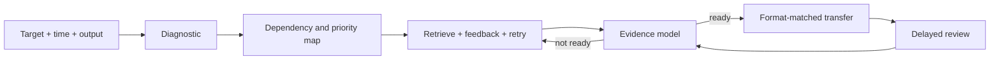

# Learning Dashboard

## Start here

| Need | Command | Finish line |
|---|---|---|
| Learn deeply | `/teach` | Independent performance that survives a delayed review |
| Understand quickly | `/fast-learn` | Explain it closed-source and use it once |
| Prepare for a deadline | `/cram` | Complete the actual task format under realistic constraints |

Use `/mode` to inspect the current session and its next priority.

## Current session

The latest active plan is mirrored in [[_learning/current-session.json]] for this dashboard. The authoritative plan is stored in its Pi chat. Every new learning-skill invocation starts a fresh plan, even when its topic matches the previous plan. To continue existing work, resume the original Pi chat with Pi's native `/resume`; its latest objective, deliverable, time boxes, and phase progress are restored without re-running the skill. Topic mastery and review history remain intact across plans.

## Topic maps

Browse [[_learning/graphs/]]. Each topic has:

- a JSON dependency graph used by the agent;
- a Mermaid note with the active mode's readiness overlay;
- optional Tier 1/2/3 and assessment-weight metadata for cram planning.

The graph validator rejects missing nodes, duplicate IDs/edges, self-edges, and cycles.

## Readiness and mastery

Evidence lives in [[_learning/mastery/]]. The engine distinguishes recognition, recall, explanation, and application, and records whether evidence came from a diagnostic, learning attempt, assessment, or later review.

The displayed percentage is a model score for routing practice. It is not a calibrated probability or a predicted grade.

| State | Gate | Additional requirement |
|---|---:|---|
| Cram ready | 70% | Unassisted, format-matched attempt |
| Fast-learn ready | 80% | Closed-source explanation or application |
| Durable mastery candidate | 95% | Independent performance, confidence calibration, and later retrieval |

## Review queue

Review cards live in [[_learning/reviews/]]. The scheduler:

- merges exact topic/skill/prompt duplicates;
- can create a real same-day checkpoint for fast-learn or cram;
- transitions to day-scale spacing after a rated retrieval;
- updates [[_learning/reviews/due-today|Due Today]].

## Session artifacts

The [[sessions/]] folder can contain:

- mirrored learning conversations;
- `fast-learn-<topic>.md` one-pagers;
- `cram-sheet-<topic>.md` retrieval maps;
- `anki_export.tsv` for reusable review cards.

Evergreen concept notes live in [[topics/]] and end with closed-book retrieval prompts.

## System map

See [[_learning/vault-guide|Vault Guide]] for the operating details and [`.pi/RESEARCH.md`](../.pi/RESEARCH.md) for the evidence base.
