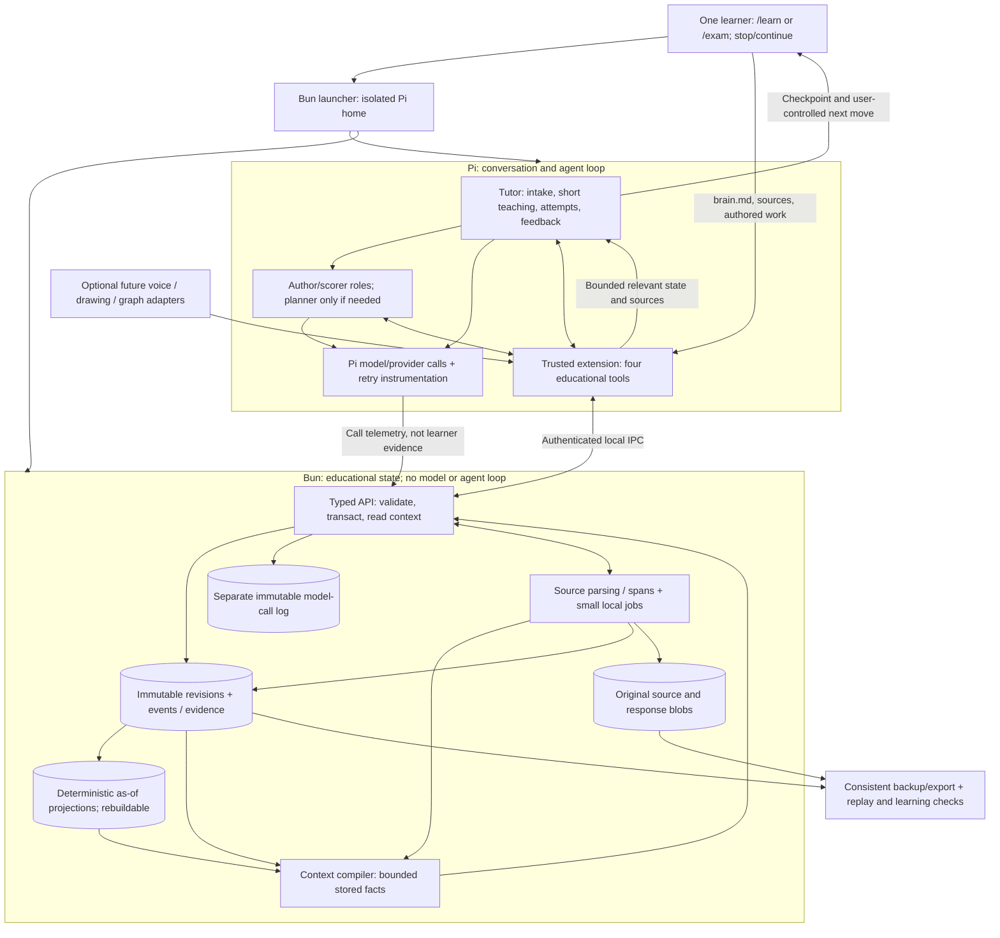

# Learning Engine — Research-Grounded Product and Infrastructure Design

**Status:** proposed architecture, not an implemented or empirically validated all-purpose tutor.  
**Updated:** 2026-10-01.  
**Product boundary:** an isolated, local-first extension of Pi, with a Bun-based host, the native Pi terminal experience, a dedicated Pi home, SQLite learner records, and original user-supplied source files. No cloud account or hosted database is required for the first release.  
**Companion artifacts:** [minimal starting specification](start.md), [standalone Mermaid map](architecture.mmd), and [research/provenance record](main.provenance.md). This file is the full design; `start.md` defines the buildable first slice.

## 1. Decision and evidence boundary

Build **one tutoring engine with two initial policies**: `/learn` for durable understanding and usable skill, and `/exam` for a specific near-term demonstration of knowledge or skill. `/exam` includes tests, essays, speeches, interviews, oral defenses, and practical tasks; the name does not impose an MCQ format. `/accelerate` and standalone `/drill` are **deferred**, not enabled initial commands. Source-linked practice remains usable inside both initial modes without a dedicated drill product. Voice, drawing, graphing, and other modalities are **interfaces and task tools**, not learning modes. The application has one learner and one active tutoring conversation; do not introduce organizations, classrooms, or multi-tenant infrastructure.

The invariant loop is:

> Define the goal and horizon → prepare a provisional task map → offer a short, optional probe → give the smallest useful explanation/example → elicit an attempt → provide targeted feedback and a new attempt → check a different facet of the skill → advance, repair, or mark uncertainty → offer a learner-controlled stopping point → revisit later on an independent task.

The **system** may choose an instructional move, but the **learner** decides when a session stops or continues. A time budget changes scope and the next recommendation, not ownership of the clock. Neither a fluent AI explanation nor the quantity of generated questions is evidence of learner mastery.

The project's seven available reviews support several bounded components: retrieval and spacing for many delayed-recall tasks; guidance and examples for some novice complex tasks; task-specific feedback; conditional mixed practice; and selected transfer prompts. They **do not** validate a universal combined policy, exact thresholds, sparse-data personalization, or a planning subagent [L1–L8]. In addition, the project is a **partial corpus**: reviews 01 and 09–12 and syntheses 13–14 were absent from its audit [L8]. The design below labels empirical observations, engineering inferences, and normative safeguards separately. Do not market a “synapse-optimized” system: the reviewed behavioral evidence does not justify such a control variable.

### Evidence-to-decision matrix

| Evidence, with scope | Design consequence | Boundary |
|---|---|---|
| Retrieval practice improves many delayed-recall outcomes; success and feedback matter [L1]. | Elicit an attemptable, initially unaided response; scaffold/correct unsuccessful attempts and revisit later. | Not a rule to quiz incessantly or to withhold needed instruction. |
| Distributed practice benefits many verbal-memory outcomes; intervals and procedural/classroom outcomes vary [L2]. | Use a transparent, horizon-aware fixed review baseline first. | No universal 1/3/7-day schedule or validated individual scheduler. |
| Worked examples/guidance can aid novices; fading depends on demonstrated topic knowledge [L3, E1]. | Show a brief example for a new, complex task, then reduce help on that component. | No global “novice” label or universal fade threshold. |
| Self-explanation prompts yielded a positive average effect in a meta-analysis of 64 reports, but conditions differ [E2]. | Ask for an explanation when relations and method choice matter; follow it with application. | “Feynman inversion” is not a separately validated named dose or a substitute for performance. |
| Feedback effects vary by information and task [L5]. MCQ feedback reduced lure intrusions in a studied setting [E3]. | Correct the actual misconception, then test a *new* item; distinguish feedback from assessment. | No one feedback timing or MCQ proportion for all subjects. |
| Interleaving and comparison can improve discrimination or selected transfer tasks [L4, L7]. | Mix confusable types once the target skill includes selecting among them; document changed context and cues. | Familiar-item success does not imply far transfer. |
| A short prior-knowledge measure can be useful [E4]; prequestion benefits were mainly specific to prequestioned material [E5]. | Use a non-gating probe to select an entry point, then diagnose during instruction. | A short probe cannot certify every prerequisite. |
| Structured AI tutoring improved immediate post-lesson outcomes versus a particular active classroom comparison in one undergraduate-physics RCT [E6]; unguarded AI assistance impaired independent mathematics performance in another setting [E7]. | Scaffold attempts; prevent answer leakage; measure **unassisted** learning. | Neither study validates this engine across ages, domains, delays, or modes. |
| Automated generation can yield expert-rated items comparable to traditional items in a bounded medical comparison [E8], yet 55/150 computer-science MCQs in another zero-shot analysis had at least one item-writing flaw [E9]. | Generate candidates, validate and pilot them, and separate practice from locked assessment. | Similar wording or infinite item supply is not infinite valid measurement. |

### Non-goals and promises the product must not make

- No “mastered forever” label after one session; no fixed percentage that proves understanding across all domains.
- No requirement that every misconception be eliminated before any advance. Critical prerequisites are repaired promptly; other gaps are explicitly tracked and revisited.
- No indiscriminate rotation through retrieval, MCQs, analogies, teach-back, and integrations. Select the **smallest activity that targets the current objective**.
- No claim that an LLM planner, a learner-style profile, a voice interface, or a large generated bank is inherently more effective. The architecture must earn those additions against a simpler baseline.
- No automatic execution of code, prompts, plugins, or instructions found inside an uploaded document.

### Concrete subject coverage: same records, different evidence

Support **math, English/writing/literature, sciences, humanities/social sciences, world languages, computing, and practical/creative subjects** through declarative subject profiles—not separate tutoring engines. A profile names relevant concept/component distinctions, response forms, scoring dimensions, sources, and limits. All accept text and learner-authored attachments initially; real-time simulation, audio, and physical sensors are optional adapters. Coverage means the engine can teach and record these task types; it does **not** claim equal scoring reliability or proven efficacy in every domain.

| Subject | Concept (idea/relation) | Component (observable target behavior) | Task/step evidence and validation |
|---|---|---|---|
| Math | Equivalence; rate of change; geometric invariants. | Rearrange an equation without changing its solutions; justify a derivative; select a theorem. | Work-through, justification, numerical/symbolic check where appropriate; separate reasoning, method choice, and arithmetic. |
| English, writing, literature | Claim–evidence–warrant; narrative perspective; syntax. | Construct a supported argument; interpret a passage with evidence; revise an ambiguous sentence. | Learner outline/draft/revision; rubric dimensions for claims, evidence, reasoning, structure and language. Multiple defensible responses; no single answer key. |
| Physics, chemistry, biology and other sciences | Motion, conservation, molecular structure, inheritance and systems. | Translate graph to physical claim; balance a reaction; explain a mechanism; interpret data. | Prediction, diagrams, explanation and calculation; source/unit checks; experimental work requires observed artifacts and safety limits. |
| History, geography, civics and social sciences | Causation, evidence, scale, competing explanations. | Evaluate a source; compare explanations; substantiate a historical argument. | Source analysis and evidence-backed response; record disputed claims and source context, not a fabricated unique interpretation. |
| World languages | Grammatical relations, lexical meaning, pragmatics. | Recall vocabulary in context; produce an appropriate sentence; understand/respond to speech. | Text production/interpretation first; listening/pronunciation require actual audio access and reliable review. A transcript cannot prove pronunciation. |
| Computing and technical subjects | State, invariants, complexity, abstractions. | Trace, implement, debug or explain an algorithm. | Step reasoning and code artifacts; verified tests only with a permitted sandbox; passing tests alone does not demonstrate explanation or broad correctness. |
| Arts, music, design and practical/vocational skills | Composition, technique, functional constraints. | Critique/produce a work; demonstrate an ordered procedure under stated conditions. | Artifacts and task-specific rubrics; a written description proves neither motor execution nor a safe real-world procedure. Human observation/expertise may be required. |

One learner may move between subjects without copying an ability score across domains. Cross-subject prerequisites are explicit, contestable links. Advanced, physical, high-stakes, and subjective performances may require sources or expert assessment the system does not possess; show “not observed / cannot verify,” not inferred mastery. This taxonomy is a **design inference** from task- and outcome-bounded research [L3, L7, E12], not an ontology of the brain.

## 2. Learner contract, modes, and time

### Intake: minimal but sufficient

The intake asks only for missing decisions: **what** the learner wants to do; **why and by when**; available time and accessibility constraints; target performance format and success criteria if known; relevant prior experience; whether to take or skip a short opening probe; and an optional free-text **“anything else about how you want this to go?”** field. For a near-term event, ask what must be produced, for whom, under what time/aid conditions, and whether there is a rubric or exemplar. If none exists, agree on a *provisional* criterion with the learner rather than inventing an official one. The free-text response is retained as a current user instruction/constraint with provenance, not silently turned into a pedagogical fact. Permit edits mid-session. Do not make every invocation repeat already confirmed information; ask only what changed.

An opt-out from the opening probe leaves prior knowledge **unknown**, not “beginner.” Start with a brief orientation and collect evidence in the first learning activity. The tutor can offer “challenge me instead” at any point. A skipped probe cannot block `/learn` or `/exam`; it must not trigger a compensatory long diagnostic. Deferred modes are not advertised as installed commands.

### Mode policies over the same engine

| Mode | Target and horizon | Allocation and instruction | Coverage, exit, and disclosure |
|---|---|---|---|
| `/learn` | Conceptual understanding, procedural ability, independent retention, and relevant application over a user-chosen horizon. | Cover essential components; examples for unfamiliar complex work; explanations, independent attempts, contrasting cases, and later checks as useful. Move quickly through demonstrated strengths. | Session ends at learner request or an offered checkpoint. “Independent now,” “retained,” and “applied” remain separate claims. |
| `/exam` — initial | Readiness for a specific near-term demonstration—quiz, essay, speech, interview, oral defense, or practical task—at a known horizon. | Work backward from the actual criteria and allowed aids. Rehearse, correct consequential gaps, then try a fresh or revised performance with less task-specific help. | Report task-specific readiness, date, assistance and uncertainty separately from durability; the learner controls stopping. |
| `/accelerate` — deferred | Rapid coherent first-pass capability. | Future policy may prioritize dependencies and compress redundant explanation, not thinking time. | Not an initial endpoint; show coverage debt if later enabled. |
| `/drill` — deferred | Renewable source-bound practice. | Future dedicated command may assemble validated variants from sources. | Initial `/learn` and `/exam` already accept sources and practice tasks; no unlimited-bank service in the starter. |

**`/exam` is a purpose policy, not a faster reading speed or an MCQ preset.** First identify the target performance and its rubric, audience, time limit, permitted aids, and stakes. Prioritize the few gaps most likely to affect that performance; run an authentic rehearsal; return feedback on the relevant dimensions; and repeat on a new prompt or meaningful revision when useful. For a problem test, that may be unaided retrieval and method choice. For an essay, it may be an evidence-backed argument plan and a timed independent draft. For a speech, it may be an outline and spoken rehearsal with consented audio, focusing on accuracy, structure, and delivery rather than merely memorizing a script. For an interview, use follow-up questions; for a practical task, assess the actual sequence or artifact. These are **format-matching design choices**, not evidence that every format has the same optimal rehearsal dose. If no target conditions are known, ask or state the provisional assumptions. The tutor must not write the final performance for the learner and then count its quality as independent readiness.

Source-bound practice does **not** replace understanding or independent performance: attached papers, prompts, and exemplars may sample only a narrow task. In `/exam`, practice uses the known target blueprint; in `/learn`, include conceptual and changed-context checks where relevant. The dedicated `/drill` command and automatic large-bank generation are postponed.

**Time model:** distinguish (a) learner-declared session budget, (b) actual learner work/pauses, (c) AI processing/wait time, and (d) target retention horizon. Display estimates as ranges calibrated against actual interaction, not as authoritative countdowns. No forced stop when an estimate expires; offer “stop here / one more component / change goal.” Persist a checkpoint with next action and uncertainties. Scheduling later reviews requires consent for reminders; no assumed daily availability. A deadline can cause the system to choose a narrower objective but must not upgrade a short-term performance result into a durability claim.

## 3. Core instructional state machine

This is a **policy design to evaluate**, not a universal proven ordering. **Pi owns the conversation, all agent/model calls, planning, grading proposals and the next instructional move. Bun owns records, revision checks, evidence eligibility, timestamps, deterministic validation and cached educational projections.** Bun rejects invalid writes and exposes state; it does not run a competing agent loop, send autonomous tutoring prompts, or choose content instead of Pi.

1. **Scope.** Capture the goal, horizon, task conditions, source set, available time, learner notes, and desired outcome. Show an editable one-sentence mission and what will count as evidence.
2. **Orient, without a compulsory map.** Pi identifies the current target and a small working outline from the learner's goal and relevant source. Start teaching without a planner call or a full prerequisite graph. Add a component or suspected prerequisite only when a task/source makes it useful; keep such relations provisional and learner-correctable.
3. **Probe, optionally.** Use one short conceptual/work-through task where it can meaningfully change the starting move. Record answer, reasoning, hints, medium, and confidence in the inference. A correct answer to one form buys a harder/different check, not a permanent skip.
4. **Orient/teach.** Begin with a small motivating phenomenon or authentic task, not a wall of prose. When the task is too complex for a meaningful novice attempt, show a *brief worked example* and its reason. Let the learner inspect/replay more only as needed.
5. **Attempt.** Ask the learner to produce something appropriate to the target—an answer, method choice, explanation, graph, code, spoken reasoning, or physical-action report. Clearly distinguish **independent** from **supported** attempts. Show public criteria and permitted aids where appropriate; withhold answers, solution-bearing rubric exemplars and task-specific coaching until submission in an independent check. Revealing them early reclassifies the affected evidence.
6. **Interpret and correct.** Score against an explicit, source-backed rubric; retain uncertainty; show what was correct and what specific relation failed. Give the least sufficient correction and a *new* attempt. If repeated stalls occur, change representation/scaffold, reconsider prerequisites, or suggest a human/source check—not infinite retries of the same item.
7. **Cross-check.** For an important component, use a changed representation, discriminating counterexample, or new context aligned with the goal. Do not equate a paraphrase with transfer. Method selection and execution are separately observable.
8. **Choose next move.** Repair a blocking prerequisite; fade guidance for that component after repeated independent evidence; advance with an explicit unresolved gap; or schedule later review. A simple fixed default governs when evidence is sparse. Proposed thresholds require validation.
9. **Checkpoint/stop.** Present demonstrated abilities, assisted abilities, unresolved questions, source uncertainties, coverage debt, and the next sensible activity. The user decides whether to stop or continue.
10. **Return.** At a goal-relevant delay, test without revealing support first; score retention and novel application separately. Correct and reschedule when needed. Record missed reviews as missing evidence, not forgetting.

### Decision constraints (not a magic optimizer)

- If the learner cannot make an attemptable response, **teach or cue**; do not maximize retrieval count.
- If they succeed with visible examples, seek an **independent** attempt before claiming current ability.
- If they succeed independently on a familiar form, sample a different representation/task family before broadening the claim.
- If errors are conceptual, explain the causal or structural distinction; if procedural, model the missing step; if selection-related, contrast problem types; if merely arithmetic, check whether it is a slip before reteaching the concept.
- Select MCQs for discrimination or efficient breadth, open work for generation and reasoning, teach-back for explanatory relations, and tool-based tasks when the real skill requires them. An activity format is not a mode.
- If a learner requests the answer, the tutor may provide it; log that this item is no longer independent evidence, and later use a different task. User control is not overridden by an arbitrary anti-answer rule.
- Uncertain grading must not force an automatic remediation or mastery decision; seek a clearer task or review.

### Example: kinematics, three-week use horizon

Intake says “learn constant-acceleration motion for problems in three weeks,” with a sketch preference. Pi starts with the immediate target and a short outline: solve one motion problem, then check its graph interpretation. Displacement, velocity, sign conventions or formula selection are added as the work exposes a need; no upfront domain map or planner call is required. An optional work-through asks for final velocity and displacement of a cart with nonzero initial velocity, plus why final velocity times time is not displacement. A good algebra answer leads to a velocity–time graph, not an automatic skip of graphs. A wrong displacement but correct velocity triggers a short annotated graph/example, then a new independently solved case. Next, a braking problem tests sign conventions and method choice. The checkpoint distinguishes independent algebra, graph interpretation requiring help, and untested application. A later, no-hint test checks retention; a changed-context item checks application. In `/exam`, prioritize the learner's near-term performance blueprint (for example, a timed physics problem test), while recording untested conceptual components. Uploaded past papers seed practice-task families inside either initial mode; graph or conceptual checks are added as the goal or errors warrant them. A later standalone `/drill` uses the same records rather than a second learner model.

## 4. Temporal learner evidence and compact working state

### Concepts are not components

A **concept** is an idea, relation, or factual referent: acceleration, equivalence, claim–evidence–warrant. A **component** is a scoped observable target: interpret the slope of a velocity–time graph; rearrange an equation; support an interpretation with textual evidence. A component may reference several concepts; one concept may support several components. Component granularity is an instructional hypothesis [E12], not a discovered mental atom. Do not create a new component for every response token or confuse topic exposure with demonstrated behavior. Candidate prerequisite links are revisioned and contestable.

Assess **components**, using task/rubric evidence; show concepts as an organizing map. A component record specifies target behavior, response conditions, concept references, and relevant rubric dimensions. A holistic essay or performance may jointly assess several components; retain its holistic evidence rather than inventing independent results for every concept mentioned.

### Three task layers, one evidence chain

- **`task_family`:** shared construct and lineage/structure, including what can vary and what reasoning must remain. Used to track overexposure and related variants. It is not a guarantee of equal difficulty.
- **`task_definition`:** a versioned authored/generated task specification: family revision, prompt, component revisions, source spans, public criteria, answer/key where relevant, **rubric revision**, permitted aids, and meaningful step definitions. A corrected key or wording creates a new revision; existing attempts remain pinned to the old one.
- **`task_instance`:** the particular task delivered to this learner at this time: frozen definition revision, materialized parameters, prompt/artifact hash, goal/session, intended practice/check purpose, and declared conditions. Resuming the same instance is not a fresh observation; retrying creates a new attempt; a changed prompt or parameters creates a new instance.
- **`attempt`:** one learner response episode to an instance, with start/submission/abandonment events, response/artifact references, and support conditions. **`step_attempt`** records meaningful intermediate work with its own ID, time, target step and evidence. Examples: choosing a physics equation, computing an area, outlining a thesis, supporting a claim. A revision is another step attempt, not an overwrite. Unstructured responses may use one whole-response step; an overall assessment is retained separately from step assessments. Do not count dependent steps as independent repetitions.
- **`rubric_revision`:** immutable dimensions, criteria/anchors, source references and applicability. Assessments pin an exact revision, assessor, evidence spans and uncertainty. Re-scoring/correction is a new event referencing the prior assessment; it does not erase it. Public scoring criteria can be shown beforehand; hidden solutions and key-bearing exemplars cannot leak into an independent check. A changed rubric does not silently regrade history.

### Assistance is first-class, scoped, and temporal

Log **assistance offered, requested, authorized and actually exposed** separately. An assistance record includes ID, kind (hint, cue, example, explanatory feedback, reveal, peer/external help or tool), content/artifact reference, actor, instance/attempt/step scope, affected components, delivery time, and whether it supplies part or all of the answer. An offer alone is not delivered help. If streaming reveals help and then fails, retain `exposure_unknown` or `possibly_exposed`, never assume independence. Link subsequent dependent steps to the help that influenced them; step 1 feedback can invalidate an unaided claim for step 2 even if no second hint was requested. Where scope is unclear, label evidence uncertain rather than assigning a numerical penalty.

Permitted conditions matter: an open-book essay or calculator-allowed task can be **independent under stated aids**, but is not closed-book recall. Accessibility support is recorded as a condition, not automatically treated as answer-bearing help. AI-written arguments or revealed solutions are task-specific assistance; a learner revising them is supported evidence, not independent authorship. Report performance before and after help separately. Do not subtract an arbitrary fixed percentage per hint. Balancing help and productive effort remains an open instructional problem [E13; L3, L5].

### State is an as-of view, never a timeless label

Every event carries `occurred_at` (when the interaction happened), `recorded_at` (when Bun accepted it), an authoritative monotonically increasing local `seq`, session/branch identity, and optional clock uncertainty. The sequence gives deterministic write order; wall clocks are not guaranteed monotonic. Late imports cannot masquerade as new practice. Durations use a local monotonic timer; privacy/time telemetry does not imply focus.

A component projection carries `as_of_time`, `through_seq`, projector version, supporting event IDs, last observed performance dates, actual delays since relevant practice/exposure, assistance conditions, task-family coverage, active rubric/source revisions, and recorded uncertainty. It is a deterministic fold of persisted facts at explicit sequence/time inputs: no model calls, new semantic summaries, implicit clock reads or fresh mastery/planning judgments. An assessment proposed by Pi is a stored observation/judgment, not an inference the projector repeats. Report **observed at that time**, **retained at that tested delay**, and **applied under those documented changes**—not “independent now” from a weeks-old answer. Elapsed time without a new test makes the *current claim unverified*, not evidence of forgetting. Preserve observed history even when the learner later struggles. A new supported success cannot overwrite an earlier independent failure or be blended into a misleading percentage.

Reconstruct history either using a past `through_seq` (what the system knew then) or using current corrections about interactions before an `as_of_time` (what it knows now about that period). Label those queries distinctly. Predictions, if later added, name the future task, horizon and aid conditions, model version and uncertainty; they never rewrite evidence. No per-person forgetting curve, universal mastery threshold or deep knowledge-tracing model is needed initially [L2, L6, L8, E14].

### Concrete, low-overhead adaptation

Pi applies the following ordered, **testable default rules**, with Bun returning evidence and eligibility rather than autonomously tutoring:

1. Honor current learner goal, stop request, aid conditions and deadline; record changes.
2. If the task/rubric/source is unreliable, clarify or choose a reliable task before concluding the learner has a gap.
3. If the learner cannot make a meaningful attempt, provide a short explanation/example or scaffold; if a blocking prerequisite is evidenced, repair that specific component.
4. If success relied on answer-bearing assistance, use a new task with less help before broadening the claim. If reasoning conflicts with a correct final answer, address the conflict.
5. After independent success, reduce explanation for that component and try a relevant different form when uncertainty warrants it. Do not treat one success as a permanent skip or require redundant practice purely by quota.
6. At a checkpoint, advance or stop with unresolved gaps visible. Offer a later check at a learner-approved, goal-relevant interval; no optimal interval is asserted. In `/exam`, prioritize the stated performance and disclose coverage debt.
7. If repeated repair is not helping, change representation or revisit the plan; do not loop indefinitely. One learner can override the default and the reason is logged.

Bun's dedicated **context compiler** assembles the active goal/constraints, current task/steps, assistance, exact rubric, relevant source excerpts and a handful of component summaries for Pi. It is an internal module, not another service, agent or projection. Compile deterministically from explicit sequence/time, authorized revisions, request scope and a bounded size budget; use stable ordering and report omissions. The full history stays in SQLite. Pi asks for targeted drill-down rather than reading a giant graph or every event. The compiler selects and formats stored facts; Pi chooses teaching actions and performs any semantic interpretation.

### Decisions are not model calls

Keep the **educational facts** complete, but log only **consequential choices** beyond those facts: a changed goal/working outline, non-routine repair or advancement, revealing answer-bearing support, a review-date choice, an uncertainty/permission override, or abandoning the agreed path. Put a brief reason and evidence references on the existing task, assistance, assessment, source or checkpoint event when possible; use a standalone decision event only when no domain event represents the choice. Do not add proposal/acceptance/result triplets for every ordinary task, feedback turn, context read, unchanged plan or harmless validation error. Rejected proposals with no educational consequence may stay in operational diagnostics. Record actor, relevant revisions, optional call/correlation IDs and a short declared reason—not hidden chain-of-thought. A planned external action must not masquerade as delivered assistance or executed work.

Log **model calls separately**, including tutor, planner, scorer, generation, compaction and retries. Each actual provider attempt has call ID, operation/actor, provider/model/config, timestamps, request/response hashes or consented artifact references, usage/cost if reported, terminal status and error. One call can support multiple decisions; deterministic decisions have no call. Stream tokens need not each become events. Pi supplies instrumentation; Bun persists it. No provider calls originate from the Bun educational service. If exact retry/call correlation cannot be observed in the pinned provider path, report a logging gap—do not infer calls from assistant messages. Aborted/incomplete calls do not become successful evidence.

Routine conversation and reasoning remain in Pi's transcript, not duplicated as decision events. Pi transcripts are useful context but not the authoritative learner-evidence ledger. Branch navigation and replay do not duplicate genuine attempts or undo learning. Planned/simulated alternative branches must be tagged and excluded from learner-evidence projections. Corrections and withdrawals append events; mutable caches may be deleted/rebuilt. Immutable records have an explicit privacy purge exception: authorized deletion removes sensitive payloads/blobs/backups under the stated policy, not an infinite retention promise. None of this auditability proves causal learning efficacy.

## 5. `brain.md`, planner, and subject adaptation

`brain.md` is an optional **learner-authored preference and constraint file**, not a hidden instruction hierarchy. Suggested sections: goals/horizons; accommodations and languages; interaction preferences; recurring frustrations; self-reported experience; desired/undesired activities; permissions for sources, voice, reminders, and data retention. Mark self-reported strengths and “this method works for me” as claims to verify, not mastery data. The free-text intake field is a current-session instruction; do not overwrite `brain.md` unless the learner explicitly asks.

Bun's context compiler includes explicitly recorded constraints and learner-selected notes, with current instructions ahead of older preferences; it does not infer a profile from prose. For long notes, Pi may propose a **short, attributed, learner-correctable profile**, persisted as a revision only when useful. No separate planner is required. Preserve accessibility and explicit stop/consent constraints, flag conflicts and show omissions rather than silently filtering them away. The tutor need not see unrelated private notes. A source document or `brain.md` entry must not silently grant tool privileges, replace system safeguards, or become proof that a learning-style theory applies [E10].

**Start without a planner:** the tutor maintains a small, optional working outline: current target, next few activities and known gaps. It is a disposable proposal, not a validated model of the subject or learner. A generated prerequisite link is a hypothesis; a single answer cannot validate a large map or clear an entire branch. Do not create a graph, coverage score or outline revision after each response. Narrow goals can proceed with no persisted plan at all.

Only request a separate bounded Pi planning call when a broad source/goal or repeated stall makes the ordinary tutor outline inadequate. Let the learner inspect/correct its scope; retain source/evidence references and uncertainty. Source extraction/acceptance is required before relying on its content; a complete mapping pass is not. Mid-task sources can wait for a checkpoint unless the learner chooses a switch. The tutor owns the local move; an optional planner does not grade or publish items.

Optional outline contract (versioned only on meaningful changes):

```text
PlanRevision {
  goal_revision_id,
  active_component_revision_ids[],
  next_activities[] { target, source_or_task_revision_id?, reason },
  known_gaps[], uncertain_assumptions[], supporting_revision_or_event_ids[]
}
```

Use a small library of activity contracts—worked example, explain, free response, discriminate, draw, simulate, solve, perform—rather than arbitrary planner-generated executable workflows. The planner may compose a new *activity* within a validated contract; code execution, web access, and new plugin installation are separately permissioned. Version and compare plans; an old plan never overrides recent learner evidence.

## 6. User sources: prompt intake, ingestion, trust, and provenance

The learner can add PDF past papers, answer keys, textbook excerpts, notes, slides, Markdown/text, images of scratchwork, URLs when permitted, and later audio/transcripts. Each addition gets an immediate **receipt** and visible status. “Read immediately” means start ingestion immediately, not claim that a 200-page scanned PDF has been understood or that generated tests are ready before extraction/validation.

**Source pipeline:**

1. **Receive:** record source owner, purpose (curriculum, past paper, answer key, reference, personal note), rights/redistribution status (including `unknown`), locale, edition, and intended scope; hash and store the untouched original. Unknown rights default to local/private processing only, with no sharing or public item export pending review. Reject oversized/unsupported files with a reason and preserve no hidden partial ingestion.
2. **Extract and preview:** parse available text/pages promptly; show a *provisional* list of detected topics and questions as soon as extraction permits. Continue tables, figures, mathematical notation, answer keys, and OCR in a bounded job where needed. OCR is fallible; retain page coordinates, extraction method/version, and uncertainty. Never execute macros, embedded scripts, or prompt instructions from source text.
3. **Review/normalize:** detect missing pages, duplicated files, questionable answers, conflicting editions, low-confidence OCR, and ambiguous question boundaries. Mark `needs_review` rather than treating raw text as fact. A provisional map can be visible immediately, but unverified spans cannot produce confidently scored items.
4. **Index:** chunk by semantic section/page and create lexical/FTS search with stable source-span IDs. Store original and extraction separately. Embeddings/reranking are optional only if measured retrieval failures justify them.
5. **Orient as needed:** Pi retrieves *relevant accepted spans* for the current target and, only if useful, adjusts the small working outline or target-performance brief. Do not require a full subject map, prerequisite graph or planner call before using a clean excerpt. Show conflicts and provisional extraction explicitly. A user source is evidence of what an exam or course covers, not automatically scientific truth.
6. **Generate:** candidates linked to source spans and learning objectives enter validation, not the published practice bank directly.
7. **Invalidate/revise:** new editions, deleted sources, corrected OCR/keys, or changed rights invalidate dependent unreviewed maps/items. Published attempts retain historical provenance; fresh work uses the latest accepted revision.

Source states are `received → extracting → needs_review | indexed`; task readiness is validated separately. Optional mapping is not a source-readiness gate; `failed`, `superseded`, and `removed` are explicit. `needs_review` is not silently promoted. Small clean text sources can complete in the current command; large/OCR sources use an idempotent background job with progress and a user-visible “not ready yet” status. On source removal, stop future use, remove derived content as requested, and explain which past learning records are retained or deleted under the user's choice.

**Trust boundary:** uploaded text is untrusted data, even if it says “ignore previous instructions.” Retrieval returns bounded quoted passages with source IDs, never executable instructions. License/rights metadata determine whether the engine may store, transform, export, or share past-paper content. Local private practice is not a blanket copyright exemption; expose rights uncertainty rather than making a legal claim. High-stakes medical/legal/safety content and ambiguous grading require expert review or clear limits.

## 7. Source-bound practice now; standalone `/drill` deferred

The goal is **renewable, meaningful practice**, not an infinite count of cosmetic paraphrases. Treat past papers, assignment briefs, sample essays, and speech prompts as possible task blueprints, not guarantees of broad competence. Ask whether the learner wants original tasks, source-grounded variants, a rehearsal under target conditions, or weak-area practice. Where a key or rubric exists, cross-check it; otherwise mark scoring criteria provisional and avoid high-confidence grading.

### Practice-task generation and review pipeline

1. **Specify the construct:** skill/component, response format (answer, essay, spoken response, performance artifact), cognitive demand, expected reasoning or performance dimensions, sources and spans, and the allowed structural change. Distinguish a changed name/number from a changed reasoning demand; subjective tasks need rubrics and exemplars, not a single canonical answer.
2. **Generate candidate in Pi:** a grounded prompt proposes a versioned `task_definition` bound to a `task_family` revision and exact `rubric_revision`, rationale/key or exemplar criteria, source spans and model-call ID. Bun validates the proposal, stores an immutable revision and logs publication/rejection; it does not invoke a generator model. Materialize a frozen `task_instance` only when presenting the task. Family lineage captures shared templates/solution structures rather than proving equal difficulty. Initial generation is one task on demand, not an automatic unlimited-bank job.
3. **Static checks:** verify source spans exist and support claims; catch answer-in-prompt leakage, duplicate/near-duplicate tasks and families, unsupported facts, and licensing constraints. For objective items, also check ambiguous options, units, and answer uniqueness. For essays, speeches, and performances, check that the prompt, permitted aids, rubric dimensions, and exemplar criteria are coherent without pretending there is one correct response. For equations/code, use an independent calculator/symbolic solver/test when appropriate. An LLM's self-agreement is not independent verification.
4. **Review gate:** promote low-stakes practice only after automated checks and domain-appropriate review; require human review for high-stakes claims or uncertain solution/rubric. Record `candidate | needs_review | practice_ready | rejected | retired` with reasons.
5. **Pilot and monitor:** observe difficulty, error patterns, repeat exposure, accessibility, and scoring disagreements; for objective items, evaluate discrimination and anomalous answer keys where data permit. Sparse data imply uncertain item parameters. Retire flawed families rather than quietly changing a task after learners attempted it.
6. **Serve and learn:** choose a bounded mixture of useful families based on objectives and horizon; after an attempt, give feedback then, if needed, a different item. Avoid repeating one family until the learner recognizes the template.

**Practice is not the locked outcome test.** Keep a family/source/solution-path-disjoint assessment bank (including essay prompts, speaking scenarios, and performance tasks where appropriate), preferably externally authored and frozen before evaluating the engine. Pi's tutor/planner/generator cannot retrieve protected solutions during practice. Public criteria are visible; key-bearing exemplars and solutions are not. After submission, Bun can grade an objective response deterministically or grant a scoped Pi scoring call the frozen rubric and necessary protected evidence. That scoring context is not reused for tutoring; all bank accesses and scoring calls are logged. These are application access boundaries, not a sandbox against an OS-privileged plugin. A held-out *item* from the same family is not independent. If the learner already uploaded/examined the paper, call a later variant “unseen form of a known family,” not true transfer. For a personal low-stakes drill, a generated variant may be useful practice without being psychometrically calibrated; show that distinction.

Pugh et al. compared 102 automated and traditional medical MCQs by blinded expert ratings and found no significant quality difference in that bounded comparison—not improved delayed learning [E8]. A separate study found flaws in 55/150 zero-shot computer-science MCQs, particularly ambiguous keys and implausible distractors [E9]. A large 2025 field study of AI-generated exams across 91 classes reports encouraging item-response results, but it is a **preprint about assessment properties**, not a randomized proof that unlimited generated practice causes durable mastery [E11]. These results justify a validated pipeline, not an “infinite equivalent questions” promise.

## 8. Modular local backend and Pi boundary

### Chosen first-release topology

A **single-learner Bun/TypeScript local service** owns educational events, immutable revisions, projections, source/artifact files, deterministic validation, and import/backup jobs. A small Bun `learn` launcher starts a dedicated native Pi CLI and this service. **Pi owns the conversation and agent loop**, including all tutor/planner/generator/scorer model calls and the instructional policy. The trusted core extension exposes only `/learn` and `/exam` initially, plus source/status/stop controls and typed educational operations over authenticated local IPC. Bun supervises processes but does not decide the next prompt, call an LLM, or run an independent educational-agent scheduler. One active tutoring conversation per learner is sufficient. No Kafka, Redis, multi-tenant API, distributed event broker or cluster is proposed. Optional interfaces connect to the same Pi conversation and Bun records [P1–P5].

Pi's SDK explicitly supports a Bun process [P3], but the terminal CLI subprocess path is the conservative initial UX. Pin tested Bun/Pi versions; verify extension/SDK compatibility in CI. The service-to-extension transport may use a random loopback port plus per-launch capability token, request IDs, origin rejection, and strict schema validation; a platform IPC adapter can replace it. The exact transport is an implementation choice, not a learning mechanism.

**Isolation is deliberate, not assumed:** set `PI_CODING_AGENT_DIR`, `PI_CODING_AGENT_SESSION_DIR`, and `PI_PACKAGE_DIR` to dedicated product locations [P1]. Launch from a controlled workspace, disable ambient context/skills/extensions/prompts with the documented Pi flags, and explicitly load only trusted, allowlisted resources [P2]. A dedicated config directory **alone** does not exclude ancestor context files or other discovered skills [P4]. Keep provider auth in the dedicated Pi home and never copy global credentials without explicit consent. In an SDK path, use a controlled resource loader and dedicated `agentDir` [P3]. Do not fork Pi merely to rename it.

Suggested **product package structure** (design, not files already present):

```text
src/
  cli/             Bun launcher, dedicated paths, install/config/doctor
  bun/             store, projections, imports, validation, backup
    context/       bounded deterministic context compiler; no model calls
  contracts/       shared operation/event/object schemas; no LLM dependencies
  pi/              core extension, mode policy, planner/scorer calls, instrumentation
  subjects/        small declarative domain profiles and rubric fixtures
  adapters/        optional I/O or verified external tools
skills/            concise tutoring and task-authoring instructions loaded by Pi
fixtures/          math, English, science and other domain tasks / replay tests
```

Start as **one repository/package with these internal modules**, not nine independently deployed services. Never import a model client into `src/bun/`; never let `src/pi/` write SQLite directly. Shared contracts do not imply shared authority.

The first build can be a single Bun package with internal modules; extract packages only when separate lifecycle or reuse earns the complexity. The CLI wrapper should offer `learn init`, `learn doctor`, `learn plugin add/list/remove`, `learn source add/list/status/remove`, `learn brain edit`, `learn export/backup/restore`, and `learn` to enter the Pi tutor. In-session commands mirror high-frequency actions. **Proposed install UX** once published: one documented `bunx <published-learning-cli> init` invocation, then `learn`. That placeholder is not an existing package or currently runnable command. Installer checks Bun and Pi compatibility, creates the dedicated home, migrates the database, lets the user choose/authenticate a provider, installs the trusted core package, and tests an offline fixture. Rollbacks preserve data.

Pi packages can bundle extensions, skills, prompts, and themes; the wrapper can call Pi's own install/remove mechanisms **inside the dedicated home** and maintain a manifest of explicitly enabled resources [P5]. Plugin additions show origin, version, requested tools, data permissions, and trust implications before enabling; pin versions and allow rollback. Pi extensions execute with the process's operating-system privileges [P2], so “easy to add” must not mean auto-installing code from a PDF or silently granting source files access to every plugin. Subject adapters that only teach a workflow should begin as Agent Skills; executable integrations need extensions; a separate model provider is not needed for an ordinary tutor.

### Responsibility and data-flow contract

| Concern | Pi | Bun |
|---|---|---|
| Dialogue, intake, learner stop, phase transitions | Own the interaction and cancellation; propose/log educational transitions. | Persist accepted intents/checkpoints and validate transitions; never auto-continue a lesson. |
| Context, outline and next move | Request context; interpret evidence; keep a small outline and choose teaching/task/help. | Own the context compiler; assemble bounded as-of facts and authorized source spans; validate/store changes. |
| Generate/grade with a model | Invoke model in Pi; return task or assessment proposal with call/revision references. | Validate/store it, flag missing provenance, perform deterministic checks; no independent LLM call. |
| Assistance and evidence | Report rendering/exposure/submissions and actor. | Persist assistance/attempt events; compute eligibility under declared aid conditions. |
| Sources and due reviews | Propose semantic mapping after extracting accepted spans; ask whether to review. | Parse/index originals, expose source status, compute requested due lists; no auto-prompting. |
| Call/consequential-choice trace | Instrument actual provider calls; give brief reasons for consequential choices; handle retries/cancellation. | Persist separate call records and domain events, avoiding duplicate routine decision events; projections reference evidence, not token counts. |
| Plugins/adapters | Own trusted Pi tool use and model-visible artifacts. | Persist artifact metadata/permissions; enforce educational API validation. |

A planner/scorer is a Pi-side role/context, not another Bun agent service. The starter uses the ordinary tutor and a small outline; it needs no planner call. Add a bounded planning call only when a concrete broad-scope problem warrants it. Native agent retries cannot duplicate learner attempts because Bun uses stable IDs and idempotency keys.

### SQLite event architecture: rich history, seven small tables

Use `bun:sqlite` with foreign keys, WAL, parameterized statements, short transactions and one serialized writer [B1]. One local database belongs to **one person**. There is no `learner_id` on every row, tenant hierarchy or cross-learner global score. A future separate profile gets a separate database. The physical starter schema is specified in [start.md](start.md); retain semantic distinctions using strict **kind-specific schemas**, not one unvalidated JSON dumping ground.

| Table | Authority / mutability | Content |
|---|---|---|
| `object_revision` | Immutable inserts | Goal/profile/plan/source revisions, **concept**, **component**, **task_family**, **task_definition**, frozen **task_instance**, and **rubric** bodies. Stable entity ID plus immutable revision ID, parent revision, schema version, content hash. No in-place edit of prompts, keys or rubrics. |
| `event` | Immutable append-only domain ledger | Intent/decision/result, task delivery, attempt and **step_attempt** lifecycle, assistance lifecycle/exposure, assessment/correction, source acceptance, review scheduling, checkpoint, user override. Ordered `seq`, UUID event ID, occurred/recorded time, typed payload and causal links. This is the evidence store; no duplicate separate evidence table. |
| `model_call_log` | Immutable lifecycle entries, **separate** from `event` | Per actual Pi provider attempt: `started`, `completed`, `failed`, `cancelled` or `unknown`; request/call IDs, actor/operation, provider/model, hashes, usage if known, latency and error. Never count a logged call as learner performance. |
| `projection` | Mutable, disposable caches | Deterministic component/source views and current pointers; each carries `through_seq`, projector version and `as_of_time`. Safe to delete and rebuild from events + revisions. The context packet is assembled separately by the context compiler, not persisted as another learner-state projection. |
| `blob_manifest` | Immutable content metadata, purge exception | Original sources, responses and artifacts in hash-addressed local files; MIME/size/hash, consent/storage role. Do not make SQLite huge with every raw PDF or audio stream. |
| `source_span` | Immutable per extraction/source revision | Accepted/provisional excerpts, page/section/coordinates and extraction confidence, linked to original revision. Optional FTS index is derived/rebuildable, not another authority. |
| `job` | Mutable operational cache | A small restartable import/export queue with idempotency key, state, lease, attempts and error. Domain publication/results are evented; job progress is not learning evidence. No background model loop in Bun. |

**Transaction contract:** validate command/revision/permissions → append immutable changes/domain events, including a concise reason for consequential choices where relevant → update relevant deterministic projections with the same `through_seq` → commit → return the persisted result. No network or model call inside a SQLite transaction. External work is separated into start/result events and idempotent completion; jobs are claimed by a local worker and can be retried. Do not introduce an outbox/Kafka pipeline until a real external delivery need exists. Reject stale/invalid operations without committing invalid evidence. Persist consequential refusals/overrides; ordinary malformed requests need only operational diagnostics. Never let tools issue arbitrary SQL.

**Replay and time:** rebuild projections in event-sequence order using the exact reducer version and rubric/source references. Store observed times; do not substitute replay time as learning time. A correction refers to the prior event and changes the effective projection, not the original observation. A separate historical query can reconstruct the decision context at its original sequence. Replaying is deterministic bookkeeping; it never re-queries a model, re-renders a hint, or generates new learner evidence. Time-dependent labels use an explicit `as_of_time` input, never the reducer's ambient clock. Equal persisted inputs, sequence, time and projector version must yield equal output; no LLM calls or fresh ability judgments occur during replay. On fork, retain real past learning while excluding hypothetical branch data. Persist a watermark for crash recovery; test replay equivalence and duplicate suppression.

**One-person optimization:** no per-person IRT calibration, Kafka, Redis, model-training pipeline, distributed scheduler or elaborate materialized graph. Query a few recent relevant events/steps plus cached summaries; keep rich history on disk. Additional tables or predictors require measured benefit. Optional FTS/embeddings only address demonstrated source retrieval problems. Backups include a consistent SQLite snapshot, original blobs and manifest; restore and privacy-purge behavior are tested. Do not copy a live WAL database file alone. Provider secrets stay in dedicated auth storage, never learner tables.

### Small API surface and failures

Expose **four model-facing educational operations**: `learning_context` (bounded reads), `learning_define` (typed immutable object proposals), `learning_record` (typed decisions/attempts/steps/assistance/assessments/checkpoints), and `learning_source` (explicit import/status/search). A trusted, non-model-facing bridge records provider-call telemetry. Ordinary CLI settings/backup controls are separate. Internal schemas distinguish each operation kind even though the tool surface is small. The model cannot submit SQL, mark its own call successful, or change stored rubrics in place.

Every write has an operation/idempotency ID, expected relevant goal/source revisions and optional outline revision, actor and correlation ID. Duplicate requests return the original outcome, not a new attempt. An assessment pins exact response/step and rubric revisions; Bun checks references and support eligibility but cannot promise the judgment is correct. Public criteria can be shown anytime; revealing a solution before/during an independent attempt requires an assistance event and reclassification. A stale plan is rejected or explicitly rebased as a new revision. OCR/adapter failures leave `needs_review`/`not_observed` records, not invented evidence. On DB loss, pause evidence-bearing work rather than silently losing learner data; Pi can still explain the fault and offer retry/stop. Full acceptance tests appear in `start.md`.

## 9. Security, privacy, reliability, and operations

**Threat model:** untrusted PDFs/URLs and instructions within them; overly privileged Pi extensions/skills; wrong or stale answer keys; prompt leakage from held-out banks; spoken/handwritten transcription mistakes; accidental sharing of private learning history; duplicate writes after agent retries; provider calls containing user material. Mitigations are source-as-data boundaries, scoped tool capabilities, explicit plugin trust, locked assessment partitions, provenance and correction events, user-controlled consent/export/delete, and tests for replay, injection, and access controls. Some Pi extensions have full OS permissions; there is no claim of a sandbox merely because a package is installed through this CLI [P2].

**Privacy defaults:** local originals and DB; no analytics or external sync by default; disclose when model-provider calls send excerpts; let the learner choose source scope, voice recording retention, and deletion; do not log raw credentials or every private spoken utterance for metrics. Encrypt at rest only if a verified key-management path is provided; otherwise state the local filesystem threat plainly rather than promising encryption from an opaque key stored beside the database. Use the OS credential store or Pi's dedicated auth storage for provider credentials per documented configuration [P4].

**Observability:** job status and errors, source extraction confidence, item rejection reasons, model/provider costs and latency, user-visible checkpoints, scoring overrides, plugin failure counts. Metrics use consented aggregates. Record AI wait separately from learner work; focus is **not** inferred from latency. Local diagnostic logs are bounded, redacted, exportable, and removable. Timeouts and cancellation leave durable, resumable checkpoints.

**Release/upgrade:** reproducible pinned dependencies, package integrity, migration preview and rollback, compatibility tests across Bun/Pi versions and platforms, offline fixtures, signed/known plugin provenance where available, backup before migration, and recovery from interrupted install. `learn doctor` checks resource isolation, database integrity, source-index consistency, configured model/auth, plugin manifest, and a harmless fixture; it should not upload learner data.

## 10. Evaluation: proving value rather than activity

Predefine a **fixed, transparent comparator** with the same content, learner time, example access, feedback opportunities, source set, and target horizon. Where feasible, randomize exposure to adaptive decisions or mode-policy variants. Report immediate acquisition, independent delayed retention, explanation, method selection, procedural execution, and source/family-disjoint application **separately**. A within-learner change, dashboard engagement, model fit, or question count is not causal evidence. Report uncertainty, attrition, missing delayed tests, accessibility/subgroup results, and false mastery claims [L8].

Minimum evaluation ladder:

1. **Content and system validity:** source extraction, answer correctness, rubric agreement, provenance, rights, injection resistance, isolation, backup/restore, and locked-bank access tests.
2. **Feasibility and burden:** learner time excluding AI latency, time-to-independent-attempt, response/error patterns, explanation quality, review completion, dropout, and user control.
3. **Learning impact:** prespecified no-feedback, unassisted delayed checks, independently authored or family-disjoint application tasks, matched-dose baseline, and interval estimates. For essays, speeches, or performances, use a relevant rubric and, where feasible, independent or blinded scoring—not only a quiz.
4. **Ablations:** planner versus no planner, optional probe versus in-lesson diagnosis, source-generated versus curated practice, adaptive versus fixed review, and voice/drawing adapters only on relevant tasks. Test one expensive addition at a time.
5. **Initial mode-specific endpoints:** `/learn` delayed component and relevant application outcomes; `/exam` independently produced performance under the stated near-term conditions, scored against a pinned task-relevant rubric (test response, essay, speech, interview, or practical work). Do not pool them into one score. Deferred `/accelerate` and `/drill` require separate evaluations before becoming product claims.

Provide the concrete subject coverage defined above, but qualify evidence by task and domain. Validate initial fixtures in math, English and science first, with additional profiles for the other categories; unsupported modalities or unreliable judging must remain explicitly unverified. A physics or medical MCQ study cannot establish all-subject mastery. Use subject-expert review for high-stakes judgments.

## 11. Build sequence and open decisions

**Starting endpoint:** [start.md](start.md) fixes the initial two modes, seven-table schema, Pi/Bun contracts, minimal adaptation and acceptance tests. It is a specification, not runnable application code.

**Phase 0 — record correctness:** isolated Pi launch, Bun store/API and dedicated context compiler, immutable revisions/events, separate actual-call instrumentation, deterministic temporal/assistance reducers, replay/idempotency, backup/restore and content fixtures. No extra service, mandatory planner or per-turn decision trace.

**Phase 1 — two-mode tutor:** `/learn` and broad `/exam`, concise intake/free text, optional probe, short teaching/attempt/feedback, meaningful step attempts, pinned rubric assessments, user-controlled checkpoints and a transparent later-review offer. Text/source excerpts and attachments where reliably supported; one grounded task at a time. Validate math/English/science examples plus honest limits for other subject profiles. No automatic unlimited bank or mandatory planner fan-out.

**Phase 2 — richer sources and tools:** verified PDF/OCR, on-demand family-aware variants, protected assessment checks, source-revision invalidation, and justified voice/scratchwork/graphing adapters. Existing modes use them without new commands.

**Deferred:** `/accelerate`, standalone `/drill`, large-bank generation, learned forgetting/difficulty predictors, full simulations and multi-agent planning. Enable each only when usability and independent outcomes justify cost.

**Still required before real deployment:** target learner age/accessibility accommodations and permitted high-stakes use; provider-sharing/retention consent; source rights and responsible human review. Subject coverage, one-person operation, Pi/Bun authority, two initial modes and the starter schema are now explicit. No multi-user backend or maximally complex ontology is needed. The design is a testable default, not a proof of global optimality.

## 12. Sources and provenance

### Local project corpus

- **[L1]** [Retrieval practice](outputs/evidence/02-retrieval.md); **[L2]** [Spacing](outputs/evidence/03-spacing.md); **[L3]** [Conceptual understanding/guidance](outputs/evidence/04-understanding.md); **[L4]** [Practice structure](outputs/evidence/05-practice-structure.md); **[L5]** [Feedback/errors](outputs/evidence/06-feedback-errors.md); **[L6]** [Metacognition/study choice](outputs/evidence/07-metacognition.md); **[L7]** [Transfer/generalization](outputs/evidence/08-transfer.md); **[L8]** [Evidence gaps](outputs/synthesis/15-evidence-gaps.md) and [corrected integrated synthesis](outputs/learning-science-final.md). These reports document study-specific populations, outcomes, delay, access, and contrary evidence; none is a validation of this product.

### Decisive external research (claim and access scope)

- **[E1]** Salden et al. (2010), [adaptive worked-example fading](https://doi.org/10.1007/s11251-009-9107-8): one lab and one classroom tutor experiment; publisher abstract inspected.
- **[E2]** Bisra et al. (2018), [self-explanation meta-analysis](https://doi.org/10.1007/s10648-018-9434-x): 69 effects/64 reports, overall random-effects `g=.55`; abstract accessible, full paper not reanalyzed.
- **[E3]** Butler & Roediger (2008), [MCQ feedback and lures](https://doi.org/10.3758/mc.36.3.604): publisher abstract inspected; bounded passage-testing context.
- **[E4]** Kalyuga & Sweller (2004), [rapid prior-knowledge measure](https://doi.org/10.1037/0022-0663.96.3.558): publisher/index abstract for grades 9–10 algebra/geometry; not a generic three-item diagnostic.
- **[E5]** St. Hilaire, Chan, & Ahn (2024), [prequestion meta-analysis](https://doi.org/10.3758/s13423-023-02353-8): article abstract/full HTML inspected; reported specific effect `g=.54`, 97 effects; general effect `g=.04`, 91 effects. These are learning effects, not diagnostic accuracy estimates.
- **[E6]** Kestin et al. (2025), [undergraduate physics AI-tutoring RCT](https://pmc.ncbi.nlm.nih.gov/articles/PMC12179260/): open full text; two lessons, `N=194`, immediate posttests; no universal or long-term conclusion.
- **[E7]** Bastani et al. (2025), [unguided AI mathematics trial](https://doi.org/10.1073/pnas.2422633122): publisher article/abstract inspected; independent-performance risk in studied high-school mathematics, not an all-subject effect. Its [2025 correction](https://doi.org/10.1073/pnas.2518204122) concerns author affiliation, not the instructional conclusion.
- **[E8]** Pugh et al. (2020), [automated versus traditionally authored medical MCQs](https://doi.org/10.1186/s41039-020-00134-8): open abstract, 102 expert-rated items, no significant quality difference; no learner delayed outcome.
- **[E9]** [Docimological quality analysis of LLM MCQs](https://doi.org/10.1007/s42979-024-02963-6) (2024): open article; 55/150 computer-science items in its case study had at least one item-writing flaw; other domains/settings not assumed equivalent.
- **[E10]** Pashler et al. (2008), [learning-styles evidence review](https://doi.org/10.1111/j.1539-6053.2009.01038.x): use preferences for accessibility and agency, not an unvalidated style-matching rule.
- **[E11]** Isley et al. (2025), [AI-generated exam item field study](https://arxiv.org/html/2508.08314): open preprint with 91 classes/nearly 1,700 students; item-quality study, not a randomized learning intervention or proof of variant equivalence.
- **[E12]** Koedinger, Corbett & Perfetti (2012), [Knowledge–Learning–Instruction framework](https://doi.org/10.1111/j.1551-6709.2012.01245.x): Crossref metadata and publisher content inspected; a framework linking different knowledge/learning processes to instruction, not empirical validation of this concept/component schema or all-domain AI scoring.
- **[E13]** Koedinger & Aleven (2007), [assistance dilemma](https://doi.org/10.1007/s10648-007-9049-0): publisher abstract inspected; reviews step feedback, errors and hints in Cognitive Tutors and explicitly identifies when/how much help to provide as an open problem. This supports distinguishing assistance, not a universal hint penalty.
- **[E14]** Corbett & Anderson, [knowledge tracing of procedural knowledge](https://doi.org/10.1007/BF01099821): publisher abstract inspected; short-program tasks in the ACT Programming Tutor, with knowledge estimates and predictive studies. Publisher lists December 1994; Crossref records 1995. A bounded procedural model is not a validated forgetting/essay model, nor proof that predictive accuracy causes learning gains.

### Implementation references, not efficacy evidence

- **[P1]** Pi [environment variables](https://github.com/earendil-works/pi/blob/main/packages/coding-agent/docs/environment-variables.md), including agent, package, and session directory overrides.
- **[P2]** Pi [CLI resource/tool flags](https://github.com/earendil-works/pi/blob/main/packages/coding-agent/docs/cli.md) and [extension privilege/lifecycle](https://github.com/earendil-works/pi/blob/main/packages/coding-agent/docs/extensions.md).
- **[P3]** Pi [SDK](https://github.com/earendil-works/pi/blob/main/packages/coding-agent/docs/sdk.md) and installed Bun-capable SDK examples; exact signatures must be rechecked against the pinned installed version.
- **[P4]** Pi [configuration/discovery](https://github.com/earendil-works/pi/blob/main/packages/coding-agent/docs/configuration.md) and [skills](https://github.com/earendil-works/pi/blob/main/packages/coding-agent/docs/skills.md).
- **[P5]** Pi [packages](https://github.com/earendil-works/pi/blob/main/packages/coding-agent/docs/packages.md), [TUI](https://github.com/earendil-works/pi/blob/main/packages/coding-agent/docs/tui.md), and [RPC integration](https://github.com/earendil-works/pi/blob/main/packages/coding-agent/docs/cli-integration.md).
- **[B1]** Bun [SQLite](https://bun.com/docs/runtime/sqlite) and [compiled executable](https://bun.com/docs/bundler/executables) documentation; platform and Pi-in-Bun compatibility are implementation checks.

Further search and access qualifications are in [main.provenance.md](main.provenance.md). All precise schedules, thresholds, schemas, integration choices, and agent policies in this document are **proposals to test**, not directly established findings.

## 13. Overall structure map

The same diagram is saved as [`architecture.mmd`](architecture.mmd). **The subgraphs define authority:** all conversation and agent/model work is in Pi; all educational persistence, deterministic validation and cached state is in Bun. The loopback boundary does not create another tutor. Source-bound tasks are available in the two initial modes; extra commands/adapters are deferred.


