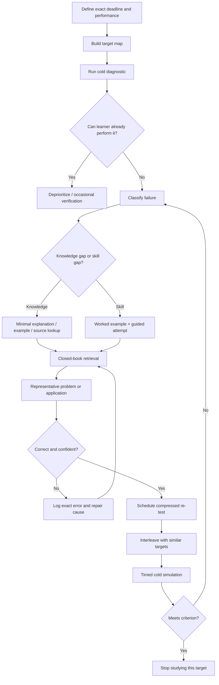

# Rapid Learning Under Deadline: An Evidence-Based System for Cramming and Short-Term Mastery

## Executive summary

**The central finding is blunt:** effective cramming is not “study faster.” It is **aggressively eliminating low-yield learning activity and cycling between minimal input, forced retrieval, representative practice, and immediate error correction**. For a deadline measured in hours rather than months, the optimal system differs from conventional advice designed for durable learning.

The strongest general evidence in learning science favors **practice testing/retrieval practice** and **distributed practice** over passive rereading; a major evidence review rated both as high-utility techniques. However, the spacing literature also shows that the spacing interval that maximizes performance depends on the delay until the final test: as the desired retention interval shrinks, the optimal study gap also shrinks. Therefore, for a one-to-48-hour objective, a compressed schedule using **micro-spacing** is more rational than blindly applying long-term spaced-repetition schedules. citeturn23view14turn23view12

The practical hierarchy for short-term mastery is:

**Targeted retrieval + representative practice > worked examples with self-explanation > focused study of only prerequisite/high-yield material > error-driven repetition > short within-day spacing > broad note-taking, rereading, highlighting, or summary production.** Retrieval practice produces robust testing effects, while repeated study after something has already been learned adds surprisingly little delayed benefit compared with continued retrieval. citeturn1search16turn1search9turn9search1

For novices, immediately attacking difficult problems can be wasteful. **Worked examples are unusually efficient during initial acquisition** because they expose the solution structure without forcing the learner to discover everything through trial and error. Their value rises when the learner explains *why* each step is valid, and then transitions quickly from examples to partially completed and finally independent problems. citeturn6search24turn23view17

**Interleaving is useful but routinely misapplied.** A meta-analysis found an overall moderate benefit, but effects differed substantially across materials. In rapid learning, block practice first when acquiring an unfamiliar procedure, then interleave similar-looking problem types when the task requires choosing the correct method rather than merely executing it. citeturn4search1turn4search0

**Sleep becomes increasingly valuable as the deadline extends.** Meta-analytic evidence indicates that sleep deprivation both before and after learning impairs memory, while acute sleep loss also degrades attention and cognitive performance. If the deadline is tomorrow rather than in two hours, an all-nighter is usually a bad trade: it buys additional exposure at the expense of encoding quality, consolidation, attention, and retrieval reliability. citeturn13search0turn13search12turn13search24

**There is no credible evidence that the canonical 25-minute/5-minute Pomodoro cycle is a biologically optimal learning interval.** Brief breaks can reduce vigilance decrement and micro-breaks tend to improve fatigue/well-being, but research does not identify one universal study-block length. A better engineering default is roughly **35–50 minutes of uninterrupted work followed by 5–10 minutes away from the task**, lengthening blocks when deep problem solving remains productive and shortening them when error rate or mind-wandering rises. citeturn11search10turn12search24

**Caffeine is an alertness tool, not a substitute for sleep or learning technique.** Its major strategic danger in a 24–48-hour protocol is damaging the sleep that would otherwise consolidate learning and restore attention. A systematic review found caffeine reliably worsens multiple sleep outcomes, with effects depending on dose and timing; controlled research confirms that larger doses can interfere with sleep many hours later. There is also intriguing evidence that post-learning caffeine can enhance some forms of 24-hour memory discrimination, but that finding is too narrow to justify treating caffeine as a general memory enhancer. citeturn24search35turn14search1turn14search8

**Generative AI can radically accelerate the input side of learning, but that can become a trap.** A randomized study of an AI tutor found substantially greater learning in less time than an active-learning classroom condition in a specific college-physics setting. Conversely, a large study of GPT-assisted mathematics found that unrestricted AI could improve performance *while the AI was available* yet damage subsequent unaided learning; tutoring-oriented guardrails reduced the problem. The correct role for AI in a cramming system is therefore **compression, explanation, question generation, feedback, and adversarial testing—not answer outsourcing**. citeturn20search0turn20search11turn20search2turn23view3

The resulting rapid-learning architecture is:

> **Define the actual performance → diagnose → triage → acquire the minimum model → retrieve → perform representative tasks → classify errors → repair only the bottlenecks → retrieve again after a gap → simulate the final performance.**

The objective is not “know everything.” It is to maximize **deadline-specific independent performance per minute**.

## Scope, definitions, and cognitive mechanisms

### What counts as cramming

There is no single universally accepted scientific cutoff at which studying becomes “cramming.” For this report, the useful operational distinction is temporal.

**Cramming** means learning concentrated into a short period immediately preceding a performance deadline, with much of the exposure occurring with very short intervals between repetitions. In experimental memory terminology, that resembles **massed practice**, contrasted with distributed or spaced practice. Cepeda and colleagues’ large quantitative review examined 839 assessments from 317 experiments and found that the relationship between spacing and later retention depends strongly on the final retention interval. citeturn23view12

**Rapid learning**, as used here, is broader: any deliberately engineered process designed to achieve a specified level of independent performance within approximately **one to 48 hours**, without requiring that the competence remain intact weeks or months later.

That distinction matters. Conventional learning advice often implicitly optimizes lifetime knowledge. The user’s objective is different:

\[
\text{Rapid-learning objective} \approx
\frac{\text{deadline-relevant independent performance}}{\text{available time}}
\]

not:

\[
\frac{\text{knowledge retained months later}}{\text{study time}}.
\]

That changes the preferred allocation of time. Extremely wide spacing, extensive note systems, elaborate long-term SRS schedules, comprehensive reading, and broad enrichment may all be sensible for durable expertise yet have poor return when the test is tonight.

### What “rapid understanding” should mean

Recognition is an inadequate metric. Seeing a page and thinking “this looks familiar” is cheap and dangerously misleading. Retrieval studies show that learners' subjective predictions can diverge from later performance, particularly when repeated exposure creates fluency without requiring successful recall. citeturn1search16

A useful short-term definition of **understanding** is therefore behavioral. You understand a target well enough when, without the source open, you can:

1. state the central concept or procedure accurately;
2. explain *why* the major steps or relationships hold;
3. distinguish it from nearby alternatives;
4. execute the representative task;
5. handle at least one unfamiliar variant.

Only the fifth criterion meaningfully tests whether you acquired a usable structure rather than memorized one surface example. Analogical-learning research supports explicitly comparing structurally similar cases to promote transfer rather than memorizing isolated instances. citeturn6search19

### The mechanisms that matter under severe time pressure

Rapid learning works by exploiting a few cognitive mechanisms rather than by increasing reading speed indefinitely.

**Attention gates encoding.** Learning cannot compensate efficiently for fragmented attention. Research on smartphone presence suggests that even an available personal phone can consume cognitive resources under some conditions, supporting the practical rule that the device should be physically removed or put into an inaccessible focus state rather than merely ignored. citeturn18search2

**Working memory is constrained.** Novel material imposes heavier processing demands because novices lack organized schemas. Worked examples therefore reduce unnecessary search during initial acquisition, allowing attention to be spent on relationships that define the solution. Classic worked-example research and later studies found substantial advantages for early skill acquisition, particularly when examples are actively processed. citeturn6search24turn6search1

**Chunking converts many independent elements into fewer meaningful units.** Its practical value is not memorizing arbitrary “chunks of seven”; it is recoding details into structures such as “three causes,” “four phases,” “input → transformation → output,” a formula family, a diagnostic decision tree, or a recognizable problem pattern. Working-memory research has repeatedly emphasized limited active capacity and the value of organized representations rather than an unlimited scratchpad. citeturn19search44

**Retrieval changes accessibility.** Attempting to reconstruct an answer makes memory more retrievable and exposes what is unavailable without cues. Karpicke and Roediger found that repeated retrieval after learning produced large later-retention benefits whereas repeated study after successful learning contributed little; broader meta-analytic work confirms a robust testing effect across many conditions. citeturn1search9turn1search16turn9search1

**Elaboration builds relational structure.** Self-explanation is particularly useful because it forces the learner to connect steps to principles. In Renkl's worked-example research, qualitative differences in self-explanation predicted learning gains even after time-on-task was controlled. citeturn23view17

**Discrimination matters when tasks compete.** Blocked practice answers the question “can I execute technique A?” Interleaved practice additionally asks “can I recognize that this is an A rather than B or C problem?” That difference helps explain why interleaving is especially useful when categories or procedures are confusable. citeturn4search1turn4search0

**Consolidation continues after study.** Memory is not finished when the book closes. Sleep deprivation around the learning period reliably impairs aspects of memory and cognition, which is why sleep becomes a genuine component of the learning protocol as soon as the available window includes an overnight period. citeturn13search0turn13search12

**Stress affects different memory stages differently.** A meta-analysis covering 113 studies and 6,216 participants found that acute stress before or during encoding generally impaired memory except under specific tightly coupled conditions; stress immediately before or during retrieval also impaired memory, whereas post-encoding stress sometimes improved retention. This makes deliberate last-minute panic a terrible “activation strategy,” particularly immediately before testing. citeturn24search0

The system should therefore seek **high engagement, low distraction, manageable arousal, repeated independent production, and rapid corrective feedback**.

## Evidence-based techniques and their short-term value

The evidence below distinguishes established effects from recommendations inferred specifically for a one-to-48-hour objective. “Strong” does not mean every learner or subject benefits equally.

| Method | Evidence base | Best rapid-learning use | Main failure mode | Short-term verdict |
|---|---|---|---|---|
| **Retrieval practice / practice testing** | Among the most strongly supported learning techniques; repeated retrieval outperforms repeated restudy for later access. citeturn23view14turn1search16turn9search1 | Recall facts closed-book; solve problems without solution visible; oral explanation; mini-tests | Testing only easy items; immediately looking up answers; recognizing instead of generating | **Core method** |
| **Massed practice** | Usually inferior to spacing for durable retention, but optimal spacing shrinks as the required retention interval shrinks. citeturn23view12turn3search2turn3search3 | Emergency acquisition when deadline is hours away | Mistaking high immediate fluency for mastery; fatigue; rapid forgetting | **Necessary but should contain micro-spacing** |
| **Distributed / spaced practice** | Large meta-analytic literature; optimal gap depends on retention interval. citeturn23view12 | Revisit the same targets after tens of minutes/hours and after sleep | Applying weeks-long SRS schedules to a test tomorrow | **Strong; compress intervals to deadline** |
| **Worked examples** | Strong for initial acquisition, especially novice procedural learning. citeturn6search24turn6search1 | See one or two high-quality complete solutions before independent practice | Watching many examples passively | **Excellent early-stage accelerator** |
| **Self-explanation** | Quality of explanation predicts learning from examples; broadly rated moderate utility. citeturn23view17turn23view14 | Explain each step, assumption, causal link, or rule in plain language | Producing verbose paraphrases rather than causal/principled explanations | **High value when brief** |
| **Interleaving** | Meta-analysis reports a moderate average benefit but strong heterogeneity by material. citeturn4search1 | Mix similar problem types after basic procedures are known | Interleaving totally unfamiliar topics before any schema exists | **Conditional but powerful** |
| **Analogical comparison** | Comparing structurally related cases can improve transfer. citeturn6search19 | Ask “what is invariant across these two examples?” | Matching superficial features rather than underlying relations | **Useful for conceptual transfer** |
| **Chunking / schema formation** | Consistent with constrained working-memory models and expertise research. citeturn19search44turn6search24 | Collapse details into decision trees, taxonomies, formula families, causal chains | Arbitrary mnemonics that do not support actual task performance | **High practical value** |
| **Deliberate / targeted practice** | Deliberate practice correlates with performance, although meta-analysis shows its explanatory power varies greatly by domain and is far from the sole determinant of expertise. citeturn16search0turn18search0 | Identify weakest task component, practice it with feedback, repeat | “Practice” that is just repetition of strengths | **Use the mechanism, ignore 10,000-hour folklore** |
| **Dual verbal + visual representation** | Useful when the visual communicates genuinely relevant structure; generic imagery/mnemonics have much weaker general utility than retrieval or spacing. citeturn23view14 | Diagrams for anatomy, processes, geometry, causal networks, timelines | Decorating notes, redundant graphics, visual clutter | **Conditional** |
| **Summarization** | Broad reviews rate generic summarization below testing and distributed practice. citeturn23view14 | Create a tiny compression sheet *after* understanding, ideally from memory | Rewriting the textbook | **Secondary tool** |
| **Rereading / highlighting** | Rated low utility as general learning strategies in the Dunlosky review. citeturn23view14 | Rapid orientation or locating a specific missing fact | Becoming the dominant study activity | **Minimize** |
| **Short breaks** | Experiments show brief interruptions can attenuate vigilance decrement; micro-break meta-analysis is more consistent for fatigue/well-being than for large performance improvements. citeturn11search10turn12search24 | Reset attention between intense blocks | Phone/social-media breaks that become 30 minutes | **Supportive, not magical** |
| **Sleep** | Meta-analytic evidence links deprivation around encoding/consolidation with impaired memory; sleep loss also harms attention. citeturn13search0turn13search12turn13search24 | Protect a normal sleep period when deadline allows | All-nighter producing extra exposure but worse next-day cognition | **Essential for 24–48 h protocols** |
| **Nap** | Experimental work supports memory consolidation in some tasks, including language learning, while broader evidence varies by nap timing/stage/task. citeturn13search15turn13search23 | Restore an exhausted learner when a longer schedule remains | Long nap causing sleep inertia or sacrificing nighttime sleep | **Situational** |
| **Caffeine** | Reliably affects alertness but can disrupt sleep; post-encoding memory effects are task-specific. citeturn24search35turn14search1turn14search8 | Correct genuine sleepiness early enough not to sabotage later sleep | Escalating doses, using it instead of sleep | **Tactical support only** |
| **Food / “brain food”** | Adult breakfast literature shows a small memory advantage in some circumstances but inconsistent effects elsewhere; composition evidence is weak. citeturn23view10 | Avoid studying while uncomfortably hungry; eat normally | Heavy meals, sugar-loading, supplement hunting | **Do not over-optimize** |
| **Stress reduction** | Acute stress immediately before retrieval can impair memory. citeturn24search0turn24search20 | Downshift before final simulation/test; eliminate avoidable deadline chaos | Trying to “psych yourself up” into panic | **Important near evaluation** |

### Retrieval practice is the backbone

For short-term learning, retrieval has two distinct benefits.

The first is **memory/accessibility**: repeated attempts strengthen later access. The second is arguably even more important during cramming: **diagnosis**. Every closed-book question divides the material into things you can actually produce and things you merely recognize.

A high-efficiency retrieval cycle looks like:

> **Attempt → score → identify the exact failure → inspect only what fixes that failure → close source → re-attempt.**

Do not “review the chapter” after missing one concept. That is an expensive response to a narrow error.

A useful distinction is:

**Fact targets:** flashcards, blank-page recall, oral Q&A.  
**Procedural targets:** complete problems, code, calculations, demonstrations.  
**Conceptual targets:** explain-to-an-adversary questions, causal diagrams from memory, compare/contrast.  
**Performance targets:** full simulations under deadline conditions.

The closer practice is to the actual independent performance, the more useful its score becomes.

### Spacing versus massing: the key cramming correction

The slogan “never cram; always space” is too crude for this objective.

The spacing literature overwhelmingly supports distributed learning when retention is needed over appreciable delays, but the optimum spacing interval is not fixed. Cepeda and colleagues found that the interval producing the greatest retention grows with the interval before the final test. citeturn23view12

So for a two-hour deadline, waiting three days between repetitions is obviously useless. Conversely, doing five identical recalls back-to-back is also inefficient because almost no forgetting has occurred.

The rational compromise is **compressed spacing**:

- first re-test after a short intervening task;
- second re-test after one or several blocks;
- final cold retrieval shortly before the performance;
- when the horizon crosses overnight, retrieve once before and once after sleep.

This intentionally allows *some* forgetting. A retrieval that remains completely effortless may provide little diagnostic information.

### Worked examples, fading, and analogical mapping

A novice should not spend 30 minutes reinventing a procedure that a good worked example can reveal in three.

For unfamiliar procedural domains, use:

**Worked example → self-explain → cover steps → reconstruct → partially completed problem → independent problem → varied problem.**

Worked-example research demonstrates their efficiency during initial acquisition, while self-explanation research shows that deeper principle-based explanation predicts better learning than merely spending longer with the material. citeturn6search24turn23view17

Once one case is understood, compare it with another:

> What looks different?  
> What underlying structure is identical?  
> Which cue tells me which procedure applies?  
> What would have to change for this method to fail?

That is more useful than generating ten nearly identical examples. Analogical encoding has been shown to improve transfer by directing attention toward common relational structure. citeturn6search19

### Interleaving after initial acquisition

Interleaving's average benefit is real but conditional. Brunmair and Richter's multilevel meta-analysis reported an overall moderate effect, approximately Hedges' \(g=0.42\), but found substantial variation among learning materials. citeturn4search1

For cramming, use a **block → interleave** sequence:

> Learn A → practice A twice  
> Learn B → practice B twice  
> Learn C → practice C twice  
> Then mix A/B/C without labels.

The mixed set tests **method selection**, the skill blocked sets hide.

### Deliberate practice in compressed form

Do not import the mythology that “deliberate practice” means grinding for enormous numbers of hours. Meta-analysis suggests deliberate practice explains meaningful but highly variable proportions of performance variance across domains—roughly 26% in games and 21% in music in one influential analysis, but much less in education and professions. Expertise has many determinants. citeturn16search0

The useful part for a rapid-learning system is narrower:

> **specific target + difficulty near current boundary + immediate feedback + repeated correction of the same weakness.**

That is an excellent cramming algorithm even though 24 hours will not create genuine expert-level schemas.

## Session design, physiology, and scheduling

### There is no scientifically privileged Pomodoro interval

The 25/5 Pomodoro structure is a productivity convention, not an experimentally established cognitive optimum. Research supports taking breaks from prolonged attention, but it does not establish that every brain, task, and skill should switch after exactly 25 minutes. Brief, rare breaks have prevented vigilance decrements in controlled attention experiments, while a meta-analysis of micro-breaks found clearer benefits for well-being/fatigue than a universal large boost to objective performance. citeturn11search10turn12search24

For rapid learning, a better default is:

| Work type | Starting block | Break | Why |
|---|---:|---:|---|
| New dense theory | 35–45 min | 5–10 min | Limits passive-input drift |
| Flashcard/retrieval drilling | 25–40 min | 5 min | High mental effort accumulates quickly |
| Hard problem solving/coding | 45–75 min | 10 min | Avoid interrupting productive deep work |
| Practice exam | Match real exam section | Match allowed conditions | Simulation fidelity matters |
| Exhausted / poor focus | 20–30 min | 5–10 min | Better short high-quality effort than fake 90-minute sessions |

These durations are **engineering defaults, not validated biological constants**. Break based on observable degradation: rereading the same line, escalating careless errors, mind-wandering, compulsive task switching, or sharp retrieval slowdown. The empirical case is for protecting sustained attention, not worshipping a timer. citeturn11search10turn12search24

A break should be low-friction: stand, walk, bathroom, water, brief food, stretch. Opening an infinite-scroll feed creates a new attentional task rather than a genuine disengagement from stimulation.

### Sleep versus one more study block

As the horizon moves beyond the current waking period, sleep becomes an increasingly important investment.

Meta-analytic evidence indicates that sleep deprivation both before and after encoding harms memory for newly learned information, and separate evidence shows broad short-term cognitive impairment from acute sleep loss. citeturn13search0turn13search12

Therefore:

**One-to-six-hour deadline:** sleep usually cannot contribute unless the learner is already severely sleep-deprived.

**Twelve-hour deadline:** a brief nap can be rational if fatigue is preventing productive encoding, but sacrificing a large fraction of available study time for an arbitrary nap is not automatically beneficial. Experimental studies show naps can consolidate certain newly learned information, but effects are task- and timing-dependent. citeturn13search15turn13search23

**Twenty-four-to-48-hour deadline:** preserve an overnight sleep period. The all-nighter is usually false economy because the extra hours come with degraded subsequent attention, reaction time, learning, and retrieval. citeturn13search24turn13search0

The final study period before sleep should contain **retrieval**, not merely reading. The first major session after waking should start with **cold retrieval before review**. That turns the overnight interval into both consolidation time and a genuine diagnostic spacing interval.

### Caffeine

Caffeine deserves much less attention than retrieval, problem selection, and sleep.

A systematic review and meta-analysis concluded that caffeine worsens subsequent sleep, including total sleep time and sleep efficiency, and increases sleep-onset latency; the effect varies with amount and timing. citeturn24search35 More recent controlled work reinforces that dose and timing matter and that larger doses can impair sleep even when consumed many hours before bedtime. citeturn14search1

So the correct decision rule is:

> **Use caffeine to protect a high-value learning block only when the resulting alertness is worth any sleep cost.**

That usually means avoiding the amateur strategy of repeatedly escalating intake throughout a 24–48-hour cram.

A notable experiment found that caffeine administered after study improved performance on a particular 24-hour discrimination-memory test, suggesting a possible consolidation effect, but this narrow result should not be generalized into “caffeine makes you learn faster.” citeturn14search8

### Food and hydration

The evidence does not support hunting for a special acute “learning diet.” A review of adult breakfast experiments found a small but fairly robust benefit for memory, particularly delayed recall, but effects on attention and executive functions were equivocal and evidence about optimal breakfast composition was insufficient for strong conclusions. citeturn23view10

The practical lesson is boring because reality is boring: eat in a way that prevents distracting hunger or post-meal lethargy. Do not spend scarce preparation time optimizing glucose hacks, supplements, or exotic foods.

### Stress management immediately before performance

“Some stress helps me focus” should not be converted into “more stress is better.”

The largest relevant meta-analysis found timing-specific effects: acute stress immediately preceding or occurring during retrieval tends to impair episodic recall. citeturn24search0 A systematic review focused specifically on retrieval similarly concluded that stress commonly impaired retrieval under studied conditions. citeturn24search20

Accordingly, the last 15–30 minutes before an important test should generally **reduce uncertainty rather than introduce new material**:

close remaining information gaps only if critical, conduct a brief confidence-building recall of core structures, organize materials, remove logistical surprises, and stop frantic topic switching.

## Materials, formats, and technology

### Choose material by conversion speed, not perceived seriousness

The best resource is the one that moves you from ignorance to correct independent performance fastest.

| Format | Excellent for | Poor use under time pressure |
|---|---|---|
| **Practice tests / past questions** | Diagnosing target skills; final simulation; prioritization | Using answers immediately without first attempting |
| **Worked solutions** | New procedures, mathematics, coding, accounting, technical reasoning | Watching solution after solution without reconstruction |
| **Flashcards** | Vocabulary, definitions, formulas, mappings, atomic facts | Complex essays, broad reasoning, multi-step skills |
| **Text / transcript** | Searchable facts, definitions, conceptual mapping, rapid skimming | Linear rereading from page one |
| **Video** | Dynamic procedures, demonstrations, spatial/mechanical phenomena | Watching full-length lectures when only 10% is relevant |
| **One-page summary** | Compression and final cue sheet | Spending hours making it aesthetically perfect |
| **Concept diagram** | Causal systems, anatomy, hierarchies, timelines | Decorative “dual coding” with irrelevant pictures |
| **AI tutor** | Fast explanations, transformation, quizzes, counterexamples, feedback | Supplying final answers before the learner attempts |

Generic summarizing, highlighting, and rereading have much weaker support than testing or distributed practice in the major Dunlosky review. citeturn23view14 The implication is not that summaries are useless; it is that **summary creation should consume only a small fraction of a short learning window**.

A useful compression sheet contains only:

**rules you keep forgetting; distinctions you keep confusing; formulas/cues; error patterns; one canonical example; one exception.**

It is an error-repair artifact, not a rewritten textbook.

### Flashcards and SRS

Spaced-repetition software is built around an excellent principle—retrieval separated by intervals—but default algorithms often optimize retention over weeks, months, or years. The spacing literature shows why that is mismatched to a 24-hour deadline: optimal gaps scale with the desired retention interval. citeturn23view12

For emergency use, treat Anki, RemNote, Quizlet, or similar software primarily as **retrieval engines** rather than trusting their normal long-term schedule.

A rapid deck should be:

- small;
- directly tied to the evaluation;
- answerable in seconds for factual material;
- aggressively edited or deleted;
- reviewed using short custom intervals;
- supplemented by actual practice problems whenever the target requires application.

A 500-card deck created the night before an exam is usually a sign of poor prioritization, not sophistication.

### AI summarizers and tutors

Generative AI has unusually high potential in rapid learning because **information transformation is one of the major time sinks in traditional studying**.

A model can quickly turn a source into:

- a prerequisite map;
- a compact explanation at the learner's current level;
- worked examples;
- comparison tables;
- flashcards;
- diagnostic questions;
- increasingly difficult variations;
- adversarial oral examination;
- error explanations;
- alternate analogies.

Recent randomized evidence makes the potential real rather than hypothetical. In a college-physics study, a carefully designed AI tutor produced substantially greater learning in less time than an in-class active-learning condition, although this was one context and should not be treated as proof that any chatbot beats any teacher. citeturn20search0turn20search11

The danger is equally real. Research on generative AI in high-school mathematics found that access to unguarded GPT assistance can increase performance while students are using the tool yet undermine subsequent unaided learning; tutoring-style restrictions that encourage learning rather than answer copying reduced that risk. citeturn20search2turn23view3

Therefore the AI protocol should be:

> **Learner attempts first → AI critiques → learner repairs → AI generates a variant → learner solves unaided.**

Not:

> **Learner asks → AI answers → learner reads → learner feels smart.**

For high-stakes factual material, AI-generated content should be grounded against authoritative source material rather than accepted from the model's memory. AI's greatest value is **compressing the feedback loop**, not replacing verification.

### Note-taking systems

A conventional “second brain” can become procrastination wearing intellectual clothing.

For a 48-hour objective, elaborate backlinks, taxonomy design, perfect Markdown, knowledge graphs, and beautiful notebooks have almost no intrinsic value unless the task itself depends on producing those artifacts.

Use one scratch document with four zones:

| Zone | Contents |
|---|---|
| **Target map** | What can actually appear or must actually be performed |
| **Core model** | Minimum rules/concepts/procedures |
| **Error log** | Error → cause → corrective rule |
| **Final sheet** | The smallest set of prompts needed for final retrieval |

The quality metric for notes is not completeness.

It is:

> **How many future errors does this note prevent per minute spent producing it?**

## Implementation blueprint and measurement system

The optimal rapid-learning system is a **closed feedback loop**, not a linear curriculum.

The structure reflects the strongest recurring findings: retrieval rather than repeated exposure, initial example support for unfamiliar skills, spacing between repeated attempts, and feedback-driven targeting. citeturn1search16turn23view12turn6search24turn23view17

### Rapid-learning workflow

**Define the output.** Write the exact behavior required at the deadline. “Learn organic chemistry” is meaningless. “Correctly identify the reaction type and predict the major product for the reaction families represented on the exam” is actionable.

**Build a weighted target map.** Assign each topic an estimated importance:

\[
P_i = \text{probability of appearing} \times \text{impact if failed} \times \text{current weakness}.
\]

The values do not need scientific precision. Their purpose is to prevent spending 45 minutes perfecting a 2% topic while ignoring a 20% topic.

**Cold diagnostic first.** Attempt representative questions before studying. This prevents wasting time learning what is already available.

**Acquire the minimum viable model.** Read/watch only until you can articulate the governing rule, then switch to production.

**Retrieve immediately.** Close everything. Write, speak, draw, calculate, code, or solve.

**Correct at the level of cause.** An error such as “wrong answer” is too broad. Error causes might be:

- missing fact;
- confused distinction;
- wrong method selection;
- algebra/execution error;
- omitted constraint;
- misread prompt;
- failure under time pressure.

Different causes require different repairs.

**Re-test rather than reread.** Re-exposure is allowed only long enough to repair the failure.

**Introduce delay and interference.** Move to another target, then return.

**Interleave confusable items.** Once basic competence exists, remove labels that tell you which method to use. citeturn4search1

**Run a cold simulation.** No notes, no tutor, no AI, realistic time.

**Stop when the target clears criterion.** This is one of the most important rules. Crammers frequently overpractice comfortable material because success feels rewarding. That is wasted marginal time.

### Minimal templates

**Target card**

> **Performance:** What must I be able to do?  
> **Deadline:** When?  
> **Representative test:** What task proves it?  
> **Prerequisites:** What must be known first?  
> **Criterion:** What score/time/error rate counts as sufficient?

**Error card**

> **Prompt:**  
> **My answer/action:**  
> **Correct answer/action:**  
> **Root cause:**  
> **One-sentence corrective rule:**  
> **Next variant to test:**

**Concept compression**

> **What is it?**  
> **Why does it work?**  
> **When do I use it?**  
> **When do I *not* use it?**  
> **What is it commonly confused with?**  
> **One canonical example:**  
> **One boundary case:**

**Worked-example self-explanation**

> Why was this step chosen?  
> What information made it valid?  
> What alternative would be wrong?  
> What would change the next step?

This targets the kind of principle-based and anticipatory self-explanation associated with stronger learning from worked examples. citeturn23view17

### KPIs for short-term mastery

Do not track “hours studied.” Hours are an input, not an outcome.

| KPI | Definition | Interpretation |
|---|---|---|
| **Cold Retrieval Accuracy** | Correct items recalled without cues / attempted items | Measures independent accessibility |
| **Representative Performance Score** | Score on tasks matching the actual evaluation | Primary outcome |
| **Transfer Score** | Accuracy on unfamiliar variants | Distinguishes understanding from template copying |
| **Time to Criterion** | Minutes until a target first reaches threshold | Measures learning efficiency |
| **Error Recurrence Rate** | Repeated previously logged errors / total errors | Tests whether correction is working |
| **Coverage of Weighted Targets** | Mastered priority weight / total priority weight | Prevents overtraining one chapter |
| **Calibration Gap** | Predicted score − actual score | Detects overconfidence |
| **Retrieval Latency** | Time required to generate correct answer | Useful when final performance is timed |
| **Unaided-to-Aided Gap** | Performance without tools versus with notes/AI | Detects tool dependence |

For an exam-like setting, **Representative Performance Score and unaided performance should dominate the dashboard**. A learner with 95% flashcard accuracy but 55% performance on realistic problems is not 95% prepared.

A useful mastery gate might be:

> at least two successful independent attempts, separated by another task or meaningful delay, with one attempt being a novel variant.

That threshold is an operational heuristic rather than a universal research-derived cutoff.

## Recommended protocols from one to forty-eight hours

These schedules translate the evidence into usable operating procedures. Exact block lengths and gaps are necessarily heuristic because the experimental literature does not provide a universal “optimal 17-minute gap” for every subject, learner, and evaluation. The principles—retrieval, feedback, spacing scaled to retention horizon, worked examples for novices, and sleep preservation over overnight windows—are much better established. citeturn23view12turn1search16turn6search24turn13search0

| Time available | Recommended protocol | What to sacrifice |
|---|---|---|
| **1 hour** | 5 min target/diagnostic → 10–15 min minimum model or worked examples → 25 min closed-book retrieval/representative problems → 10 min targeted correction → final 5 min cold recall | Comprehensive coverage, notes, videos, low-probability details |
| **2–3 hours** | Diagnostic → 2–3 × ~40-min target blocks → re-test first material after intervening block → final mixed simulation | Perfect understanding of every subsection |
| **4–6 hours** | Weighted diagnostic → acquisition blocks → first retrieval → rotate topics → second retrieval after 1–3 intervening blocks → mixed problems → final simulation | Passive review and aesthetic note production |
| **6–12 hours** | Two major learning waves separated by food/walk/rest; use block→interleave sequence; re-test high-value targets several hours later; nap only if fatigue makes study unproductive | Marginal details and optional enrichment |
| **12–24 hours** | Day: triage/acquire/practice → evening cold retrieval → normal overnight sleep where feasible → morning cold diagnostic before any review → repair → timed simulation | All-nighter and late-stage broad expansion |
| **24–48 hours** | Day 1 build schemas and achieve broad coverage → spaced evening retrieval → sleep → Day 2 cold retrieval and error-driven deliberate practice → increased interleaving → final full simulation → light pre-test recall | Long-term SRS schedules and rereading already-mastered material |

### Emergency protocol: one hour

**Minute 0–5: Define the target.** Determine what generates the score or required outcome.

**Minute 5–15: Cold diagnostic.** Attempt a small representative sample. Do not warm up by reading first.

**Minute 15–30: Acquire only bottlenecks.** For procedural topics, use a worked example; for factual topics, create or obtain a compact target list.

**Minute 30–50: Produce.** Closed-book questions/problems. Spend more time retrieving than consuming information.

**Minute 50–57: Error repair.** Review only errors and high-priority uncertainty.

**Minute 57–60: Final reconstruction.** Write the essential rules/formulas/decision process from memory.

In an hour, there is virtually no justification for making polished notes.

### Three-hour protocol

**First 15 minutes:** diagnostic and priority map.

**Next 40 minutes:** highest-value topic, worked example → independent practice.

**5–10-minute break.**

**Next 40 minutes:** second high-value topic.

**Then:** return to topic one without notes for compressed spacing.

**Next block:** mixed problems combining both, adding a third topic only if the first two are above criterion.

**Final 20–30 minutes:** realistic cold simulation and surgical repair.

This structure converts spacing from a long-term calendar strategy into an intra-session mechanism. The rationale follows evidence that optimal spacing depends on the final retention interval. citeturn23view12

### Six-hour protocol

Think in **two waves** rather than six continuous hours.

**Wave A:** diagnose → learn high-value material → retrieve once.

Take a real break.

**Wave B:** return cold → retrieve again → solve mixed/novel cases → attack recurring errors.

Finish with a representative mini-exam, not another lecture.

The most important transition occurs approximately halfway through: **input should decline while unaided output rises**.

### Twelve-hour protocol

Divide the available targets into:

**Must perform**, **should perform**, **nice to know**.

Complete most new acquisition in the first portion. As the deadline approaches, progressively shift toward retrieval and representative execution.

A useful allocation is conceptually:

\[
\text{Early: more acquisition} \rightarrow
\text{Middle: acquisition + retrieval} \rightarrow
\text{Late: mostly retrieval + simulation}.
\]

If fatigue becomes so strong that the learner is rereading without encoding, continuing to “study” merely inflates logged hours. Nap or rest becomes rational when it restores a subsequent high-quality block; nap research supports consolidation benefits in some learning contexts, though there is no universal nap prescription. citeturn13search15turn13search23

### Twenty-four-hour protocol

The main strategic decision is whether to sleep.

The evidence strongly favors preserving sleep rather than treating an all-nighter as free extra learning time. Sleep deprivation impairs memory and sustained attention. citeturn13search0turn13search24

**Before sleep:** test the highest-value material from memory.

**After waking:** do *not* begin by reading your notes. Test first. The overnight gap provides a high-information measurement of what survived.

Then concentrate the remaining time on:

1. failures from morning retrieval;
2. mixed/novel problems;
3. a realistic timed simulation;
4. final correction of recurring errors.

Avoid learning a large marginal topic immediately before the test unless its expected value is unusually high.

### Forty-eight-hour protocol

Forty-eight hours is enough time to exploit meaningful spacing and two sleep opportunities while remaining a genuine cram.

**First day:** establish the conceptual/procedural skeleton. Work breadth-first across high-priority targets so you do not reach the second day having mastered only one chapter.

**First evening:** cold retrieval of the day's major targets.

**Second morning:** diagnostic before review. Re-rank priorities using actual failures rather than yesterday's confidence.

**Second day:** error-driven practice, interleaving, transfer items, increasingly test-like conditions.

**Final evening/night:** do not destroy the second sleep period to chase marginal coverage. Sleep-loss evidence makes that trade increasingly unattractive. citeturn13search0turn13search12

**Final pre-performance session:** brief core recall, a few representative items, and arousal reduction. Acute stress immediately before retrieval is more likely to hurt than help memory access. citeturn24search0

## Trade-offs, limitations, ethics, and final checklist

### What this system optimizes—and what it deliberately does not

The system optimizes **short-horizon performance**, not durable expertise.

That creates several predictable costs.

**Rapid forgetting is expected.** Compressing spacing and terminating practice immediately after deadline criterion sacrifices the long-term benefits of repeated retrieval across longer intervals. Cepeda's spacing findings directly imply that schedules optimal for tomorrow are not optimal for next semester. citeturn23view12

**Transfer will be narrower.** A learner can become competent on a well-defined task in hours without possessing the rich schemas accumulated by experts over years.

**False confidence remains dangerous.** Immediate repeated success can result from residual activation and contextual cues. This is why the system requires cold testing, delayed testing, and unfamiliar variants rather than consecutive identical repetitions.

**Prior knowledge changes everything.** Worked examples can be extremely efficient for novices, while experienced learners may be better served by immediate problem solving. The same six-hour window can produce radically different gains depending on what schemas already exist. Worked-example research itself emphasizes initial skill acquisition rather than claiming that fully guided examples are always optimal. citeturn6search24turn6search1

**Domain matters.** Memorizing anatomy labels, acquiring a programming API, preparing a law-school issue spotter, learning pronunciation, and developing a physical motor skill do not have identical learning curves. Interleaving effects, for example, vary substantially by material. citeturn4search1

**Meta-analytic educational effects are not precise recipes.** Research can establish that retrieval generally beats passive restudy or that spacing affects retention without proving that a particular learner should study for exactly 43 minutes and wait exactly 96 minutes. Any system claiming a universally optimal timer is pretending to a precision the science does not support.

### Ethical boundaries

Rapid learning itself presents no ethical problem. The important distinction is between **accelerating learning** and **outsourcing the performance being evaluated**.

Using AI to explain a concept, generate practice problems, challenge an argument, or provide feedback can increase learning efficiency. Using it to produce an answer that rules require you to produce independently changes the nature of the act and may constitute academic or professional misconduct. The emerging AI-learning evidence also suggests a practical reason not to cheat yourself: unrestricted answer generation can improve assisted performance while degrading independent learning. citeturn20search2turn23view3

A second boundary concerns **safety-critical competence**. Short-term passing ability should never be equated with safe professional competence in medicine, aviation, engineering, hazardous operations, or other domains where failure can injure others. The system can accelerate acquisition of knowledge; it cannot erase requirements for supervised practice, durable skills, judgment, or certification.

A third boundary concerns pharmacological optimization. Using escalating caffeine or non-prescribed stimulants to manufacture additional waking hours is not a sensible extension of learning science. Even ordinary caffeine can undermine the sleep needed later in a 24–48-hour protocol. citeturn24search35turn14search1

### Final rapid-learning checklist

**Before studying**

- [ ] I can state exactly what I must be able to *do*, not merely what I must “study.”
- [ ] I know the deadline and evaluation format.
- [ ] I have ranked topics by probable value and current weakness.
- [ ] I have attempted a cold diagnostic.
- [ ] My phone/notifications and unrelated tabs are removed from the environment. Research on smartphone presence supports treating distraction control as cognitive-resource protection rather than a matter of willpower alone. citeturn18search2

**During acquisition**

- [ ] I am using the smallest amount of explanation necessary to begin producing.
- [ ] For a new procedure, I have examined one or two good worked examples rather than blindly trial-and-erroring indefinitely. citeturn6search24
- [ ] I can explain why each important step works.
- [ ] I convert material into a small number of causal structures, categories, or decision rules rather than isolated details.
- [ ] Visuals are being used because they clarify structure, not to decorate notes.

**During practice**

- [ ] Most of my learning time now requires me to generate an answer.
- [ ] I attempt before checking.
- [ ] Every mistake has a root-cause label.
- [ ] I re-test the corrected error.
- [ ] I revisit important targets after an intervening topic rather than repeating them instantly. citeturn23view12
- [ ] Once basic procedures are known, I mix confusable problem types. citeturn4search1
- [ ] I include unfamiliar variants so I am testing transfer rather than imitation.

**Using technology**

- [ ] Flashcards contain atomic retrievable material rather than paragraphs.
- [ ] My SRS intervals reflect an hours/days deadline rather than a months/years objective.
- [ ] AI asks, explains, critiques, and generates variants—but I still perform the target unaided.
- [ ] I verify high-stakes AI-generated facts against authoritative source material.
- [ ] My note system is an error log and compression tool, not a craft project.

**Managing energy**

- [ ] Work blocks end when productive attention falls, not because an arbitrary timer is sacred.
- [ ] Breaks do not become social-media sessions.
- [ ] Caffeine is not compromising the sleep period I still need. citeturn24search35turn14search1
- [ ] If the timeline includes a night, I have protected meaningful sleep instead of automatically choosing an all-nighter. citeturn13search0turn13search12
- [ ] I am eating normally rather than searching for a miracle cognitive food; acute dietary evidence does not justify elaborate nutritional optimization. citeturn23view10

**Before the deadline**

- [ ] I have completed at least one cold, unaided simulation.
- [ ] My score—not my feeling of familiarity—is above criterion.
- [ ] Previously corrected errors are not recurring.
- [ ] I can distinguish similar concepts or methods without labels.
- [ ] I have stopped spending time on already-mastered easy material.
- [ ] I am reducing stress rather than frantically expanding scope; acute stress immediately before retrieval can impair memory access. citeturn24search0

### Key research worth reading directly

| Study / review | Why it matters |
|---|---|
| **Dunlosky et al. (2013), “Improving Students’ Learning With Effective Learning Techniques”** | Major synthesis comparing ten common study techniques; strongest general support for practice testing and distributed practice. citeturn23view14 |
| **Cepeda et al. (2006), “Distributed Practice in Verbal Recall Tasks”** | Meta-analysis of 317 experiments showing that optimal spacing depends on the desired retention interval—the key result for rational short-horizon spacing. citeturn23view12 |
| **Karpicke & Roediger (2008), “The Critical Importance of Retrieval for Learning”** | Demonstrates the outsized role of retrieval compared with repeated studying after learning. citeturn1search16 |
| **Rowland (2014), “The Effect of Testing Versus Restudy on Retention”** | Broad meta-analysis of the testing effect. citeturn9search1 |
| **Sweller & Cooper (1985), worked examples in algebra** | Foundational evidence for using worked examples to accelerate initial procedural acquisition. citeturn6search24 |
| **Renkl (1997), “Learning from Worked-Out Examples”** | Shows why active self-explanation, not passive example viewing, matters. citeturn23view17 |
| **Brunmair & Richter (2019), interleaving meta-analysis** | Establishes a moderate but content-dependent interleaving effect. citeturn4search1 |
| **Loewenstein, Thompson & Gentner (1999), analogical encoding** | Important evidence that comparison of structurally related examples can promote transfer. citeturn6search19 |
| **Shields et al. (2017), acute stress and episodic memory meta-analysis** | 113 studies and 6,216 participants; clarifies why stress timing matters for encoding and retrieval. citeturn24search0 |
| **Newbury et al. (2021), sleep deprivation and memory meta-analyses** | Supports protecting sleep when a rapid-learning timeline extends overnight. citeturn13search0 |
| **Gardiner et al. (2023), caffeine and subsequent sleep** | Quantifies the sleep trade-off underlying caffeine decisions during a cram. citeturn24search35 |
| **Macnamara, Hambrick & Oswald (2014), deliberate-practice meta-analysis** | Corrects exaggerated claims about deliberate practice while preserving the value of focused feedback-driven practice. citeturn16search0 |
| **Kestin et al. (2025), AI tutoring randomized controlled trial** | Shows the potentially large learning-efficiency gains from carefully designed AI tutoring in a real educational setting. citeturn20search0turn20search11 |
| **Bastani et al., “Generative AI without guardrails can harm learning”** | Demonstrates the central AI paradox: better assisted task performance can coexist with worse independent learning. citeturn20search2turn23view3 |

The evidence therefore supports a fairly uncompromising design principle: **when the clock is the constraint, consume information only until you can start producing; thereafter, make your failures determine what you study next.** Retrieval supplies the signal, worked examples accelerate the first model, compressed spacing prevents immediate fluency from fooling you, interleaving tests discrimination, feedback concentrates practice on bottlenecks, and sleep protects performance whenever the timeline is long enough to permit it. citeturn1search16turn23view12turn6search24turn4search1turn13search0
