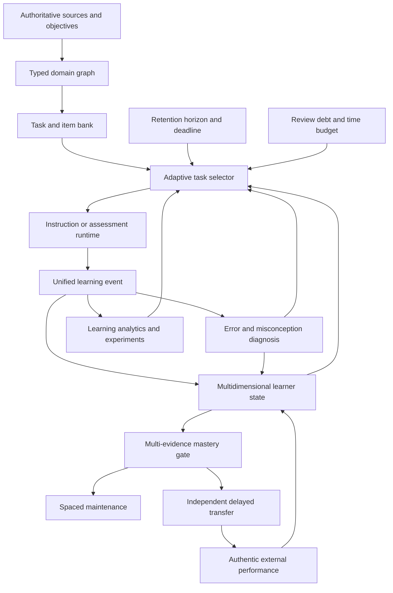

# Implementation Blueprint for an Ultimate Learning Engine

## Purpose

This document is an improvement-only evaluation and implementation plan for the learning system. It does not catalog existing strengths. It identifies what remains incomplete, inconsistent, weakly enforced, or unmeasured, then specifies the additions required to turn the program from a sophisticated AI-guided study workflow into a defensible adaptive learning engine.

The standard is not whether the program can produce a convincing lesson. The standard is whether it can cause and verify **durable, independent, transferable performance at the learner's intended future time**.

The two governing research documents are:

- [`research/learning.md`](research/learning.md), which defines the long-term architecture as **Model → Generate → Retrieve → Correct → Compare → Vary → Transfer → Space → Reassess**.
- [`research/cramming.md`](research/cramming.md), which defines the short-horizon architecture as **define performance → diagnose → triage → acquire the minimum model → retrieve → perform representative tasks → classify errors → repair bottlenecks → retrieve after a gap → simulate**.

The target product is not a chatbot with learning techniques in its prompt. It is an **evidence-producing instructional control system** in which domain structure, learner state, task selection, assistance, assessment, scheduling, and real-world outcomes are represented explicitly and enforced by runtime code.

---

# 1. Overall evaluation: what must be better

## 1.1 The pedagogy is more advanced than the runtime model

The instructional skills describe distinct evidence dimensions, graduated feedback, transfer, misconception repair, delayed retrieval, interleaving, and multi-evidence mastery. The runtime does not yet represent all of these distinctions faithfully.

The main example is `.pi/extensions/bkt-engine.ts`. It accepts recognition, cued recall, free recall, self-explanation, and application evidence, but all of them ultimately update one scalar `pL`. Confidence, a gap flag, and a Feynman count are stored alongside that value, but there is no independent estimate of:

- memory accessibility;
- structural understanding;
- discrimination among confusable concepts;
- near and farther transfer;
- procedural fluency;
- scaffold dependence;
- confidence calibration.

This conflicts with the learner-state architecture in `research/learning.md:504-534`, which explicitly requires memory, understanding, discrimination, and calibration to remain separate. It also conflicts with `research/learning.md:31-44`, which warns that collapsing the dimensions into a single mastery number destroys diagnostic information.

**Required correction:** make the multidimensional learner model the authoritative state used by routing, mastery, scheduling, dashboards, and DAG unlocking. A scalar may remain as a convenience summary, but it must never be the source of truth.

## 1.2 The system often recommends research-backed behavior without enforcing it

Several high-value learning rules exist as skill instructions rather than runtime invariants. An agent can be told to run a delayed transfer check, classify an error, record evidence, or avoid clearing a gap on the remediation item, but the underlying tools do not always prevent invalid progression.

Examples include:

- DAG nodes unlocking from `pL` alone in `.pi/extensions/dag-manager.ts`;
- provisional gaps being clearable by same-session evidence in `.pi/extensions/bkt-engine.ts`;
- a student subagent result incrementing Feynman completion and potentially clearing a gap without a separately validated learner explanation;
- Activity Studio returning results that the tutor is merely instructed to record later;
- blurt evaluation printing a suggested evidence call instead of ingesting evidence atomically;
- simulation being a mode label rather than a strict assessment environment.

The research requires mastery to be a gate backed by multiple kinds of evidence (`research/learning.md:221-234`) and requires corrected errors to be re-tested after a lag on a parallel instance (`research/learning.md:272-310`). These must become code-level conditions.

**Required correction:** convert every essential pedagogical rule into a typed state transition, validation rule, or explicit gate. Prompts should explain policy; runtime code should enforce policy.

## 1.3 The current knowledge representation is too narrow

The existing DAG represents prerequisite order. That answers “what must be learned before what?” but not:

- what concepts are commonly confused;
- which cases are analogous;
- which representations express the same relationship;
- which subskills compose a larger procedure;
- which misconceptions attach to a concept;
- where the concept should transfer;
- which examples are near-misses or boundary cases.

`research/learning.md:236-252` requires prerequisite, component, confusability, analogy, representation, and transfer edges. `research/learning.md:485-502` requires concepts, facts, procedures, misconceptions, examples, non-examples, analogies, confusable pairs, representations, and transfer targets.

**Required correction:** replace the prerequisite-only DAG with a typed domain multigraph. Preserve a DAG view for prerequisite gating, but allow non-prerequisite relation types to form a richer graph.

## 1.4 Assessment data is too weak to support the research metrics

The research requires delayed retrieval, delayed application, retention ratio, forgetting slope, latency, confidence calibration, relearning efficiency, and transfer retention (`research/learning.md:46-63`). It also specifies a minimum event log including exact response, latency, confidence, hint depth, feedback, representation, prior interval, error category, and later performance (`research/learning.md:566-588`).

Current quiz and activity result schemas do not consistently capture these fields. The system therefore cannot reliably calculate:

- learning gain per minute;
- actual calibration error;
- assistance dependence;
- response-speed changes;
- error recurrence;
- retention curves;
- representation-specific weakness;
- delayed transfer;
- causal effects of different interventions.

**Required correction:** introduce one append-only, versioned learning-event schema and route all assessment tools through it.

## 1.5 “Mastery” is not yet a sufficiently strict state

The research states that a learner should not be called mastered based on repeated same-session success (`research/learning.md:46-63`) and proposes four pieces of evidence for important concepts:

1. unaided retrieval;
2. use in an unfamiliar case;
3. discrimination from a confusable alternative;
4. success after a meaningful delay.

The current runtime still allows mastery-like labels and DAG progression to be driven too strongly by the scalar score. The web memorizer also uses same-session “mastery” language for typed success, even though the research distinguishes acquisition from durable learning.

**Required correction:** define explicit lifecycle states—`unseen`, `introduced`, `acquired`, `independently-produced`, `transfer-demonstrated`, `delay-verified`, `provisionally-mastered`, `durably-mastered`, and `lapsed`. Do not use “mastered” for same-session success.

## 1.6 Scheduling is centered on cards instead of complete learning objects

The current FSRS scheduler is appropriate for discrete prompts, but `research/learning.md:314-334` says a serious scheduler must also schedule relationships, explanations, procedures, discrimination tasks, representation conversions, analogies, transfer cases, and error patterns.

Current review ordering also lacks the full priority function proposed in `research/learning.md:336-358`: forgetting probability, importance, prerequisite centrality, future use date, conceptual uncertainty, interference, and review cost. Cram prioritization likewise needs the weighted target logic in `research/cramming.md:387-425` and the deadline-specific metrics in `research/cramming.md:465-487`.

**Required correction:** generalize the queue from `ReviewCard` to `ScheduledLearningTask`, then select tasks by expected durable competence gain per minute under deadline, cognitive-load, prerequisite, and review-debt constraints.

## 1.7 The system cannot yet prove independence from AI

Both research files warn that assisted performance can rise while unaided learning falls. `research/learning.md:411-423` states that AI must not perform the target operation, and `research/learning.md:722-728` requires no-AI delayed transfer testing. `research/cramming.md:305-334` requires attempt → critique → repair → changed variant → unaided solution.

Current conversational assessments can still contain contextual cues from the immediately preceding lesson. A simulated assessment inside the same chat is not equivalent to performance in a clean context.

**Required correction:** add a strict independent-assessment runtime that creates a clean assessment context, disables help, delays feedback, enforces time and permitted aids, and links the result back to the learner model only after submission.

## 1.8 Error handling is descriptive rather than computational

The teaching skills contain a useful taxonomy—memory failure, prerequisite gap, conceptual error, discrimination failure, execution slip, omitted constraint, prompt misread, and time-pressure failure. The runtime generally stores correctness and a coarse gap status instead of a persistent error object.

The research requires different interventions for different causes (`research/learning.md:294-310`; `research/cramming.md:399-425`). Without structured error state, the task selector cannot reliably choose the right repair.

**Required correction:** implement a misconception/error registry with recurrence, triggering contexts, corrective rule, intervention history, and required verification task.

## 1.9 The system measures internal exercises more than authentic outcomes

The strongest outcome in the research is delayed transfer to structurally novel problems (`research/learning.md:590-628`). Internal quizzes and generated activities are useful but can become self-referential: the same system creates the explanation, creates the test, grades the response, and updates its own estimate.

**Required correction:** ingest external evidence from real exams, projects, human experts, code review, presentations, workplace outcomes, and physical practice. External outcomes must be capable of overriding internal estimates.

## 1.10 Product configuration is fragmented

Mode timing, thresholds, terminology, skill content, and scheduler behavior are spread across Markdown skills and TypeScript extensions. This creates the possibility that a skill describes one policy while runtime code executes another. For example, phase allocations are duplicated and can disagree, and invalid totals may be normalized silently.

**Required correction:** create one canonical, versioned policy manifest from which skills, runtime validators, documentation, and tests are generated or checked.

---

# 2. Target definition

## 2.1 North-star objective

The engine should optimize:

> **Expected probability of successful, unaided retrieval and transfer at the learner's target future time, per minute of learning effort.**

This is taken directly from `research/learning.md:65-77`.

The engine must not optimize primarily for:

- time in the application;
- streaks;
- number of questions answered;
- same-session accuracy;
- lesson completion;
- quantity of notes;
- learner-reported ease;
- AI response quality in isolation.

## 2.2 Required evidence hierarchy

The engine should rank evidence from weakest to strongest:

1. exposure;
2. recognition;
3. cued production;
4. free retrieval;
5. self-explanation;
6. method discrimination;
7. independent representative application;
8. independent novel transfer;
9. delayed novel transfer;
10. authentic external performance.

Correctness must be qualified by:

- delay since last exposure;
- assistance and hint depth;
- novelty of the item;
- fidelity to the real task;
- response latency;
- confidence before feedback;
- representation used;
- recurrence of previous errors;
- source and grading reliability.

## 2.3 Target architecture



---

# 3. Foundational implementation: unified learning data

## 3.1 Create a versioned `LearningEvent` schema

### Research basis

`research/learning.md:566-588` lists the minimum data required to reason about learning rather than usage. `research/cramming.md:465-481` defines cold retrieval accuracy, representative performance, transfer, time to criterion, recurrence, weighted coverage, calibration gap, latency, and unaided-to-aided gap.

### Implementation

Add a shared module such as:

```text
.pi/core/learning-events.ts
.pi/core/schemas/learning-event-v1.ts
```

Every quiz, activity, blurt, review, Feynman explanation, simulation, imported result, and project checkpoint must emit the same event type.

Required fields:

```ts
interface LearningEventV1 {
  version: 1;
  eventId: string;
  learnerId: string;
  sessionId: string;
  attemptId: string;
  parentAttemptId?: string;
  occurredAt: string;

  topicId: string;
  knowledgeObjectIds: string[];
  skillIds: string[];
  taskId: string;
  itemFamilyId?: string;
  parallelFormId?: string;

  mode: "teach" | "fast-learn" | "cram" | "project" | "assessment" | "maintenance";
  phase: "diagnostic" | "instruction" | "practice" | "assessment" | "review" | "external";
  taskType:
    | "exposure"
    | "recognition"
    | "cued-recall"
    | "free-recall"
    | "self-explanation"
    | "discrimination"
    | "prediction"
    | "procedure"
    | "representation-conversion"
    | "analogy"
    | "error-diagnosis"
    | "near-transfer"
    | "far-transfer"
    | "simulation"
    | "authentic-performance";

  prompt: string;
  response: unknown;
  rubricId?: string;
  rubricScores?: Record<string, number>;
  score: number;
  correct?: boolean;

  startedAt: string;
  submittedAt: string;
  latencyMs: number;
  priorExposureAt?: string;
  priorIntervalMs?: number;
  priorEncounterCount: number;

  confidenceBefore?: number;
  predictedScore?: number;
  predictedLatencyMs?: number;

  hintsRequested: number;
  maximumHintDepth: number;
  assistanceState: "none" | "minimal" | "guided" | "worked-solution" | "AI-performed";
  feedbackIds: string[];
  feedbackShownAt?: string;

  representation: "verbal" | "symbolic" | "graphical" | "spatial" | "procedural" | "mixed";
  novelty: "repeated" | "isomorphic" | "near-transfer" | "far-transfer" | "authentic";
  sourceContext: "generated" | "authoritative-bank" | "learner-supplied" | "external-human" | "real-world";

  errorCategory?: ErrorCategory;
  misconceptionIds?: string[];
  deviceContext?: string;
  policyVersion: string;
  contentVersion: string;
}
```

### Runtime behavior

- Events are append-only.
- Corrections create amendment events; they do not rewrite history.
- Every event has an idempotency key so retries cannot double-update learner state.
- Assessment tools submit raw responses to one evidence-ingestion service.
- State updates occur only after event validation.
- Learner-facing Markdown remains under `content/`; sensitive telemetry remains under `_learning/`.
- Data retention and deletion rules are defined before collection, consistent with `research/learning.md:566-588` and `research/learning.md:658-676`.

### Acceptance criteria

- Every assessment tool emits a valid event automatically.
- No agent follow-up call is required to preserve evidence.
- Duplicate tool results do not produce duplicate state transitions.
- Latency, confidence, hint depth, representation, exact response, and prior interval are available for all graded attempts.
- Schema migrations are tested against existing `_learning/` data.

## 3.2 Replace mutable global skill tagging with attempt-bound metadata

### Current limitation

`tag_skill` stores mutable context that remains active until changed. This makes evidence attribution dependent on agent discipline and creates a risk that a later item is assigned to the wrong skill.

### Implementation

Every assessment tool must accept or receive an immutable `AssessmentContext`:

```ts
interface AssessmentContext {
  attemptId: string;
  topicId: string;
  skillIds: string[];
  knowledgeObjectIds: string[];
  mode: LearningMode;
  phase: EvidencePhase;
  taskType: TaskType;
  representation: RepresentationType;
  novelty: NoveltyType;
  itemFamilyId?: string;
}
```

`tag_skill` can remain temporarily as a compatibility adapter, but it should create a one-use context token consumed by the next assessment. The long-term API should pass context directly into `quiz`, `open_learning_activity`, `start_blurt`, and independent assessment tools.

### Acceptance criteria

- No evidence can be recorded without explicit topic and skill identifiers.
- A context token cannot be reused accidentally.
- Tests prove that concurrent activities cannot overwrite each other's tags.

---

# 4. Multidimensional learner model

## 4.1 Replace scalar mastery with a state vector

### Research basis

`research/learning.md:25-63` separates explanation, discrimination, prediction, error diagnosis, representation translation, analogical transfer, near transfer, and farther transfer. `research/learning.md:504-534` explicitly requires distinct learner-state dimensions.

### Implementation

Create a per-skill state similar to:

```ts
interface DimensionEstimate {
  mean: number;
  uncertainty: number;
  evidenceCount: number;
  lastEvidenceAt?: string;
  lastIndependentEvidenceAt?: string;
  lastDelayedEvidenceAt?: string;
}

interface SkillLearnerState {
  skillId: string;
  memoryAccessibility: DimensionEstimate;
  structuralUnderstanding: DimensionEstimate;
  discrimination: DimensionEstimate;
  application: DimensionEstimate;
  transfer: DimensionEstimate;
  representationFlexibility: DimensionEstimate;
  proceduralFluency?: DimensionEstimate;
  scaffoldIndependence: DimensionEstimate;
  calibration: DimensionEstimate;
  lifecycleState: MasteryLifecycleState;
  activeMisconceptionIds: string[];
  unresolvedErrorIds: string[];
  evidenceSummary: MasteryEvidenceSummary;
}
```

Evidence-to-dimension mapping must be explicit:

| Task | Primary dimensions | Secondary dimensions |
| :--- | :--- | :--- |
| Multiple-choice recognition | Memory accessibility | Discrimination only if distractors encode known confusions |
| Short-answer recall | Memory accessibility | Fluency through latency |
| Causal explanation | Structural understanding | Memory accessibility |
| Mixed unlabeled problem | Discrimination, application | Fluency |
| Novel changed-context problem | Transfer, application | Structural understanding |
| Representation conversion | Representation flexibility | Structural understanding |
| Error diagnosis | Structural understanding, discrimination | Transfer |
| Timed procedure | Procedural fluency, application | Scaffold independence |
| Delayed novel task | Transfer, memory accessibility | All relevant dimensions |

The update model may begin with conservative weighted estimates rather than pretending to calibrated Bayesian precision. Store uncertainty and sample size so the system can distinguish “low estimate” from “insufficient evidence.”

### Acceptance criteria

- A learner can be high in recall and low in discrimination without those states being averaged away.
- The task selector recommends contrasting cases when discrimination is weak and does not respond with another definition card.
- Dashboards show dimensions separately.
- Mastery cannot be inferred from one dimension.

## 4.2 Compute calibration instead of storing only latest confidence

### Research basis

Confidence calibration is a separate metric in `research/learning.md:50-63`, and `research/cramming.md:465-481` defines calibration gap as predicted score minus actual score.

### Implementation

Before meaningful assessments, capture:

- predicted correctness or score;
- predicted completion time;
- expected error or uncertainty;
- confidence in selected method.

Calculate:

- Brier score for binary predictions;
- mean absolute calibration error;
- overconfidence and underconfidence by task type;
- confidence conditioned on hint use;
- confidence versus delayed performance;
- confidence versus transfer performance.

Do not treat confidence as mastery evidence. Use it to choose metacognitive interventions:

- high confidence + wrong → misconception investigation;
- low confidence + correct → explanation and calibration reinforcement;
- accurate low confidence → acknowledge uncertainty and target missing evidence;
- high immediate confidence + poor delayed performance → fluency-illusion warning.

### Acceptance criteria

- Calibration is calculated from a history of predictions and outcomes.
- The system can report task-specific overconfidence.
- Latest confidence never overwrites historical calibration evidence.

## 4.3 Model scaffold dependence

### Research basis

`research/learning.md:152-163` requires guidance fading as expertise grows. `research/learning.md:272-292` requires progressively revealing feedback rather than immediate full answers.

### Implementation

Track:

- whether the learner attempted before help;
- time before first hint;
- number and depth of hints;
- whether a worked solution was exposed;
- success on the next no-hint variant;
- assistance trend across attempts.

A correct answer after a full worked solution must not count as independent evidence. Add an assistance budget that decreases as the learner state improves.

### Acceptance criteria

- Every success is labeled with its assistance state.
- Mastery gates accept only `assistanceState: "none"` for independent criteria.
- The engine detects learners whose apparent performance collapses without hints.

---

# 5. Multi-evidence mastery and progression

## 5.1 Implement an explicit mastery lifecycle

### Research basis

`research/learning.md:221-234` defines mastery as a gate requiring unaided retrieval, unfamiliar use, discrimination, and delayed success. `research/learning.md:46-63` rejects same-session mastery. `research/cramming.md:483-487` suggests two successful independent attempts separated by a task or delay, including one novel variant.

### Implementation

Use lifecycle states:

```ts
type MasteryLifecycleState =
  | "unseen"
  | "introduced"
  | "acquired"
  | "independently-produced"
  | "discrimination-demonstrated"
  | "transfer-demonstrated"
  | "delay-verified"
  | "provisionally-mastered"
  | "durably-mastered"
  | "lapsed";
```

Store the exact evidence satisfying each gate:

```ts
interface MasteryEvidenceSummary {
  unaidedRetrievalEventId?: string;
  discriminationEventId?: string;
  novelApplicationEventId?: string;
  delayedRetrievalEventId?: string;
  delayedTransferEventId?: string;
  authenticPerformanceEventId?: string;
  minimumDelaySatisfied: boolean;
  unresolvedCriticalErrors: string[];
}
```

Mode-specific gates:

### Cram readiness

Require:

- one unaided target-like production;
- one changed or boundary case;
- no unresolved critical rubric failure;
- one format-matched simulation when time permits.

Label the state `deadline-ready`, never `durably-mastered`.

### Fast-learn readiness

Require:

- unaided production;
- coherent explanation;
- one target-like application;
- one planned delayed retrieval.

### Teach mastery candidate

Require:

- unaided retrieval;
- discrimination from a confusable alternative;
- unfamiliar application;
- successful delayed retrieval;
- no active high-severity misconception.

### Durable mastery

Require:

- delayed novel transfer at the target retention horizon;
- or authentic external performance with sufficient source reliability;
- maintenance evidence appropriate to the use horizon.

### Acceptance criteria

- A score threshold alone cannot unlock durable mastery.
- DAG progression reads mastery-gate state, not raw `pL`.
- The UI clearly distinguishes acquisition, readiness, provisional mastery, durable mastery, and lapse.

## 5.2 Make Gap Escrow a runtime state machine

### Current limitation

A gap can be cleared by evidence that is too immediate or by subagent completion without validated learner performance.

### Implementation

Each error creates a `GapCase`:

```ts
interface GapCase {
  gapId: string;
  skillIds: string[];
  originatingEventId: string;
  category: ErrorCategory;
  severity: "low" | "medium" | "high" | "critical";
  status: "open" | "repaired-unverified" | "scheduled-for-verification" | "cleared" | "unresolved";
  repairInterventionIds: string[];
  requiredVerification: VerificationRequirement;
  verificationEventId?: string;
  recurrenceCount: number;
}
```

Rules:

1. The remediation item cannot clear its own gap.
2. Feynman subagent completion cannot clear a gap.
3. A full worked solution changes the state to `repaired-unverified`.
4. Clearance requires an unassisted parallel or transfer task after an intervening task or meaningful delay.
5. Recurrent gaps increase severity and influence task priority.
6. Unverified cram gaps enter the Emergency Exam Trap Register.

### Acceptance criteria

- Tests prove that immediate retries cannot clear gaps.
- Every cleared gap references a qualifying verification event.
- Repeated occurrences are visible across sessions.

---

# 6. Typed domain and curriculum model

## 6.1 Replace the prerequisite-only DAG with a typed multigraph

### Research basis

`research/learning.md:236-252` specifies six edge types. `research/learning.md:485-502` specifies the required domain objects.

### Implementation

Create canonical objects:

```ts
type KnowledgeObject =
  | ConceptObject
  | FactObject
  | ProcedureObject
  | MisconceptionObject
  | ExampleObject
  | NonExampleObject
  | AnalogyObject
  | RepresentationObject
  | TransferTargetObject
  | AssessmentObjectiveObject;

type RelationType =
  | "prerequisite"
  | "component"
  | "confusable-with"
  | "analogous-to"
  | "represented-by"
  | "transfers-to"
  | "boundary-of"
  | "misconception-about"
  | "assessed-by";
```

Prerequisite edges remain acyclic. Other relation types may be bidirectional or cyclic.

Each object should include:

- source provenance;
- importance;
- assessment weight;
- expected difficulty;
- decision cues;
- known errors;
- applicable representations;
- example family;
- near and far transfer contexts;
- content version.

### Product behavior

- `unlock_next` uses prerequisite edges and mastery gates.
- discrimination tasks are drawn from `confusable-with` edges.
- analogical comparison uses `analogous-to` edges with changed surface features.
- representation conversion uses `represented-by` edges.
- transfer assessments use `transfers-to` edges.
- misconception diagnosis uses `misconception-about` edges.

### Acceptance criteria

- The engine can explain why a task was selected: acquire, retrieve, discriminate, translate, repair, or transfer.
- At least one test fixture demonstrates each relation type.
- Existing DAG files migrate without losing prerequisite order.

## 6.2 Build an empirical confusion graph

### Research basis

`research/learning.md:712-720` recommends learning a confusion graph from bidirectional learner errors rather than randomly interleaving material.

### Implementation

For each pair of skills or categories, track:

- A mistaken for B;
- B mistaken for A;
- frequency;
- confidence during confusion;
- contexts that trigger confusion;
- whether contrastive practice resolves it.

Use this graph to select interleaving sets only when there is a real discrimination problem.

### Acceptance criteria

- Random unrelated mixing is never labeled interleaving.
- High-confusion pairs receive contrastive cases.
- Resolved confusions decay in priority but remain available for delayed verification.

## 6.3 Add item families and parallel forms

A changed item must be distinguishable from a repeated item.

Each assessment item should have:

- `itemId`;
- `itemFamilyId`;
- deep structure tags;
- surface-feature tags;
- representation;
- difficulty;
- novelty level;
- confusable alternatives;
- source;
- version;
- exposure history.

This allows the engine to know whether a “new” problem is genuinely novel, merely isomorphic, or an exact repeat.

### Acceptance criteria

- Transfer evidence cannot come from an item the learner has already seen.
- Immediate retries use a separate parallel form.
- The system can calculate performance by item family and surface variation.

---

# 7. Structured error and misconception engine

## 7.1 Implement a formal error taxonomy

### Research basis

`research/cramming.md:399-415` distinguishes missing facts, confused distinctions, method-selection errors, execution errors, omitted constraints, prompt misreads, and time-pressure failures. `research/learning.md:294-310` distinguishes memory failures from conceptual failures and requires different interventions.

### Implementation

```ts
type ErrorCategory =
  | "memory-failure"
  | "missing-prerequisite"
  | "conceptual-model-error"
  | "misconception"
  | "discrimination-error"
  | "method-selection-error"
  | "representation-error"
  | "procedure-error"
  | "execution-slip"
  | "omitted-constraint"
  | "prompt-misread"
  | "time-pressure-failure"
  | "communication-failure"
  | "source-content-error"
  | "grading-uncertainty";
```

Each error record stores:

- learner response;
- expected response or rubric;
- evidence for classification;
- confidence;
- triggering cues;
- root concept;
- corrective rule;
- chosen intervention;
- verification task;
- recurrence history.

### Routing policy

| Error category | Default intervention |
| :--- | :--- |
| Memory failure | Brief correction, earlier spaced retrieval |
| Missing prerequisite | Lock dependent node, repair prerequisite |
| Conceptual-model error | Alternate explanation, causal model, worked example |
| Misconception | Counterexample, prediction, contradiction, corrected model |
| Discrimination error | Side-by-side contrast, unlabeled mixed cases |
| Method-selection error | Decision cues, classify-before-solve practice |
| Representation error | Translate between verbal, symbolic, graphical, or spatial forms |
| Procedure error | Labeled subgoals, completion problem, faded support |
| Execution slip | Focused drill and checking routine |
| Omitted constraint | Boundary/non-example tasks |
| Prompt misread | Prompt parsing and restatement routine |
| Time-pressure failure | Timed fluency practice and full simulation |
| Communication failure | Audience-aware explanation and rubric feedback |
| Source-content error | Quarantine content and trigger verification |

### Acceptance criteria

- Incorrect responses do not all trigger more repetition.
- Recurrent misconceptions are first-class learner-state objects.
- The system can report the most costly recurring error patterns across topics.

## 7.2 Add self-diagnosis before correction

Before revealing an explanation, ask the learner to identify why the answer may be wrong when appropriate. Record the diagnosis separately from task correctness.

This tests error awareness and improves calibration. It must not become mandatory friction after every trivial slip.

---

# 8. Generalized adaptive scheduler

## 8.1 Replace `ReviewCard` with `ScheduledLearningTask`

### Research basis

`research/learning.md:320-334` defines nine scheduled object types beyond conventional flashcards. `research/learning.md:336-358` gives the priority variables.

### Implementation

```ts
interface ScheduledLearningTask {
  taskId: string;
  topicId: string;
  skillIds: string[];
  knowledgeObjectIds: string[];
  taskType: TaskType;
  itemFamilyId?: string;
  promptTemplateId: string;
  targetDimensions: LearnerDimension[];
  sourceMode: LearningMode;

  earliestAt: string;
  dueAt: string;
  deadline?: string;
  retentionHorizon?: string;

  importance: number;
  prerequisiteCentrality: number;
  conceptualUncertainty: number;
  confusionRisk: number;
  estimatedMinutes: number;
  expectedLearningGain: number;
  reviewDebtCost: number;

  schedulerModel: "fsrs" | "conceptual" | "deadline" | "simulation" | "external";
  schedulerState: unknown;
}
```

FSRS remains one scheduling model for atomic retrieval. Conceptual and transfer tasks use separate policies until enough evidence exists to calibrate them.

## 8.2 Implement task selection by expected learning gain per minute

### Research basis

`research/learning.md:536-555` defines:

> maximize expected durable competence gain divided by expected time, subject to cognitive load, prerequisites, review urgency, curriculum goals, and motivation.

### Implementation

A first transparent heuristic can be:

```text
priority =
  urgency
  × importance
  × prerequisite centrality
  × weakness or uncertainty
  × error recurrence
  × transfer deficit
  × expected intervention fit
  ÷ estimated minutes
```

Constraints:

- prerequisites available;
- cognitive load within current support level;
- review debt below cap;
- task not recently repeated;
- required representation available;
- deadline permits completion;
- sufficient novelty for the intended evidence.

Keep a small exploration rate so the model can discover that a different explanation or task type works better, as required by `research/learning.md:550-555`.

### Acceptance criteria

- The scheduler exposes a human-readable reason for every task.
- Learners can override or postpone a recommendation.
- The system records the policy version that selected the task.

## 8.3 Add deadline-aware scheduling

### Research basis

`research/cramming.md:138-153` requires compressed spacing; `research/cramming.md:489-601` provides horizon-specific protocols. Optimal gaps must scale with the final retention interval.

### Implementation

- Parse deadlines into validated timestamps.
- Calculate remaining focused minutes, sleep windows, and pre-performance buffer.
- Support minute-scale acute checkpoints and day-scale maintenance.
- Prioritize pre-sleep retrieval and post-waking cold retrieval for overnight schedules.
- Do not schedule reviews after the deadline unless the topic is explicitly converted into long-term learning.
- Use deadline proximity to shift allocation from acquisition toward unaided performance and simulation.

### Acceptance criteria

- A two-hour deadline produces different intervals and task selection from a six-month horizon.
- Overnight plans automatically reserve pre-sleep and post-waking retrieval slots.
- The system never recommends an unreachable checkpoint.

## 8.4 Add review debt and new-material limits

### Research basis

`research/learning.md:356-358` warns that introducing too much new material can overwhelm the review queue.

### Implementation

Report:

- expected review minutes by day and week;
- overdue task count weighted by importance;
- projected queue growth if new material is added;
- topics at risk of falling below the target horizon;
- maximum sustainable new items for the learner's declared time budget.

The engine should be able to refuse or warn against adding new material when maintenance obligations exceed capacity.

---

# 9. Valid independent assessment and simulation

## 9.1 Create a strict assessment runtime

### Research basis

`research/learning.md:65-77` separates learning from current performance. `research/learning.md:722-728` requires no-AI delayed transfer tests. `research/cramming.md:423-425` requires cold simulation under realistic conditions.

### Implementation

Add an assessment mode with:

- clean context separate from the teaching conversation;
- no model-generated hints unless explicitly allowed;
- exact permitted aids;
- enforced timer;
- no answer feedback until section submission;
- no revision after reveal when the real task forbids it;
- realistic task order and format;
- latency and confidence capture;
- item exposure checks;
- raw-response persistence;
- rubric-based grading after completion;
- environment declaration such as closed-book, documentation allowed, calculator allowed, or AI allowed.

Assessment types:

- cold diagnostic;
- immediate unseen posttest;
- delayed retention test;
- delayed transfer test;
- full-length simulation;
- authentic external result import.

### Acceptance criteria

- The assessment runtime cannot call answer-producing tutor tools while locked.
- Feedback is withheld until the configured boundary.
- Simulation evidence records exact conditions.
- Same-chat instructional context is not available to the clean assessment session.

## 9.2 Upgrade Activity Studio from activity renderer to assessment engine

### Current limitation

Activity Studio supports many item types, but simulation mode does not yet enforce simulation conditions. Browser-generated scores also need server-side verification.

### Implementation

Add:

- section and item timers;
- no-hint and limited-hint policies;
- delayed feedback;
- confidence per item;
- response latency;
- focus-loss and pause events where appropriate and privacy-safe;
- raw response submission;
- server-side grading from the stored activity specification;
- per-skill minimums rather than aggregate pass score alone;
- rubric criteria for open-ended work;
- item-family and novelty metadata;
- representation metadata;
- parallel-form generation and validation;
- accessibility settings that do not change the target construct;
- signed activity version and content hash.

The server must not trust client-submitted earned points or correctness. It should recompute all automatically gradable results.

### Acceptance criteria

- Tampering with browser scores cannot change recorded evidence.
- A learner cannot pass a critical skill by compensating with unrelated easy items.
- Simulation results include timing, confidence, hints, and environment.

## 9.3 Add analytic rubrics and grader uncertainty

Open explanations, essays, code, and presentations cannot be reduced safely to a single ungrounded model score.

Rubrics should contain:

- dimensions;
- observable criteria;
- performance levels;
- critical-failure conditions;
- evidence excerpts;
- grader confidence;
- optional second-grader disagreement.

For high-stakes evidence, support:

- blind second grading;
- human adjudication;
- source-grounded reference answers;
- disagreement flags;
- exclusion of uncertain grades from mastery gates.

---

# 10. Source grounding and content validity

## 10.1 Create a source-provenance layer

### Research basis

`research/learning.md:411-423` and `research/learning.md:658-676` warn that AI confidence cannot substitute for content validity. `research/cramming.md:305-334` requires authoritative grounding for high-stakes factual content.

### Implementation

Every domain object and generated assessment item can optionally store:

- source ID;
- title and author;
- canonical URI or local file;
- source passage or locator;
- publication/version date;
- authority level;
- verification status;
- verifier;
- known disagreements;
- generated-content hash.

Authority levels might include:

1. official standard or primary source;
2. peer-reviewed or authoritative reference;
3. supplied course material;
4. expert-reviewed derivative;
5. unverified AI generation.

High-stakes assessments should reject level-5 answer keys until verified.

## 10.2 Add generated-item quality checks

Before an item enters a durable bank, validate:

- alignment with the target skill;
- one defensible answer where applicable;
- correctness against sources;
- distractors based on plausible misconceptions;
- absence of answer-length and wording cues;
- appropriate difficulty;
- no prerequisite leakage;
- representation accuracy;
- whether the item is truly novel relative to prior exposure.

Maintain item statistics over time:

- difficulty;
- discrimination;
- distractor selection;
- error rate by learner state;
- grader disagreement;
- suspected ambiguity.

Quarantine items that behave anomalously.

---

# 11. Cram-mode decision engine

## 11.1 Replace static phase percentages with adaptive time allocation

### Research basis

`research/cramming.md:387-425` requires a weighted target map and stopping when criterion is met. `research/cramming.md:489-601` shows that the optimal protocol changes with available time.

### Implementation

Use one validated mode-policy manifest, but let the active plan adapt after evidence.

For every target, estimate:

```text
target value =
  probability of appearance
  × impact or points if failed
  × current weakness
  × prerequisite leverage
  × expected improvement per minute
```

Recompute after:

- diagnostic evidence;
- every high-value error;
- reaching criterion;
- a major time-budget change;
- a simulation result;
- waking after sleep.

Allocate time dynamically among:

- acquisition;
- retrieval;
- error repair;
- mixed practice;
- simulation;
- rest and sleep protection.

### Acceptance criteria

- Already-ready targets lose priority.
- Persistent low-value gaps are parked after bounded repair.
- High-centrality prerequisites rise in priority.
- The final portion shifts toward representative performance rather than additional explanation.

## 11.2 Implement cram KPIs directly

Calculate and display the metrics from `research/cramming.md:465-481`:

- cold retrieval accuracy;
- representative performance score;
- transfer score;
- time to criterion;
- error recurrence rate;
- weighted target coverage;
- calibration gap;
- retrieval latency;
- unaided-to-aided gap.

Do not display flashcard accuracy as overall readiness when representative performance is weak.

## 11.3 Add sleep and energy constraints to planning

The program cannot force sleep, but it can make the plan honest.

Add optional inputs:

- intended sleep window;
- current fatigue;
- fixed obligations;
- caffeine timing;
- meal and travel buffer;
- performance start time.

Use these only for planning, not diagnosis. Warn when a proposed schedule destroys an overnight consolidation opportunity described in `research/cramming.md:217-245` and `research/cramming.md:568-601`.

---

# 12. Long-term conceptual scheduling

## 12.1 Schedule schemas, not only cards

Create review templates for:

- reconstructing a causal chain;
- explaining why a procedure works;
- choosing among confusable methods;
- translating representations;
- identifying an error in a plausible solution;
- comparing two analogies;
- solving a changed-context case;
- completing a full performance sample.

Conceptual review should be scheduled from its own outcome history rather than inheriting atomic-card stability without validation.

## 12.2 Add retention-horizon contracts

At topic creation, collect:

- first required use date;
- desired retention duration;
- frequency of expected real use;
- consequence of failure;
- target response speed;
- allowed tools;
- whether the outcome is test readiness, practical competence, or safety-critical performance.

The contract controls:

- review intervals;
- mastery gate strictness;
- simulation frequency;
- transfer breadth;
- acceptable assistance;
- maintenance intensity;
- external verification requirements.

## 12.3 Add cram-to-retention conversion

Within a configurable period after a cram deadline, offer a conversion workflow:

1. identify central concepts worth retaining;
2. discard test-specific trivia if it has no future value;
3. replace emergency prompts with explanation, discrimination, and transfer tasks;
4. schedule longer-term reviews;
5. require one delayed novel application;
6. update the evergreen topic note.

This prevents successful cramming from being mistaken for durable expertise.

---

# 13. Authentic application and project mode

## 13.1 Add project-based learning mode

### Why it is necessary

The research emphasizes transfer, but individual generated tasks still underrepresent planning, integration, ambiguity, persistence, and judgment. Authentic projects expose failures that isolated items cannot.

### Implementation

Add `mode: "project"` with stages:

1. define an authentic artifact or outcome;
2. define a real audience and quality criteria;
3. collect the learner's independent plan before AI decomposition;
4. identify prerequisite risks;
5. allow the learner to work in milestone blocks;
6. detect blockers from produced work;
7. teach only the blocking knowledge;
8. return control to the learner;
9. obtain external or rubric-based critique;
10. revise;
11. conduct a post-project reconstruction and retrospective;
12. schedule delayed recreation or extension.

Project evidence should include:

- planning quality;
- decomposition;
- method selection;
- artifact quality;
- debugging and revision;
- explanation of tradeoffs;
- independent completion percentage;
- assistance history;
- external feedback.

### Guardrail

The AI must not immediately perform decomposition, design, implementation, or reasoning when those are target skills. It should ask the learner to commit first and provide the minimum assistance necessary.

## 13.2 Add portfolio evidence

For every major competence, maintain:

- best independent artifact;
- exact conditions under which it was produced;
- rubric result;
- delayed transfer result;
- external feedback;
- revision history;
- unresolved limits;
- date last demonstrated;
- tools used.

The portfolio answers “what can the learner demonstrably do?” rather than “what lessons were completed?”

---

# 14. Human and external feedback

## 14.1 Add structured feedback ingestion

Support imports from:

- teachers;
- exam graders;
- code reviewers;
- coaches;
- domain experts;
- peers;
- managers;
- real users;
- production failures;
- certification results.

External feedback should map to:

- skill IDs;
- rubric dimensions;
- error categories;
- misconception records;
- artifacts;
- future tasks.

Store source reliability and whether the feedback concerns correctness, quality, safety, style, or context-specific preference.

## 14.2 Let external outcomes challenge the model

If internal estimates are high but authentic performance is poor:

- lower relevant dimensions;
- raise model uncertainty;
- open a model-discrepancy case;
- investigate context mismatch, invalid internal items, or assistance leakage;
- require a new independent assessment.

Do not dismiss real-world failure because the internal model predicts mastery.

## 14.3 Support real teaching to another person

The student subagent is useful but should not be treated as equivalent to teaching a real learner. Add a human teach-back record containing:

- audience background;
- questions asked;
- points of confusion;
- explanation revisions;
- observer feedback;
- learner's post-teaching reflection.

This can count as strong explanation evidence, but durable mastery still requires delayed independent performance.

---

# 15. Oral, physical, and safety-critical competence

## 15.1 Add modality-aware evidence

Typed responses cannot fully assess pronunciation, live explanation, presentation delivery, music, laboratory technique, mechanical work, clinical procedure, or athletic movement.

Add optional evidence adapters for:

- audio recording and transcription;
- speech timing, pauses, and filler patterns;
- presentation rubric scoring;
- video upload with human rubric review;
- repeated physical trial logging;
- sensor or simulator output where available;
- observer sign-off.

## 15.2 Add safety-critical restrictions

`research/cramming.md:623-631` warns that short-term passing ability must not be equated with safe professional competence.

For safety-critical skills:

- disable durable mastery from AI-only evidence;
- require qualified human verification;
- require supervised practice hours or trials when applicable;
- display scope limits clearly;
- prevent cram readiness from being presented as professional certification;
- preserve an audit trail of sign-offs.

---

# 16. Metacognition and learner agency

## 16.1 Add a calibration laboratory

Periodically ask learners to predict:

- score;
- correctness;
- completion time;
- likely failure point;
- retention after a specified delay.

Then show calibration by task type and delay. Use real outcomes rather than generic confidence advice.

## 16.2 Add explanation of scheduling decisions

`research/learning.md:658-676` requires inspectable personalization.

Every recommended task should be able to display:

- why it was selected;
- what dimension it targets;
- what evidence is missing;
- why it is due now;
- expected duration;
- what would count as success;
- how the learner can override it.

## 16.3 Add learner override, reset, and dispute workflows

The learner must be able to:

- defer a task;
- challenge an incorrect grade;
- mark generated content as suspect;
- request a different representation;
- reset a malformed topic model;
- exclude private evidence;
- change the retention horizon;
- reject an inferred misconception.

Overrides should be recorded for audit but should not silently become mastery evidence.

---

# 17. Interface and feedback improvements

## 17.1 Implement the graduated hint ladder in tools

### Research basis

`research/learning.md:272-292` defines the hierarchy:

1. correctness signal;
2. error location;
3. strategic hint;
4. governing principle;
5. partial solution;
6. complete worked solution followed by explanation or reproduction.

### Implementation

Represent hints as structured levels rather than one optional hint string. Record each reveal. Allow policies to cap hint depth by mode and mastery state.

After a complete worked solution:

- require learner explanation or completion;
- mark the attempt as assisted;
- schedule an unassisted parallel form after a lag.

## 17.2 Add commit-before-feedback interactions everywhere

Questions, simulations, diagrams, and videos should require a prediction or answer before revealing the relevant outcome when retrieval or generation is the target.

For simulations, implement:

> hypothesis → prediction → manipulation → observation → explanation → later retrieval

as prescribed in `research/learning.md:381-399`.

## 17.3 Add integrated representation layouts

`research/learning.md:176-182` and `research/learning.md:556-564` require spatial integration of related text and visuals.

Activity layouts should support:

- labels attached directly to diagram elements;
- synchronized equation and graph states;
- progressive mechanism reveal;
- accessible text alternatives;
- removal of decorative media;
- representation conversion prompts.

## 17.4 Reduce ritualized interaction overhead

Mandatory pedagogical routines can become counterproductive if executed after every trivial item. The runtime should decide whether a Feynman round, confidence prompt, analogy, or rest interval provides information or learning value.

Use mandatory gates for central concepts and high-cost errors, but suppress redundant interactions when:

- the item is rote and low stakes;
- equivalent evidence already exists;
- the remaining time makes the interaction lower value than target practice;
- the learner has recently demonstrated the same dimension independently.

This preserves the research principle without turning it into mechanical ceremony.

---

# 18. Analytics and evaluation

## 18.1 Build a learning-outcomes dashboard

Separate four categories:

### Learning

- delayed retrieval;
- delayed application;
- novel transfer;
- retention ratio;
- forgetting slope;
- relearning efficiency.

### Efficiency

- learning gain per minute;
- time to criterion;
- time by intervention type;
- review cost;
- assistance-adjusted gain.

### Metacognition

- calibration error;
- overconfidence by task type;
- confidence after hints;
- unaided-to-aided gap.

### Operational behavior

- review debt;
- overdue high-importance tasks;
- session completion;
- override frequency;
- content-quality flags.

Usage metrics must remain secondary, consistent with `research/learning.md:590-628`.

## 18.2 Add the retention frontier

Implement the evaluation proposed in `research/learning.md:638-646`:

```text
minutes of practice → probability of successful performance after 30, 90, and 180 days
```

Allow different horizons for different topics. Report uncertainty when data is sparse.

## 18.3 Add no-AI delayed-transfer reporting

For every major topic, report:

- best assisted performance;
- best unaided performance;
- immediate unseen performance;
- delayed retrieval;
- delayed novel transfer;
- authentic external performance.

A large assisted-to-unaided gap should trigger reduced assistance and stronger independent testing.

---

# 19. Experimental personalization

## 19.1 Add policy experiments

### Research basis

`research/learning.md:630-646` requires randomized comparison of instructional policies with delayed unseen outcomes. `research/learning.md:692-704` warns that prediction accuracy is not proof of instructional benefit.

### Implementation

Support within-learner and population experiments comparing:

- immediate versus graduated feedback;
- worked-example-first versus attempt-first when both are plausible;
- blocked versus contrastive interleaving;
- alternative spacing policies;
- oral versus written retrieval;
- analogy versus additional same-structure practice;
- different hint ladders;
- different representation sequences.

Every experiment must specify:

- hypothesis;
- eligible population or topic;
- assignment policy;
- primary delayed outcome;
- transfer outcome;
- minimum sample;
- stop rule;
- privacy impact;
- policy version.

Do not optimize on same-session accuracy alone.

## 19.2 Personalize from causal outcomes, not “learning styles”

Do not label learners as permanent visual, auditory, or kinesthetic types. Adapt representations to the information and task, as required by `research/learning.md:648-656`.

Personalize first:

- review timing;
- prerequisite remediation;
- hint depth;
- example complexity;
- guidance amount;
- confusable categories;
- transfer contexts;
- task duration;
- assessment modality when construct-valid.

---

# 20. Canonical policies and system reliability

## 20.1 Create one policy manifest

Add a canonical file such as:

```text
.pi/config/learning-policy.json
```

It should define:

- mode names;
- readiness labels;
- phase templates;
- default allocations;
- mastery criteria;
- minimum delays;
- hint ladder;
- evidence weights or model versions;
- error taxonomy;
- content authority levels;
- scheduler policy versions;
- safety-critical restrictions.

Skills should reference this policy instead of duplicating numbers. Runtime should validate it. Documentation should be generated or checked against it.

## 20.2 Validate phase allocations

- Percentages must sum to 100%.
- Invalid policies must fail validation rather than being silently normalized.
- Adaptation may modify a valid initial plan, but every change should have an evidence-based reason.

## 20.3 Make skill surfaces canonical

If `.pi`, `.gemini`, and `.agents` contain equivalent skill definitions, choose one canonical source and generate or verify mirrors in CI. Do not allow stale teaching policies to coexist silently.

## 20.4 Consolidate scheduler implementations

FSRS behavior and card persistence should live in one shared module. Browser memorization and terminal review must use the same schema, initialization rules, update equations, and version.

Required work:

- create a shared scheduler library;
- migrate existing card files;
- enforce schema validation;
- add conformance tests;
- ensure cards are not given artificial stability before observed retrieval;
- remove same-session “100% mastery” terminology;
- label browser completion as acquisition or practice completion.

---

# 21. Privacy, accessibility, and ethics

## 21.1 Purpose-limit telemetry

The research notes that learning data can reveal weaknesses, routines, disabilities, and inferred competence (`research/learning.md:566-588`).

Implement:

- local-first storage by default;
- explicit retention periods;
- event-level deletion;
- export of all learner data;
- pseudonymous learner IDs;
- separation of content and sensitive telemetry;
- encryption options;
- no collection of fields without an active use;
- clear disclosure of experimental policies.

## 21.2 Add accessibility state without treating it as weakness

Support:

- keyboard-only interaction;
- screen-reader semantics;
- adjustable time accommodations;
- reduced-motion mode;
- high-contrast themes;
- alternative input methods;
- audio and text alternatives;
- larger controls and readable math.

Accommodation use must not automatically lower mastery estimates. The system should distinguish access support from cognitive assistance.

## 21.3 Prevent manipulative engagement optimization

Do not use:

- streak anxiety;
- punitive notifications;
- endless easy questions;
- false scarcity;
- mastery inflation;
- opaque ranking.

Learning outcomes must outrank engagement, consistent with `research/learning.md:658-676`.

---

# 22. Testing and validation strategy

## 22.1 Unit tests

Add tests for:

- learning-event schema validation;
- idempotent evidence ingestion;
- dimension-specific learner-state updates;
- mastery-gate conditions;
- gap escrow transitions;
- typed graph validation;
- prerequisite cycle rejection;
- confusion-edge behavior;
- scheduler priority;
- deadline compression;
- review-debt caps;
- policy-manifest validation;
- server-side activity grading;
- data migrations;
- privacy deletion.

## 22.2 Integration tests

Test complete flows:

1. novice cold start → worked example → completion → independent case;
2. misconception → repair → intervening task → parallel verification;
3. correct recognition but failed explanation;
4. high recall but weak discrimination;
5. same-session acquisition → delayed lapse;
6. cram deadline with compressed checkpoints;
7. overnight pre-sleep and post-waking retrieval;
8. browser memorization → terminal unaided verification;
9. strict assessment with hints disabled;
10. external exam result contradicting internal mastery;
11. project milestone exposing an unmodeled prerequisite;
12. safety-critical skill requiring human sign-off.

## 22.3 Content-validity tests

Create fixtures that detect:

- multiple defensible answers;
- weak distractors;
- answer-length cues;
- source disagreement;
- mislabeled skill targets;
- repeated items incorrectly marked novel;
- transfer items that are only superficial variants;
- diagrams whose labels are spatially separated from relevant elements.

## 22.4 Outcome validation

The product should be evaluated on:

- delayed unseen retrieval;
- delayed novel transfer;
- authentic task performance;
- learning gain per minute;
- calibration improvement;
- reduction in assistance dependence;
- recurrence of previously repaired errors.

Do not validate the engine only by linting, tool success, user satisfaction, or immediate quiz gains.

---

# 23. Prioritized implementation roadmap

## Phase 0 — Correct terminology and unsafe state transitions

These changes should happen before adding more features.

1. Remove same-session “mastery” labels from the web memorizer.
2. Prevent Feynman subagent completion from clearing gaps without scored learner evidence.
3. Prevent remediation items from clearing their originating gaps.
4. Make DAG unlocking respect unresolved gaps.
5. Validate phase allocations and eliminate silent normalization.
6. Choose a canonical skill source and detect stale mirrors.
7. Consolidate duplicated scheduler logic.

### Exit criterion

The current system no longer claims stronger evidence than it possesses.

## Phase 1 — Evidence foundation

1. Add `LearningEventV1`.
2. Add immutable assessment context and attempt IDs.
3. Route quiz, activity, blurt, explanation, Feynman, and review evidence through one ingestion service.
4. Capture latency, confidence, hints, assistance, representation, novelty, and exact responses.
5. Add schema migration and idempotency tests.

### Exit criterion

Every learner-state change can be traced to a validated event.

## Phase 2 — Valid learner state and mastery

1. Implement the multidimensional learner model.
2. Add calibration metrics.
3. Add scaffold-dependence tracking.
4. Implement the mastery lifecycle.
5. Implement runtime Gap Escrow.
6. Change DAG unlocking to use explicit gates.

### Exit criterion

The engine can distinguish recall, understanding, discrimination, application, transfer, fluency, and independence.

## Phase 3 — Domain intelligence

1. Implement the typed domain multigraph.
2. Add misconception, procedure, example, non-example, analogy, representation, and transfer objects.
3. Add item families and parallel forms.
4. Add the empirical confusion graph.
5. Add source provenance and generated-item validation.

### Exit criterion

The engine can select tasks for a stated instructional reason beyond prerequisite order.

## Phase 4 — Scheduling and cram optimization

1. Generalize cards into scheduled learning tasks.
2. Add expected-learning-gain-per-minute selection.
3. Add deadline-aware compressed spacing.
4. Add review debt and new-material limits.
5. Add retention-horizon contracts.
6. Implement adaptive weighted cram triage and research KPIs.

### Exit criterion

Task timing and selection respond to forgetting, importance, conceptual uncertainty, transfer deficits, deadlines, and learner capacity.

## Phase 5 — Assessment validity

1. Build the strict independent-assessment runtime.
2. Upgrade Activity Studio with timers, delayed feedback, confidence, latency, and server-side grading.
3. Add analytic rubrics and grader uncertainty.
4. Add no-AI delayed transfer tests.
5. Add full-length authentic simulations.

### Exit criterion

The strongest mastery evidence comes from clean, unaided, delayed, novel performance.

## Phase 6 — Real-world learning

1. Add project mode.
2. Add portfolio evidence.
3. Add human and external feedback ingestion.
4. Add oral, presentation, and physical-performance adapters.
5. Add safety-critical human verification.
6. Add cram-to-retention conversion.

### Exit criterion

The system connects internal practice to artifacts, experts, real users, and authentic outcomes.

## Phase 7 — Scientific personalization

1. Add learning-outcomes dashboards.
2. Add retention-frontier reporting.
3. Add policy experiments with delayed outcomes.
4. Add explainable scheduling and learner override.
5. Evaluate interventions causally rather than by predictive accuracy alone.

### Exit criterion

Personalization policies are justified by measured improvements in delayed independent performance.

---

# 24. Feature acceptance scorecard

A feature should not be considered complete merely because a tool exists. Every learning feature must pass these questions:

## Construct validity

- What capability is this task intended to measure?
- Does success require that capability?
- Could the learner succeed through recognition, cues, or answer leakage instead?

## Independence

- Was the response unaided?
- What hints or solutions were shown?
- Was the item already seen?
- Did the surrounding conversation cue the answer?

## Delay

- How long since last exposure?
- Was the answer still active in working memory?
- Does the delay match the retention contract?

## Transfer

- Is the case structurally novel?
- Did surface features change?
- Did the learner select the method without a label?

## Feedback

- Was the error classified?
- Did feedback target the cause?
- Was the repaired skill re-tested on a parallel form after a lag?

## Source validity

- Is the answer authoritative?
- Can it be traced to a source?
- Was generated content verified when stakes require it?

## Efficiency

- How many minutes did the intervention consume?
- What delayed gain resulted?
- Was a lower-cost intervention available?

## Ethics and agency

- Can the learner inspect and override the recommendation?
- Is data collection necessary and disclosed?
- Does the feature optimize learning rather than compulsion?

---

# 25. Definition of the ultimate learning engine

The program reaches the intended standard when it can do all of the following reliably:

1. Represent the domain as prerequisites, components, confusions, analogies, representations, misconceptions, and transfer targets.
2. Represent learner knowledge as multiple uncertain dimensions rather than one mastery score.
3. Select the next task based on expected durable gain per minute under real constraints.
4. Give the minimum effective assistance and measure dependence on that assistance.
5. Diagnose why an error occurred and route a cause-specific intervention.
6. Refuse to clear a gap on the correction item itself.
7. Distinguish acquisition, readiness, provisional mastery, durable mastery, and lapse.
8. Schedule facts, explanations, procedures, discriminations, representations, errors, and transfer cases.
9. Adapt spacing to observed forgetting and the intended retention horizon.
10. Shift cram sessions toward deadline-weighted independent performance and realistic simulation.
11. Run clean assessments in which AI and conversational cues cannot perform the target operation.
12. Verify learning through delayed unseen retrieval and delayed novel transfer.
13. Ground high-stakes content and grading in authoritative sources.
14. Ingest human feedback and authentic real-world outcomes.
15. Support projects, oral performance, physical skills, and safety-critical sign-off where text quizzes are insufficient.
16. Show the learner why each task was selected and permit override.
17. Measure calibration, latency, error recurrence, review debt, assistance gaps, and learning gain per minute.
18. Evaluate personalization policies with delayed outcomes rather than immediate engagement.
19. Protect learner privacy and distinguish accommodations from cognitive assistance.
20. Make every mastery claim auditable back to the exact evidence that justifies it.

The decisive transition is this:

> The current system primarily orchestrates strong learning behaviors. The ultimate system must additionally **represent, enforce, measure, and validate those behaviors as a coherent closed-loop learning control system**.

That means the final product is not judged by how intelligent the tutor sounds. It is judged by whether the learner can later enter a clean, unfamiliar, unaided situation and perform correctly—quickly enough, for long enough, with accurate self-knowledge, and without needing the system to do the thinking for them.
