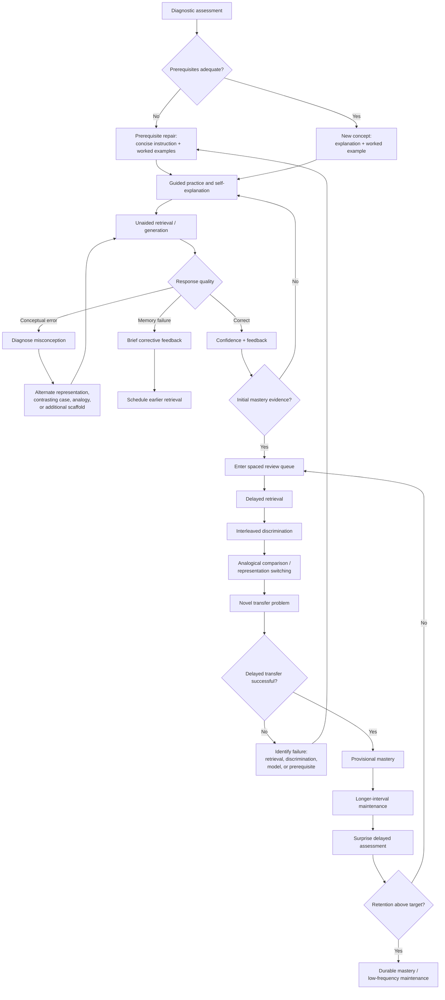

# Designing a Learning System for Conceptual Understanding and Long-Term Retention

## Executive summary

The evidence does **not** support a single “best learning method.” The strongest learning systems combine several mechanisms that solve different problems: **explicit instruction and worked examples establish an initial mental model; generative activities and analogical comparison deepen and organize it; retrieval practice makes knowledge accessible; spacing stabilizes it over time; interleaving teaches learners when and where to use it; feedback corrects errors; and mastery gates prevent weak prerequisites from compounding downstream**. Reviews of learning techniques consistently place practice testing/retrieval and distributed practice among the highest-utility strategies, while classroom studies show retrieval benefits across ages, subjects, delays, and assessment formats. citeturn22view1turn22view2

The strongest quantitative result directly relevant to memory-system design is **spaced retrieval**. A 2021 meta-analysis of 29 studies found spaced retrieval superior to massed retrieval by **Hedges' g = 0.74**. Crucially, it found essentially no overall advantage for progressively expanding intervals over uniform intervals (**g = 0.034**). The practical conclusion is that the system should aggressively avoid massed repetition but should **not hard-code an expanding schedule as though it were scientifically optimal**; spacing should instead be individualized around estimated forgetting and the learner's target retention horizon. citeturn21view1

Retrieval practice should not be treated as a synonym for flashcards. A systematic review of 50 classroom experiments covering 5,374 students found that 57% of reported effects were medium or large and that benefits appeared across educational levels, content areas, delays, retrieval formats, feedback conditions, and experimental designs. Experimental work also demonstrates that retrieval can improve **meaningful learning**, not merely verbatim recall: Karpicke and Blunt found retrieval practice superior to elaborative concept mapping on delayed tests of science material. citeturn22view2turn5search15

For conceptual understanding, the system needs more than memory optimization. The strongest architecture is:

**Model → Generate → Retrieve → Correct → Compare → Vary → Transfer → Space → Reassess.**

“Model” means concise explanations and worked examples. “Generate” means explaining, predicting, drawing, deriving, or solving before seeing the answer. “Compare” means contrasting confusable categories and structurally analogous cases. “Vary” means changing surface details, representations, contexts, and problem types. “Transfer” means testing on genuinely new cases rather than slight repetitions. “Space” means revisiting the underlying knowledge after forgetting has begun. These operations target different components of durable expertise. Cognitive-load theory provides the complementary constraint: difficulty is useful only when the learner has enough cognitive capacity and prerequisite knowledge to engage productively. citeturn12search7turn18search9turn22view4

Several widely marketed ideas need qualification. **Interleaving is not universally superior to blocking**; its benefit depends strongly on what is being discriminated, and some verbal materials favor blocking. citeturn1search1 **“Dual coding” does not mean decorating text with pictures**; multimedia works when visual and verbal representations are instructionally complementary and integrated. A recent meta-analysis of Mayer-style multimedia interventions estimated an overall effect around **g = 0.37**, while the spatial-contiguity/split-attention literature reports substantially larger effects when instructional information that must be mentally integrated is physically integrated. citeturn23search8turn23search18 **Deliberate practice is not a magic law of expertise**: a major meta-analysis found that measured deliberate practice explained only about 4% of performance variance in education, with substantially larger associations in domains such as games and music. citeturn13search34

Technology is most useful when it **operationalizes learning science rather than replacing it**. Intelligent tutoring systems have historically produced substantial gains over large-group teaching, nonadaptive computer instruction, and textbooks, with a 2014 meta-analysis reporting **g = .42, .57, and .35**, respectively; they were statistically indistinguishable from individualized human tutoring in that synthesis. citeturn21view2 Adaptive review is similarly promising: personalized review has produced meaningful improvements in long-term course retention, and computational work now formalizes scheduling as an optimization problem around individual forgetting. citeturn20search4turn20search0 But sophisticated prediction is not the same as demonstrated learning improvement: an algorithm that predicts answers accurately is not necessarily an algorithm that causes better learning.

The critical design error would be to optimize the product for **engagement, immediate quiz accuracy, streaks, lesson completion, or short-term fluency**. Those are product metrics, not learning outcomes. Learning and current performance are separable: conditions that make practice feel easier can yield weaker delayed learning, while spacing, retrieval, and interleaving can impair immediate performance yet improve later accessibility. citeturn21view1turn5search17 A serious system therefore needs delayed retention tests, transfer tests, calibration measures, and learning-per-unit-time metrics as first-class outcomes.

The recommended product architecture is a **dual-state learner model**. One state estimates *memory accessibility*: “Can this learner retrieve this knowledge after delay?” The other estimates *conceptual competence*: “Can this learner explain, discriminate, apply, and transfer the underlying principle?” A learner should not be labeled “mastered” because either state alone is high. Memorized facts without transferable structure are brittle; conceptual insight that cannot be retrieved when needed is inert.

## What the system should actually measure

### Conceptual understanding

There is no universal psychometric variable called “conceptual understanding” that can be read directly from a quiz score. For system-design purposes, it should be operationalized as a **latent capability inferred from several different behaviors**, not as raw percentage correct. Work on analogical learning, transfer, generative learning, and cognitive load all points toward the importance of organized relational knowledge rather than mere reproduction of previously encountered surface forms. citeturn18search26turn18search9turn12search7turn22view4

A learner should count as understanding concept \(C\) when they can reliably do most of the following without being cued toward the answer:

| Dimension | What to measure | Example assessment | Why it matters |
|---|---|---|---|
| **Explanation** | Causal/relational structure | “Why does this happen?”; explain each step of a solution | Distinguishes knowing an answer from possessing an explanatory model. Generative learning benefits arise from actively organizing and integrating information. citeturn12search7 |
| **Discrimination** | Recognition of when a concept applies—and when it does not | Mix similar problem types; require method selection before solving | Interleaving is especially relevant when learners must distinguish confusable categories or strategies. citeturn1search1 |
| **Prediction** | Ability to infer consequences | “What changes if parameter X doubles?” | Tests whether relationships have been represented, rather than memorized as fixed statements. |
| **Error diagnosis** | Ability to detect and explain misconceptions | Present a plausible incorrect solution and ask what failed | Reveals structural understanding more effectively than another isomorphic correct-answer problem. |
| **Representation translation** | Mapping across words, equations, graphs, diagrams, cases | Explain the same concept using two representations | Appropriate multimedia and integrated representations can support learning when they reduce unnecessary integration demands. citeturn23search8turn23search18 |
| **Analogical transfer** | Recognition of shared deep structure across different surface contexts | Two source cases followed by a novel target case | Guided comparison can cause learners to abstract relational schemas that transfer to new problems. citeturn18search26turn18search9 |
| **Near transfer** | Application to novel but structurally close problems | New values/context, same underlying principle | Detects knowledge beyond item memorization. |
| **Farther transfer** | Application when surface cues and context change substantially | Cross-domain or unfamiliar application | The hardest and most important evidence that a transferable abstraction exists; transfer should therefore be directly tested rather than inferred from training accuracy. citeturn18search26 |

These dimensions should remain visible separately in the learner model. Collapsing everything into a single “82% mastery” number destroys diagnostically useful information. A learner with excellent explanation but poor discrimination needs different intervention from one who can classify problems but cannot explain why.

### Long-term retention

For a learning system, **retention should mean successful retrieval or application after a delay during which the learner has not simply kept the item active through continuous rehearsal**. The relevant delay is determined by the intended use. A seven-day retention test may be meaningful for a one-month course but almost meaningless if the goal is professional competence several years later. Spacing research itself demonstrates that retention depends on temporal structure, making immediate post-study performance an inadequate endpoint. citeturn21view1

A robust system should track at least:

| Metric | Definition | Recommended use |
|---|---|---|
| **Delayed retrieval accuracy** | Probability of recalling an answer after \(t\) days without restudy | Core memory metric |
| **Delayed application accuracy** | Correct use of knowledge on a novel problem after delay | Core conceptual-retention metric |
| **Retention ratio** | Delayed performance / immediate criterion performance | Detects rapid decay hidden by high initial scores |
| **Forgetting slope / estimated half-life** | Change in retrieval probability as time since successful recall increases | Drives adaptive scheduling |
| **Latency** | Time to produce a correct response | Distinguishes fragile reconstruction from increasingly fluent access, provided speed is not allowed to replace correctness |
| **Confidence calibration** | Correspondence between confidence and actual delayed performance | Measures metacognitive accuracy |
| **Relearning efficiency** | Time/trials needed to regain criterion after forgetting | Useful secondary measure of residual learning |
| **Transfer retention** | Performance on unseen applications after a delay | Best combined indicator of durable conceptual knowledge |

A central design rule follows: **never call knowledge “mastered” solely because a learner answered it correctly several times in one session.** Massed success is exactly the condition under which performance can look excellent without establishing correspondingly durable memory; spacing research demonstrates substantial delayed advantages from distributing those retrievals. citeturn21view1

### Learning versus performance

This distinction should shape the entire analytics architecture. Immediate response accuracy, hints used, session speed, and lesson completion measure *current performance*. Learning is an enduring change that must be inferred from performance after a delay or under changed conditions. Reviews of “learning versus performance” emphasize that manipulations improving acquisition-session performance can sometimes reduce later learning, and vice versa. citeturn5search17

The north-star outcome therefore should not be:

> “Percent correct today.”

It should resemble:

> **Expected probability of successful, unaided retrieval and transfer at the learner's target future time, per minute of learning effort.**

That formulation changes product behavior. The system becomes willing to make today's practice harder if doing so measurably improves tomorrow's independent performance.

## Cognitive mechanisms and strength of evidence

### Retrieval practice and the testing effect

Retrieving knowledge changes memory differently from merely exposing oneself to it again. The classroom evidence is unusually strong by educational-research standards: Agarwal, Nunes, and Blunt screened roughly 2,000 abstracts and synthesized 50 experiments involving 5,374 learners; 57% of effects were medium or large, with benefits across educational levels, subject matter, delays, retrieval formats, final-test formats, and feedback arrangements. citeturn22view2

The common objection that retrieval practice merely trains rote recall is incorrect. Karpicke and Blunt's experiments compared retrieval practice with elaborative studying through concept mapping and found greater delayed learning from retrieval practice, including on measures intended to tap meaningful understanding. citeturn5search15 The implication is not that concept mapping is useless; it is that **active reconstruction from memory is itself a powerful route to meaningful learning**.

Retrieval quality nevertheless matters. A flashcard asking “What is X?” exercises a different representation from “Why does X cause Y?”, “Which principle applies here?”, “What would happen if...?”, or “Solve this case without seeing the procedure.” A conceptual learning system should therefore retrieve **relations, explanations, distinctions, procedures, and predictions**, not just terms.

A particularly effective interaction pattern is:

**Question → commit to answer → confidence judgment → answer submission → targeted feedback → later retrieval in a different representation.**

Showing the explanation before requiring a genuine retrieval attempt destroys part of the mechanism the system is trying to exploit.

### Spacing and spaced retrieval

The best direct quantitative evidence in this literature is strong. Latimier, Peyre, and Ramus synthesized 29 studies and found **g = 0.74** favoring spaced over massed retrieval. Yet their analysis found almost no overall difference between expanding and uniform spacing schedules (**g = 0.034**); expanding intervals became more advantageous under some conditions involving more repeated tests. citeturn21view1

That result has a major engineering implication: **the scientifically justified primitive is spacing, not any specific folklore schedule such as 1-3-7-14-30 days.** Fixed schedules ignore differences among learners, items, prior knowledge, interference, desired retention horizon, and response history.

The scheduler should instead estimate something like

\[
P(\text{successful retrieval at time }t \mid
\text{history, item, learner, context})
\]

and review an item when the expected learning value of another retrieval becomes large enough. Computational work has explicitly framed spaced-repetition scheduling as an optimization problem adapted to individual performance. citeturn20search0turn20search2 A classroom study of personalized review also reported a **16.5% improvement in long-term course retention relative to then-current educational practice**, demonstrating that personalization can matter outside tightly controlled memory experiments. citeturn20search4

Do not push recall probability arbitrarily close to 100%. That creates excessive review, unnecessary ease, and opportunity cost. The objective is **retention per unit of scarce learner time**, not zero forgetting.

### Interleaving and discrimination

Interleaving mixes different categories, problem types, or strategies rather than repeatedly practicing one type before moving to another. Its main conceptual value is frequently misunderstood: the important learning problem is not merely *solving* a problem after being told which technique to use, but **learning to recognize which technique applies**.

The 2019 meta-analysis by Brunmair and Richter found substantial moderation by the structure and similarity of learning materials. Benefits are strongest in circumstances where alternating exemplars forces learners to distinguish confusable categories; interleaving is not universally beneficial, and some verbal/word-learning conditions can favor blocking. citeturn1search1

This produces a better sequencing rule than “always interleave”:

**Early acquisition:** some blocked examples can establish a representation.

**After initial competence:** interleave confusable categories.

**Later:** remove labels telling the learner what kind of problem is being presented.

**Transfer:** present heterogeneous cases requiring both problem classification and solution generation.

The goal is not random variety. It is **contrastive variety**.

### Generative learning, elaboration, and self-explanation

Generative learning requires learners to construct an output from what they are learning rather than simply consume it: explanations, summaries from memory, predictions, drawings, concept structures, questions, derivations, or teaching explanations. A 2023 meta-analysis of text-generation interventions found an overall learning advantage of approximately **Hedges' g = 0.41**, and the result could not simply be attributed to spending more time on the task. citeturn12search7

The useful mechanism is not “write more notes.” It is **selecting, organizing, and integrating** information with relevant prior knowledge. citeturn7search1 Consequently, transcription and near-copying should not receive the same status in the system as generation without source access.

Good prompts include:

> “Explain why each step is necessary.”

> “Predict the result before running the simulation.”

> “Draw the mechanism from memory.”

> “Give an example and a non-example.”

> “Explain how this concept differs from the one most easily confused with it.”

> “What assumption makes this method valid?”

The system should subsequently compare the learner's generation with an expert model or rubric. Otherwise, highly generative activity can simply become a sophisticated way to rehearse a misconception.

### Worked examples, scaffolding, and cognitive load

Cognitive-load theory starts from a fundamental asymmetry: long-term knowledge structures can encode extremely complex information, whereas unfamiliar interacting elements place much more severe demands on working memory. Instruction should therefore reduce **unproductive** processing while preserving processing relevant to building usable knowledge structures. citeturn22view4

This is why unguided problem solving is often a poor starting point for novices. Worked examples reveal a valid solution path before learners possess schemas capable of generating that path efficiently. The evidence base underlying cognitive-load theory includes the worked-example effect, split-attention effects, variability of examples, and guidance fading. citeturn22view4

The correct progression is not “worked examples forever”:

**full worked example → worked example with self-explanation → completion problem → partially scaffolded problem → independent problem → varied/interleaved problem → transfer problem.**

As expertise grows, information that once helped can become redundant. That is the practical meaning of the expertise-reversal problem: **personalization should alter the amount of guidance, not merely the difficulty number attached to a question.**

### Analogical comparison and transfer

Transfer frequently fails because novices represent cases in terms of surface details instead of underlying relational structure. Analogical comparison addresses that problem directly by juxtaposing examples that differ superficially but instantiate the same principle.

In foundational experiments on analogical encoding, learners who explicitly compared cases developed more abstract schemas and transferred them more successfully. In one study, approximately **90% of learners receiving guided analogy training transferred the target principle, compared with 70% receiving simple comparison, 55% studying cases separately, and 37% in baseline conditions**. citeturn18search26 More recent randomized work with children found that even a brief analogical comparison could support learning of an elementary engineering principle. citeturn18search9

This makes analogical comparison one of the most underused high-value techniques for a conceptual learning product. Every important concept should eventually be represented through:

**two positive examples with different surface characteristics, one near-miss/non-example, one commonly confused alternative, and at least one novel transfer case.**

The learner should identify *what remains invariant*.

### Multimedia and “dual coding”

The popular version of dual coding—“add a picture to improve memory”—is far too crude. Evidence from multimedia learning instead favors designs in which complementary representations convey relevant structure while unnecessary search and integration are reduced. A 2025 meta-analysis of work based on Mayer's multimedia-learning principles estimated an overall effect of about **g = 0.37**, with considerable moderation. citeturn23search8 An overview of multimedia reviews identified multiple design principles with significant meta-analytic support. citeturn23search24

Spatial integration is particularly important. Meta-analytic work on spatial contiguity/split attention has reported an overall effect around **g = .63** when information that must be mentally integrated is presented in an integrated rather than unnecessarily separated format. citeturn23search18

The design consequence is blunt: **decorative graphics are not dual coding.** A useful diagram externalizes relationships that would otherwise have to be maintained mentally. Labels should sit where they are used; animation should expose dynamics that static media obscure; signaling should direct attention to causally relevant elements; redundant ornament should be removed.

### Desirable difficulties

Spacing, retrieval, interleaving, generation, and reduced cues can all make practice more difficult while improving subsequent learning. But “harder = better” is wrong. A difficulty is desirable only when it forces a learning-relevant operation that the learner can actually execute. The distinction between acquisition performance and durable learning explains why fluency and ease can mislead both students and system designers. citeturn5search17turn21view1

Difficulty should therefore be **diagnostic and targeted**:

- forgetting enough to require retrieval can be desirable;
- selecting among similar methods can be desirable;
- explaining a solution can be desirable;
- deciphering a cluttered interface is not;
- solving a problem whose prerequisites are absent is not;
- forcing repeated failure without actionable feedback is not.

That is the useful synthesis between desirable-difficulty research and cognitive-load theory. citeturn22view4

### Comparative evidence

The effect sizes below should **not** be ranked as though they came from one common experiment. The studies use different controls, outcomes, delays, populations, and units of analysis. They are best interpreted as approximate evidence magnitudes plus boundary conditions.

| Method | Quantitative evidence | Evidence strength | Conceptual learning | Factual retention | Scalability | Implementation complexity | Critical boundary condition |
|---|---:|---|---|---|---|---|---|
| **Spaced retrieval** | **g = 0.74** vs massed retrieval; expanding vs uniform **g = 0.034** citeturn21view1 | **High** | High when retrieval requires explanation/application | **Very high** | **Very high** | Medium | Space successful retrievals; no universal optimal fixed interval |
| **Retrieval practice** | 50 classroom experiments, n=5,374; **57% medium/large effects** citeturn22view2 | **High** | **High** with conceptual prompts | **Very high** | **Very high** | Low–medium | Retrieval must be successful often enough to learn; feedback matters after errors |
| **Generative text / explanation** | **g ≈ 0.41** citeturn12search7 | Moderate–high | **Very high** | Medium–high | High | Medium | Generation must involve organization/integration, not copying |
| **Feedback** | Overall **d ≈ 0.48** in a large 2020 meta-analysis citeturn23search0turn23search3 | **High but heterogeneous** | **High** | High | High where answers can be evaluated | Medium–very high | Information content and task alignment matter more than generic praise |
| **Interleaving** | Positive but strongly moderator-dependent; not universally superior to blocking citeturn1search1 | Moderate–high | **Very high for discrimination/strategy selection** | Medium | Very high | Low–medium | Highest value when categories are confusable; some materials favor blocking |
| **Mastery learning** | Historical 36-study meta-analysis: **ES ≈ 0.59**; moderators include threshold, subject, assessment and feedback citeturn22view3 | Moderate; evidence is positive but much underlying work is older | High | High | Medium–high with software | **High** | Mastery criterion must genuinely represent competence |
| **Intelligent tutoring systems** | **g=.42** vs large-group teaching; **.57** vs non-ITS computer instruction; **.35** vs textbooks citeturn21view2 | Moderate–high | High | High | High after development | **Very high** | Content model, feedback and task selection determine value |
| **Multimedia design** | Overall Mayer-principle meta-analysis **g≈.37**; spatial contiguity literature around **g=.63** citeturn23search8turn23search18 | Moderate–high | High for representational/causal concepts | Medium | Very high | Medium | Relevant, integrated representations—not extra media for its own sake |
| **Analogical comparison** | Guided analogy produced large transfer differences in foundational experiments; more recent RCT evidence supports the mechanism citeturn18search26turn18search9 | Moderate | **Very high** | Low | High | Medium | Learners need explicit attention to relational structure |
| **Worked examples + fading** | Extensive cognitive-load literature; effect depends strongly on expertise and task complexity citeturn22view4 | **High for novice complex-skill acquisition** | **Very high** | Low–medium | Very high | Medium | Fade guidance as schemas develop |
| **Deliberate practice** | Deliberate-practice measures explained about **4% of performance variance in education** in a major meta-analysis citeturn13search34 | Moderate; mostly not randomized intervention evidence | High for well-defined skills | Low | Medium | **High** | Requires diagnostically targeted tasks and high-quality feedback; hours alone are meaningless |

The strongest general-purpose stack is therefore not the row with the biggest number. It is **worked examples/scaffolding during acquisition + generation and analogy for structure + retrieval for accessibility + spacing for persistence + interleaving for discrimination + feedback/mastery for error control**.

## Instructional architecture and curriculum sequencing

### Mastery should be a gate, not a score

Mastery learning is best interpreted as an architecture: define explicit objectives, diagnose performance, provide corrective instruction, reassess, and permit progression when a standard has actually been reached. A 2023 practical review notes a historical meta-analysis of 36 studies with an average effect around 0.59, while also emphasizing that outcomes varied with mastery threshold, course structure, subject matter, testing, pacing, and feedback. citeturn22view3

The system should therefore replace a single “80% = mastered” convention with **multi-evidence mastery**. A concept should progress from *introduced* to *provisionally mastered* only after the learner has demonstrated:

1. successful unaided retrieval;
2. successful use in at least one unfamiliar case;
3. discrimination from a confusable alternative; and
4. success after a meaningful delay.

For high-stakes domains, require all four. For low-stakes factual material, the transfer condition can be lighter.

A student who scores 100% five minutes after studying something has demonstrated **acquisition**, not long-term mastery.

### Curriculum sequencing

The curriculum should be represented as more than a linear chapter list. Each knowledge object should carry several edge types:

**prerequisite edges** — A must be known before B;

**component edges** — A and B jointly compose C;

**confusability edges** — A is commonly mistaken for B;

**analogy edges** — A and B instantiate common structure;

**representation edges** — equation, graph, verbal explanation, diagram, worked case;

**transfer edges** — concept C should generalize into contexts X, Y, and Z.

This allows the scheduler to distinguish four fundamentally different reasons to present another problem: *acquire*, *retrieve*, *discriminate*, or *transfer*.

For novices, sequence from high guidance toward independence. Cognitive-load research supports reducing unnecessary working-memory burden during initial complex-task acquisition; guidance should then fade as knowledge structures develop. citeturn22view4 Once a problem family has become familiar, interleave it with plausible alternatives so the learner must choose the method rather than merely execute it. citeturn1search1

### Deliberate practice

Deliberate practice should be implemented as a **task-selection principle**, not as a timer. Macnamara, Hambrick, and Oswald's meta-analysis is an important corrective to extravagant claims: deliberate-practice measures accounted for substantially less performance variance in education and professions than in more stable domains such as games and music. citeturn13search34

A useful practice engine should therefore target **specific, diagnosed deficits**:

> repeatedly missing negative signs → targeted sign-manipulation problems;

> knowing a theorem but choosing it inappropriately → discrimination cases;

> solving correctly but slowly → fluency practice;

> explaining correctly but failing transfer → structurally similar cases with changed surface features.

That is deliberate practice in a useful system-design sense. “Spend another 30 minutes on mathematics” is not.

### Feedback

A 2020 meta-analysis estimated the overall effect of feedback on learning at **d = .48**, but the central finding is heterogeneity rather than a universal feedback effect: what the feedback contains and what it directs attention toward substantially affects usefulness. citeturn23search0turn23search3

A learning system should use an escalation hierarchy:

**First:** correctness signal when sufficient.

**Then:** identify the error location.

**Then:** give a strategic hint.

**Then:** expose the relevant principle.

**Then:** show a partial solution.

**Finally:** show the complete worked solution and require the learner to explain or reproduce it.

Jumping immediately to the final answer maximizes task completion while eliminating much of the retrieval and problem-solving opportunity. Conversely, withholding all assistance when a learner has no workable model wastes time and can overload working memory. Cognitive-load theory supports adapting assistance to the learner's knowledge and task complexity. citeturn22view4

After corrective feedback, do not simply ask the identical item immediately. Require **re-retrieval after some lag**, and later test a parallel instance. Otherwise the system is measuring short-lived answer memory.

### Retrieval schedule

A sensible default policy is:

**Initial encoding:** one genuine retrieval after instruction.

**Early consolidation:** another retrieval after enough time/context change that the answer is no longer trivially active.

**Subsequent consolidation:** reviews scheduled from the learner's observed forgetting.

**Maintenance:** extend intervals after repeated successful delayed retrieval.

**Error:** shorten the next interval, diagnose the failure, and distinguish memory failure from conceptual failure.

**Repeated conceptual error:** return to instruction, examples, analogy, or prerequisite repair rather than merely increasing card frequency.

The last distinction is essential. A scheduler that treats every wrong answer as forgetting will respond to a misconception with more repetition of the same inadequate representation.

## Technology and adaptive learning implementation

### Adaptive spaced-repetition systems

Conventional SRS products are optimized for items that can be represented as relatively discrete retrievals. That makes them excellent for vocabulary, terminology, formulas, associations, dates, syntax, and prerequisite facts. The spacing evidence strongly supports their central mechanism. citeturn21view1

But an SRS becomes intellectually shallow when every learning objective is converted into atomic flashcards. Conceptual competence depends on relationships among knowledge objects, contextual discrimination, explanation, and transfer. Analogical-learning and generative-learning research specifically show the value of representing and reconstructing relations, not merely isolated item-answer mappings. citeturn12search7turn18search26

A better SRS should schedule several object types:

| Scheduled object | Example |
|---|---|
| Atomic fact | “What does term X mean?” |
| Relationship | “How are X and Y related?” |
| Explanation | “Why does X produce Y?” |
| Procedure | “Perform method X without a template.” |
| Discrimination | “X, Y, or Z—which model applies here and why?” |
| Representation conversion | “Convert this graph into an equation and explain the parameters.” |
| Analogy | “What structural principle do these two cases share?” |
| Transfer case | “Use concept X in this unfamiliar scenario.” |
| Error pattern | “What is wrong with this plausible solution?” |

Only the first is a conventional flashcard.

### Personalized scheduling

A mature scheduler should represent uncertainty explicitly. It can maintain a probability distribution over memory strength rather than a binary known/unknown flag, updating it after every delayed response. Computational work such as Tabibian and colleagues' PNAS framework demonstrates how adaptive repetition can be formulated as optimization over a learner's memory dynamics. citeturn20search0turn20search2

The review policy should consider:

\[
\text{priority}
=
f(
P_\text{forget},
\text{importance},
\text{prerequisite centrality},
\text{future use date},
\text{conceptual uncertainty},
\text{interference},
\text{review cost}
)
\]

This is superior to “oldest card first.” Forgetting a central prerequisite needed tomorrow should matter more than forgetting an obscure fact with no near-term use.

The system also needs a cap on new material. Formal work on spaced-repetition queues shows that aggressively introducing new items can overwhelm review capacity and sharply degrade performance. citeturn20academia43 The learner's review debt is therefore a real design variable.

### Intelligent tutoring systems

Intelligent tutoring systems demonstrate what is possible when learner modeling, problem selection, hints, and feedback are coupled. Ma and colleagues synthesized 107 effect sizes involving 14,321 learners. ITS use outperformed teacher-led large-group instruction (**g=.42**), non-ITS computer instruction (**g=.57**), and textbook/workbook learning (**g=.35**); differences from individualized human tutoring (**g=-.11**) and small-group instruction (**g=.05**) were not statistically significant in that synthesis. citeturn21view2

A newer 2025 preprint meta-analysis focused on U.S. K–12 ITS reported a more modest overall effect of **g=.271** across 18 studies and 77 effect sizes, with worked examples, intervention duration, outcome type, and other design factors emerging as important moderators. Because this synthesis was reported as a preprint, it should be treated as provisional rather than equivalent to the established 2014 meta-analysis. citeturn15academia37

The lesson is not “build an AI tutor.” It is that **adaptive task selection plus high-quality instructional feedback can outperform static software**. The word *intelligent* does no work by itself.

### Multimedia

Multimedia should serve one of four functions:

**make an invisible mechanism visible;  
externalize relationships;  
show change over time;  
reduce the need to mentally integrate separated information.**

That is much more defensible than adding videos to increase engagement. Reviews of multimedia-design research find significant positive effects for multiple design principles, while spatial integration of related text and visuals has particularly strong support. citeturn23search24turn23search18

The UX should therefore avoid the common educational-product pattern of simultaneous narration, subtitles, paragraphs, animation, decorative illustrations, sound effects, progress meters, and pop-ups competing for the same finite attentional resources. Cognitive-load theory explicitly treats the learning environment as a source of controllable load. citeturn22view4

### Simulations

Simulations are most useful for systems in which manipulating variables reveals otherwise difficult-to-observe causal structure. But the interaction should be designed around **hypothesis → prediction → manipulation → observation → explanation**, not undirected exploration.

For example:

> Before simulation: “Predict the direction and approximate magnitude of the change.”

> Run simulation.

> “Your prediction differed from the result. Which assumption failed?”

> Change one variable.

> “Explain why the new output differs.”

> Later: retrieve the principle without the simulation.

This turns a simulation into a generative and retrieval environment rather than an animated demonstration. The design follows evidence supporting generation, feedback, cognitive-load management, and retrieval. citeturn12search7turn23search0turn22view4turn22view2

### Collaborative learning

Collaboration should not substitute group performance for individual learning. Cognitive-load research has proposed circumstances in which groups can distribute processing demands on complex tasks, but coordination itself imposes costs. citeturn22view4

The product should therefore use a sequence such as:

**individual retrieval/prediction → group comparison → disagreement detection → joint explanation → individual post-discussion retrieval.**

That architecture captures the informational advantage of collaboration while still measuring whether each learner personally acquired the knowledge.

### AI and generative models

AI should primarily lower the marginal cost of operations already supported by learning science: generating parallel examples, generating counterexamples, classifying errors, providing graduated hints, producing alternative explanations, constructing analogy pairs, translating representations, and creating transfer questions.

It should not simply answer questions faster.

Recent evidence gives reason for caution. A 2026 preprint meta-analysis of generative-AI coding assistants reported a moderate productivity advantage (**g=.33**) but no statistically significant learning advantage (**g=.14; 95% CI −.18 to .47**). The evidence base remains young and domain-specific, so this should not be generalized mechanically, but the distinction is exactly the one a learning-system designer should care about: **technology can make task completion faster without causing durable skill acquisition**. citeturn15academia39

The product should therefore place an important constraint on AI assistance:

> **The AI may reduce irrelevant difficulty, but it should not perform the target cognitive operation that the learner is supposed to acquire.**

An algebra tutor that performs algebra for the learner is a productivity tool. An algebra tutor that diagnoses the learner's transformation and provides the minimum hint necessary is an instructional tool.

## Practical blueprint for the learning system

### Learner progression and system interventions

The most important feature of this workflow is the split between **memory failure and conceptual failure**. They must trigger different interventions.

### Knowledge representation

Every learning objective should be encoded in a domain model with at least:

| Object | Fields |
|---|---|
| Concept | ID, definition, prerequisite concepts, importance |
| Fact | Prompt variants, answer variants, semantic dependencies |
| Procedure | Steps, decision points, common errors |
| Misconception | Trigger pattern, diagnostic item, corrective explanation |
| Example | Surface features, underlying principle, difficulty |
| Non-example | Why it fails to satisfy the concept |
| Analogy | Shared structure, differing surface structure |
| Confusable pair | Features learners must discriminate |
| Representation | verbal, mathematical, graphical, spatial, procedural |
| Transfer target | novel context and expected structural mapping |

This may look expensive compared with dumping documents into an LLM. It is. It is also what gives the system a basis for reasoning about instruction instead of merely generating plausible text.

### Learner state

Maintain separate estimates for at least four learner dimensions:

\[
\text{LearnerState}(c)=
\{
M_c,\;
U_c,\;
D_c,\;
C_c
\}
\]

where:

- \(M_c\): probability of **memory accessibility** for concept \(c\) at a future time;
- \(U_c\): evidence of **structural/conceptual understanding**;
- \(D_c\): ability to **discriminate** \(c\) from competing concepts;
- \(C_c\): **confidence calibration**.

A fifth dimension can track procedural fluency where speed is intrinsically relevant.

A learner could therefore have:

> Memory .91  
> Conceptual understanding .63  
> Discrimination .42  
> Calibration .78

The appropriate next activity is obvious: another definition flashcard is low-value; contrasting cases are high-value.

### Task-selection policy

A serious adaptive engine should maximize something closer to **expected learning gain per unit time** than predicted probability of a correct response:

\[
a^* =
\arg\max_a
\frac{
E[\Delta \text{durable competence}\mid a]
}{
E[\text{time}\mid a]
}
\]

subject to constraints on cognitive load, prerequisite availability, review urgency, curriculum goals, and learner motivation.

That means a task with an 85% predicted success probability is not automatically preferable to one with a 65% probability. If the latter produces substantially more information about a misconception or stronger delayed learning, it may be the better choice.

The system should also retain some **exploration**. If personalization only presents what the current learner model predicts will work, model errors become self-reinforcing. Occasionally sampling an alternative explanation or task type allows the system to discover that its assumptions about a learner were wrong.

### UX principles

The interface should make the target cognitive operation unavoidable but frictionless.

A question screen should usually contain only the question, necessary representations, response mechanism, and perhaps confidence control. Relevant diagrams and labels should be spatially integrated rather than separated across tabs or screens, consistent with the spatial-contiguity evidence. citeturn23search18

Feedback should arrive **after commitment** whenever retrieval is the learning goal. Hints should be progressively revealing rather than binary. Worked solutions should be followed by an explanation or completion attempt. Video should pause for prediction or retrieval rather than permit continuous passive viewing. Simulations should ask for predictions before manipulation. These patterns operationalize retrieval, generation, feedback, and cognitive-load principles rather than merely presenting content. citeturn22view2turn12search7turn23search0turn22view4

Do not make “easy” the dominant UX objective. Make **cognitively relevant effort easy to enter into**.

### Data collection

At minimum, every learning event should log:

| Data | Why collect it |
|---|---|
| Learner pseudonymous ID | Longitudinal modeling |
| Knowledge-object ID | Link event to domain model |
| Task type | Retrieval, analogy, generation, example, transfer, etc. |
| Timestamp and prior exposure interval | Estimate forgetting |
| Exact response | Error diagnosis |
| Correctness / rubric score | Performance |
| Response latency | Fluency and difficulty |
| Confidence | Calibration |
| Hint requests and hint depth | Scaffold dependence |
| Feedback shown | Causal interpretation of future performance |
| Representation/modalities | Measure representation-specific competence |
| Prior encounters | Dose/exposure modeling |
| Error category | Misconception model |
| Device/accessibility state where relevant | Detect UX confounding |
| Subsequent delayed performance | Estimate actual learning rather than immediate performance |

Avoid collecting data merely because it might someday be useful. Learning telemetry can become unusually revealing: weaknesses, attention patterns, disabilities, behavioral routines, and inferred competence can all become sensitive educational records. The minimum viable data model should therefore be **purpose-limited**, with retention periods and access controls determined before collection rather than after a breach or policy dispute.

### Evaluation metrics

A production dashboard should separate **learning**, **efficiency**, **behavior**, and **equity**.

The primary outcomes should be:

\[
\textbf{Delayed Retention}
\]

\[
\textbf{Novel Transfer}
\]

\[
\textbf{Learning Gain / Minute}
\]

\[
\textbf{Forgetting Rate}
\]

\[
\textbf{Confidence Calibration}
\]

Secondary metrics include engagement, return rate, completion, review backlog, hint use, voluntary practice, and satisfaction. Those matter operationally, but none is evidence that learning occurred.

A useful evaluation hierarchy is:

| Tier | Outcome | Interpretation |
|---|---|---|
| Weak | Clicks, time-on-task, streaks | Product usage |
| Weak–moderate | Same-session accuracy | Acquisition performance |
| Moderate | Immediate posttest on unseen items | Initial learning |
| Strong | Delayed retention on unseen items | Durable learning |
| **Strongest** | Delayed transfer to structurally novel problems | Durable conceptual learning |

This hierarchy follows directly from the distinction between immediate performance, delayed learning, and transfer that underlies retrieval, spacing, and analogical-learning research. citeturn5search17turn21view1turn18search26

### Experimental evaluation

Do not evaluate the system merely by comparing “active users” with “inactive users.” That comparison is badly confounded by motivation, prior achievement, time availability, and self-selection.

Where feasible, use randomized experiments on individual interventions: scheduler A versus scheduler B, immediate versus graduated feedback, blocked versus interleaved problem selection, fixed versus adaptive scaffolding. In classroom settings, cluster randomization may be required when learners influence each other or teachers deliver condition-specific instruction.

Every experiment should include a **delayed outcome**, preferably one not seen during training. A scheduler can produce lower immediate accuracy while being the superior scheduler if retention weeks later improves; the spaced-retrieval literature is exactly why optimizing solely against session-level metrics is unsafe. citeturn21view1

A particularly valuable product metric is the retention frontier:

\[
\text{minutes of practice}
\rightarrow
\text{probability of successful performance after }30, 90, 180\text{ days}
\]

Compare interventions by how far they shift that curve upward, not by how much they increase today's quiz percentage.

### Personalization

Personalization should first adapt variables with strong causal rationale:

**review timing, prerequisite remediation, hint depth, example complexity, quantity of guidance, confusable categories, and selection of transfer contexts.**

It should be much more skeptical about psychographic “learning styles.” The multimedia and cognitive-load literatures support adapting presentation to the information and task demands; they do not justify simplistic classification of people into permanent visual/auditory learner types. The safer principle is **multiple useful representations for the material**, not a permanent modality label for the person. citeturn22view4turn23search24

The learner model should also decay its own certainty. Someone who understood calculus two years ago should not be treated as identical to someone who demonstrated the same performance yesterday.

### Ethical constraints

The optimization target itself creates ethical risks. An algorithm rewarded for “engagement” can learn to maximize notifications, streak anxiety, competition, or endless easy questions without maximizing knowledge. The remedy is architectural: **learning metrics must outrank engagement metrics in the objective function**.

Several product rules follow:

**Never use inferred weakness as a punitive label.** Knowledge-state estimates are probabilistic and task-dependent.

**Expose the reason for scheduling.** A learner should be able to see, for example, “This is appearing because you last retrieved it 21 days ago and your previous recall was slow.”

**Permit override and reset.** Personalization should advise rather than trap someone in a model-generated track.

**Minimize sensitive educational data.** Store what is needed to improve learning, not a permanent behavioral dossier.

**Audit outcomes across groups.** An adaptive system can reproduce differential access, language, disability, or prior-opportunity effects through its learner model even when protected attributes are not explicit.

**Do not allow AI confidence to substitute for content validity.** High-confidence explanations, generated questions, and grading decisions require validation mechanisms in high-stakes settings.

Those are not peripheral compliance features. A learner model that cannot be challenged or inspected is a poor educational instrument even before it becomes a privacy problem.

## Evidence limits, unresolved questions, and research gaps

### External validity is weaker than the headline literature implies

Retrieval practice has one of the strongest classroom evidence bases, but even its 2021 classroom review found that only **6% of included experiments were conducted in non-WEIRD countries**. citeturn22view2 Evidence should therefore not be treated as universally invariant across languages, educational cultures, socioeconomic conditions, curricula, and testing regimes.

Many cognitive-science effects originate in constrained laboratory tasks. The strongest system architecture should use those effects as priors, then validate them in the product's actual population and subject matter.

### The optimal schedule for complex conceptual knowledge is unresolved

The evidence that spacing improves retention is strong; evidence identifying a universally optimal schedule is not. The expanding-versus-uniform result is essentially null overall, and adaptive algorithms remain an active area of research. citeturn21view1turn20search0

More importantly, much scheduling research involves discrete retrievable items. It is unresolved how best to schedule **interdependent conceptual schemas** whose components are retrieved together and whose utility depends on problem context. A future system should treat conceptual scheduling as an experimental problem rather than assuming that flashcard algorithms automatically generalize.

### Prediction is not intervention

Modern learner models can become extremely good at predicting whether an answer will be correct. That does not establish that the policy chosen from those predictions maximizes learning.

This is a fundamental edtech research gap: a knowledge-tracing system can have lower predictive error and still make worse instructional decisions. The ultimate test must therefore be **causal improvement in delayed performance**, ideally under randomized policy comparison.

### Interactions among methods are under-characterized

Research often asks whether method A beats method B. Real systems combine A+B+C+D.

Retrieval may interact with spacing. Interleaving may interact with expertise. Worked examples may interact with self-explanation. Multimedia may change cognitive load differently at different knowledge levels. Feedback may change whether generation is productive. Mastery learning itself incorporates repeated assessment, feedback, corrective practice, and variable time. citeturn21view1turn22view3turn22view4

The product therefore needs factorial or sequential experimentation, not only isolated feature A/B tests.

### Transfer remains substantially harder than retention

People often remember a principle without spontaneously seeing when it applies. Analogical-learning experiments are valuable precisely because they demonstrate that presenting multiple cases is not necessarily sufficient: explicit comparison and guidance can materially improve schema abstraction and transfer. citeturn18search26turn18search9

This means a system reporting excellent delayed factual retention may still fail its real educational purpose. Transfer needs its own training tasks and outcome measures.

### Interleaving needs better domain-specific models

The relevant question is not “Should this course use interleaving?” It is:

> Which categories are confusable enough that juxtaposition improves discrimination, and at what stage of expertise?

The substantial moderation observed in the interleaving meta-analysis shows why generic random mixing is not defensible. citeturn1search1 A mature learning platform could learn a **confusion graph** from learner error data and preferentially interleave categories with high bidirectional confusion.

That is a promising bridge between empirical learning science and adaptive-system design.

### AI tutoring evidence is moving faster than evidence quality

Traditional ITS evidence is mature enough to show meaningful average benefits, although outcomes vary materially by comparison group and implementation. citeturn21view2 LLM-based tutoring is much newer. Preliminary 2025–2026 syntheses are appearing, but the evidence does not yet justify treating fluent conversational assistance as equivalent to established tutoring principles; recent programming evidence, for example, suggests productivity benefits need not imply learning benefits. citeturn15academia39turn15academia37

The key unanswered questions concern **long-term retention, transfer after AI removal, dependence on hints, metacognitive calibration, learner agency, error propagation, and whether learners can still perform independently**.

A rigorous AI-learning evaluation should therefore include a **no-AI delayed transfer test**. If performance collapses when assistance disappears, the tool trained assisted performance rather than competence.

### Mastery-learning evidence needs modernization

The estimated mastery-learning effect around 0.59 is encouraging, but the quantitative foundation cited in modern reviews relies heavily on older studies, and implementation varies substantially. citeturn22view3 Contemporary adaptive platforms create an opportunity to decompose the bundle: how much benefit comes from variable pacing, repeated retrieval, corrective feedback, criterion-based progression, or additional time on difficult material?

That is more useful than continuing to ask whether “mastery learning” as an undifferentiated package works.

### The strongest final design

The research supports a clear architecture:

> **Teach explicitly enough that the learner has a viable model. Make them reconstruct rather than reread it. Correct errors. Compare related and confusable cases. Remove scaffolding. Require transfer. Revisit the knowledge after forgetting has begun. Adapt review to observed forgetting. Reassess after delays.**

Or, as a system loop:

\[
\boxed{
\text{Model}
\rightarrow
\text{Generate}
\rightarrow
\text{Retrieve}
\rightarrow
\text{Feedback}
\rightarrow
\text{Contrast}
\rightarrow
\text{Transfer}
\rightarrow
\text{Space}
\rightarrow
\text{Retrieve again}
}
\]

The high-level conclusion is that **memory and conceptual understanding should not be designed as competing objectives**. Durable expertise requires both. Retrieval without structure produces accessible but shallow knowledge. Structure without retrieval produces understanding that may be unavailable when needed. The highest-value learning system is therefore not an SRS, a tutor, a video platform, a quiz engine, or an AI chatbot in isolation. It is a system that **orchestrates representations, generation, retrieval, feedback, comparison, transfer, and time**, while continuously measuring whether the resulting competence survives both delay and contextual change. The strongest current evidence supports retrieval and spacing as the durable-memory backbone, cognitive-load-aware worked examples as the acquisition backbone, and generation, interleaving, analogy, feedback, and transfer testing as the mechanisms that turn remembered information into usable knowledge. citeturn21view1turn22view2turn22view4turn12search7turn1search1turn18search26turn23search0
